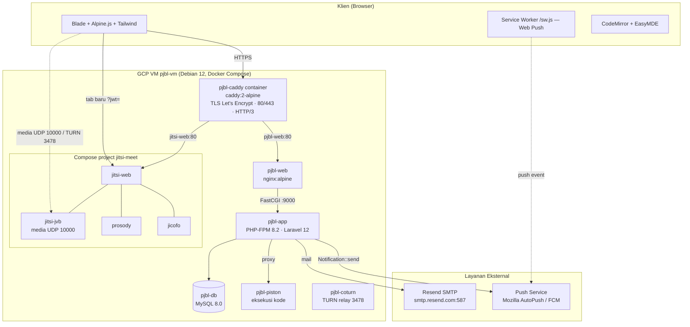
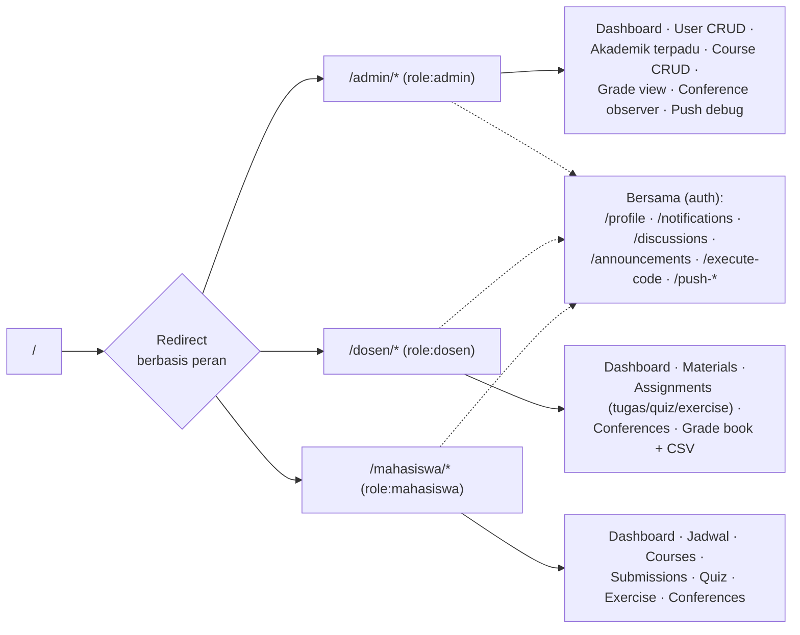
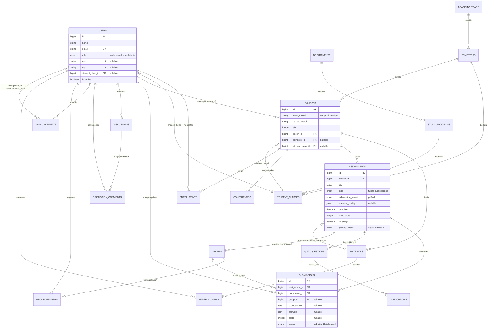
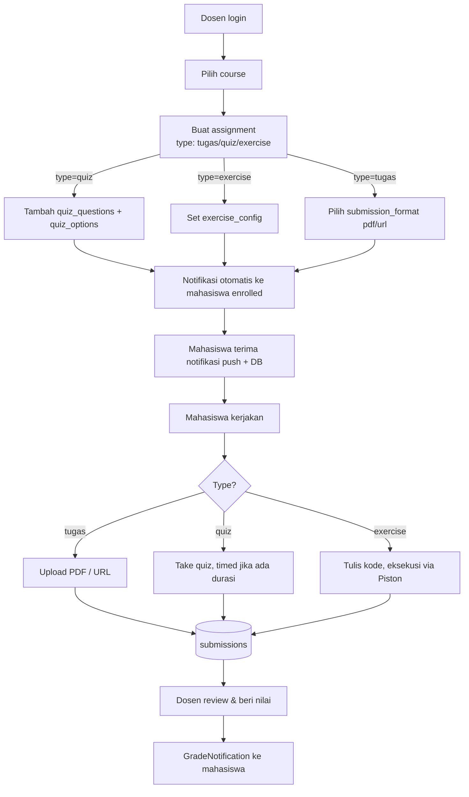
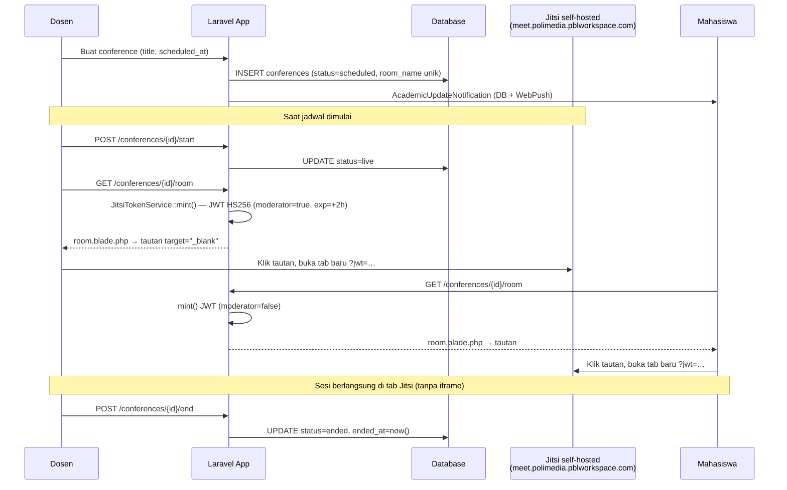
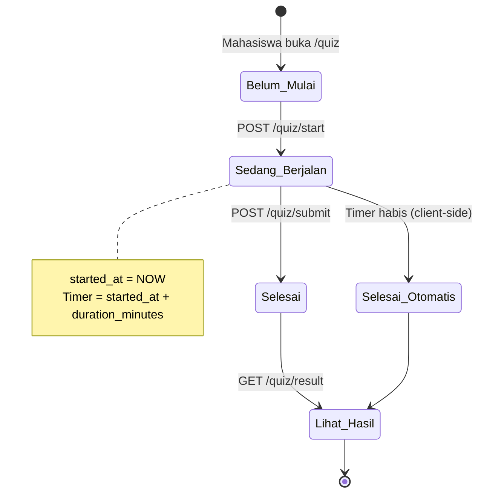
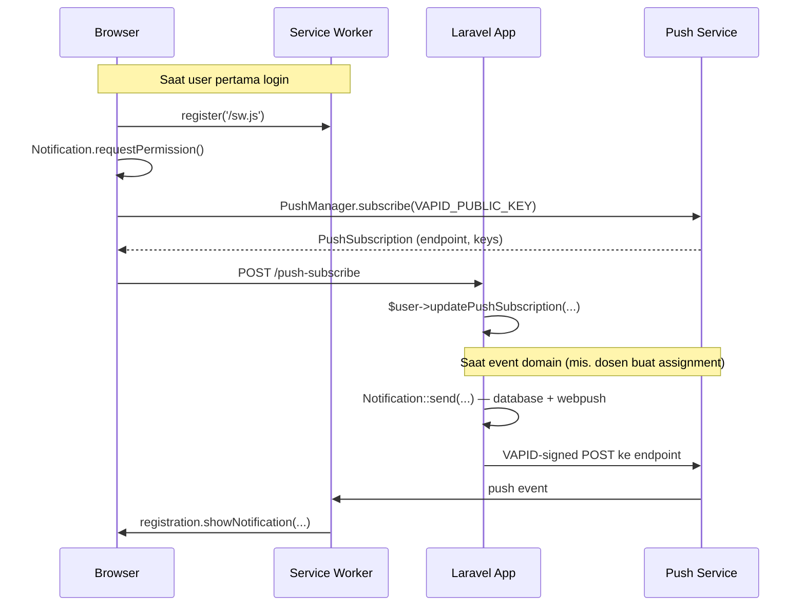

# BAB 4 — Implementasi dan Pengujian Sistem

> Dokumen ini menjelaskan **proses pengembangan dan implementasi** aplikasi **PBL Workspace** secara rinci, ditarik langsung dari kode di `D:\Projects\pjbl\` dan dari lingkungan **produksi yang berjalan** di GCP VM `pjbl-vm`. Cakupannya adalah sistem **sebagaimana benar-benar dijalankan di produksi** — komponen, percobaan, atau rancangan yang sempat dieksplorasi namun tidak dipakai di produksi tidak dibahas. Setiap fakta dapat ditelusuri ke file sumber atau tabel database agar mudah diverifikasi ulang saat menulis naskah BAB 4 final.
>
> Status acuan: kode pada branch `main`, lingkungan produksi diperiksa langsung pada **2026-06-05**.

---

## Daftar Isi

- [4.0 Profil Aplikasi](#40-profil-aplikasi)
- [4.1 Proses Pengembangan](#41-proses-pengembangan)
- [4.2 Lingkungan Implementasi](#42-lingkungan-implementasi)
- [4.3 Arsitektur Sistem](#43-arsitektur-sistem)
- [4.4 Implementasi Basis Data](#44-implementasi-basis-data)
- [4.5 Implementasi Modul per Peran](#45-implementasi-modul-per-peran)
- [4.6 Implementasi Antarmuka Pengguna](#46-implementasi-antarmuka-pengguna)
- [4.7 Implementasi Integrasi Eksternal](#47-implementasi-integrasi-eksternal)
- [4.8 Implementasi Keamanan](#48-implementasi-keamanan)
- [4.9 Deployment Produksi (GCP)](#49-deployment-produksi-gcp)
- [4.10 Pengujian Sistem](#410-pengujian-sistem)
- [Lampiran A — Inventaris Route](#lampiran-a--inventaris-route)
- [Lampiran B — Variabel Lingkungan](#lampiran-b--variabel-lingkungan)
- [Lampiran C — Akun Uji](#lampiran-c--akun-uji)
- [Lampiran D — Daftar Tangkapan Layar](#lampiran-d--daftar-tangkapan-layar)

---

## 4.0 Profil Aplikasi

**PBL Workspace** adalah platform Project-Based Learning berbasis web untuk mendukung pembelajaran berbasis proyek di lingkungan politeknik. Aplikasi melayani tiga peran pengguna — **admin**, **dosen**, dan **mahasiswa** — di atas struktur akademik berjenjang: jurusan (*department*) → program studi (*study program*) → kelas (*student class*) → mata kuliah (*course*).

| Atribut         | Nilai                                                              |
| --------------- | ----------------------------------------------------------------- |
| Nama aplikasi   | PBL Workspace (`APP_NAME`)                                         |
| Domain bisnis   | E-learning / LMS berorientasi project-based learning              |
| Bahasa domain   | Indonesia (`mata_kuliah`, `kode_matkul`, `sks`, `nim`, `nip`)     |
| Pola arsitektur | Monolith MVC, server-rendered (Blade), bukan SPA                  |
| URL produksi    | `https://polimedia.pblworkspace.com`                              |
| Konferensi      | `https://meet.polimedia.pblworkspace.com` (Jitsi self-hosted)     |
| Repository      | Git, branch utama `main`                                          |

---

## 4.1 Proses Pengembangan

### 4.1.1 Pendekatan dan Tahapan

Pengembangan dilakukan secara **iteratif-inkremental** oleh satu pengembang. Urutan pembangunan tercermin dari garis waktu migrasi database (`database/migrations/`) dan riwayat Git, dan dapat diringkas menjadi lima tahap berikut.

1. **Scaffolding autentikasi** — fondasi autentikasi di-*generate* dengan **Laravel Breeze** (Blade stack): registrasi, login, lupa/atur ulang password, verifikasi email, dan halaman profil. Inilah dasar yang kemudian diperluas dengan kolom `role`, alur OTP, dan login admin terpisah.
2. **Pemodelan domain akademik** — entitas hierarki akademik (`academic_years` → `semesters` → `departments` → `study_programs` → `student_classes`) dan inti pembelajaran (`courses`, `enrollments`) dibangun lebih dulu karena seluruh fitur lain bergantung padanya.
3. **Modul per peran** — fitur dibangun per peran di atas domain: modul **Dosen** (materi, tugas/quiz/exercise, penilaian), modul **Mahasiswa** (katalog mata kuliah, pengumpulan, quiz, exercise), dan modul **Admin** (manajemen pengguna, halaman akademik terpadu, observer).
4. **Integrasi eksternal** — kemampuan real-time ditambahkan: konferensi video (**Jitsi self-hosted**), eksekusi kode (**Piston**), notifikasi push (**Web Push/VAPID**), dan email transaksional (**SMTP relay Resend**).
5. **Containerisasi & deployment** — seluruh stack di-*container*-kan dengan **Docker Compose** dan dirilis ke sebuah **GCP Compute Engine VM** dengan **Caddy** sebagai reverse proxy dan terminator TLS.

Beberapa kolom dan fitur berkembang selama proses (mis. `courses.kode_matkul` yang semula *unique* global lalu direlaksasi menjadi *composite unique* untuk mendukung satu dosen mengampu mata kuliah yang sama di beberapa kelas — lihat [4.4.4](#444-detail-tabel-inti)). Garis waktu migrasi menjadi catatan evolusi skema yang otentik.

### 4.1.2 Struktur Repositori

Tata letak mengikuti konvensi Laravel 12 standar:

| Direktori                  | Isi                                                                                   |
| -------------------------- | ------------------------------------------------------------------------------------- |
| `app/Http/Controllers/`    | Controller, dikelompokkan per peran (`Admin/`, `Dosen/`, `Mahasiswa/`, `Auth/`, dst.) |
| `app/Http/Middleware/`     | Middleware kustom (`CheckRole`, `CheckAssignmentUnlocked`)                             |
| `app/Models/`              | Model Eloquent (20 kelas)                                                              |
| `app/Policies/`            | Policy otorisasi (`CoursePolicy`, `AssignmentPolicy`)                                  |
| `app/Services/`            | Service tunggal `JitsiTokenService`                                                    |
| `app/Notifications/`       | 7 kelas notifikasi (channel database / webpush / mail)                                 |
| `app/Livewire/`            | Satu komponen Livewire (`Discussion\Show`)                                             |
| `database/migrations/`     | 25 file migrasi                                                                        |
| `database/seeders/`        | 10 seeder; `database/factories/` 11 factory                                            |
| `resources/views/`         | Template Blade per peran                                                               |
| `resources/{css,js}/`      | Aset frontend yang dibundel Vite                                                       |
| `routes/`                  | `web.php` (route domain) + `auth.php` (route Breeze)                                   |
| `docker/`                  | Dockerfile dependency: `nginx/`, `jitsi/web/` (branding)                               |
| `docs/`                    | Dokumentasi pengembang (termasuk dokumen ini)                                          |

### 4.1.3 Konvensi Kode

Konvensi berikut konsisten di seluruh kode dan menjadi acuan saat menambah fitur baru:

- **Validasi inline di controller**, bukan kelas FormRequest, kecuali dua bawaan auth (`LoginRequest`, `ProfileUpdateRequest`). Controller baru memanggil `$request->validate([...])` langsung.
- **Policy, bukan Gate** — otorisasi per-instance memakai `$this->authorize('view', $course)`. Kebijakan baru ditambahkan sebagai Policy sebelum menambah cek peran di controller.
- **Query pivot langsung** — alur mahasiswa banyak memakai `DB::table('enrollments')->where(...)` alih-alih relasi Eloquent demi performa. Pengecualian: `Mahasiswa\ScheduleController`, `SubmissionController`, dan `DashboardController` memakai relasi `User::enrollments()`.
- **Sibling courses & fan-out** — form pembuatan materi/tugas/konferensi dosen menyertakan pemilih kelas sibling; aksi `store()` memproses record utama lalu menyalin ke kelas sibling yang dipilih, selalu meng-*intersect* `sibling_ids` dengan `$course->siblings()` sebagai pengaman.
- **Dispatch notifikasi langsung** — tidak ada `NotificationService`; controller memanggil `Notification::send($users, new XxxNotification(...))` atau `$user->notify(...)`.

### 4.1.4 Alur Build dan Format Kode

- **PHP**: format dengan `vendor/bin/pint` (PSR-12).
- **Frontend**: Vite mem-bundle JS dan CSS; `npm run dev` untuk HMR, `npm run build` untuk produksi.
- **Dev runner**: `composer dev` menjalankan empat proses paralel (`php artisan serve`, `queue:listen`, `pail`, `vite`).
- **Cache produksi**: `composer optimize` (config + route + view + event cache) dijalankan setelah setiap deploy.

---

## 4.2 Lingkungan Implementasi

### 4.2.1 Perangkat Lunak dan Versi

| Kategori              | Perangkat Lunak                                                        | Versi               |
| --------------------- | --------------------------------------------------------------------- | ------------------- |
| Bahasa backend        | PHP                                                                    | ≥ 8.2               |
| Framework backend     | Laravel                                                                | 12.x                |
| Build tool frontend   | Vite                                                                   | 7.0.7               |
| Manajer paket PHP     | Composer                                                               | 2.x                 |
| Manajer paket JS      | NPM (Node.js ≥ 18)                                                     | 10.x                |
| Database (produksi)   | MySQL (`mysql:8.0`)                                                    | 8.x                 |
| Database (testing)    | SQLite in-memory                                                       | bawaan PHP          |
| Web server (produksi) | Nginx (`nginx:alpine`) di belakang Caddy                              | —                   |
| Reverse proxy / TLS   | Caddy (`caddy:2-alpine`, container)                                    | 2.x                 |
| OS host produksi      | Debian 12 (bookworm)                                                   | —                   |
| Session & Cache       | Database (produksi)                                                    | —                   |
| Queue driver          | `sync` (produksi — dispatch inline, lihat [4.7.7](#477-dispatch-notifikasi-langsung)) | —   |
| Broadcast driver      | `log` (belum ada Pusher/Reverb)                                        | —                   |

### 4.2.2 Dependensi Inti

**Backend (`composer.json`):**

| Paket                                   | Versi | Fungsi                                                             |
| --------------------------------------- | ----- | ------------------------------------------------------------------ |
| `laravel/framework`                     | ^12.0 | Framework MVC inti                                                 |
| `livewire/livewire`                     | ^3.x  | Komponen reaktif (hanya untuk thread diskusi)                      |
| `laravel/breeze`                        | (dev) | Scaffolding autentikasi                                            |
| `laravel-notification-channels/webpush` | ^10.5 | Notifikasi push W3C berbasis VAPID                                 |
| `firebase/php-jwt`                      | ^7.0  | Penanda-tangan JWT HS256 untuk Jitsi (`JitsiTokenService::mint`)   |
| `pestphp/pest`                          | ^3.8  | Test runner (Pest di atas PHPUnit)                                 |
| `laravel/pint`                          | ^1.24 | PHP code formatter (PSR-12)                                        |
| `laravel/pail`                          | —     | Real-time log tail untuk dev                                       |
| `laravel/dusk`                          | (dev) | Browser testing E2E                                               |

**Frontend (`package.json`):**

| Paket                 | Versi    | Fungsi                                                                  |
| --------------------- | -------- | ---------------------------------------------------------------------- |
| `alpinejs`            | ^3.4.2   | Reaktivitas UI ringan (modal, dropdown, sidebar)                       |
| `tailwindcss`         | ^3.1.0   | Utility-first CSS framework                                            |
| `@tailwindcss/forms`  | —        | Reset styling form                                                     |
| `vite`                | ^7.0.7   | Bundler & dev server (HMR)                                             |
| `laravel-vite-plugin` | ^2.0.0   | Integrasi Laravel ↔ Vite                                               |
| `codemirror`          | ^5.65.20 | Editor kode untuk modul exercise (HTML/CSS/JS/Java/PHP/C#)             |
| `easymde`             | ^2.20.0  | Markdown editor untuk pembuatan materi oleh dosen                      |
| `marked`              | ^17.0.1  | Parser Markdown → HTML di sisi klien                                   |
| `highlight.js`        | ^11.11.1 | Syntax highlighting konten ter-render                                  |
| `axios`               | ^1.11.0  | HTTP client (CSRF-aware)                                               |
| `chart.js`            | ^4.4.0   | Grafik analitik dashboard (admin, dosen, mahasiswa)                    |
| `concurrently`        | —        | Menjalankan banyak proses dev paralel                                  |
| `fast-glob`           | ^3.3.0   | Resolusi entry point CSS per halaman                                   |

### 4.2.3 Skrip Pengembangan

| Perintah                 | Tujuan                                                                                             |
| ------------------------ | ------------------------------------------------------------------------------------------------- |
| `composer setup`         | Setup awal: install deps, salin `.env`, generate key, migrate, install npm, build aset, optimize  |
| `composer dev`           | 4 proses paralel: `serve`, `queue:listen`, `pail`, `vite`                                          |
| `composer optimize`      | Cache config + route + view + event — wajib setelah setiap deploy produksi                         |
| `composer test`          | `config:clear` + `php artisan test` (Pest)                                                         |
| `vendor/bin/pint`        | Format kode PHP (PSR-12)                                                                           |
| `npm run dev` / `build`  | Vite dev server (HMR) / build aset produksi                                                        |
| `npm run audit:contrast` | Audit kontras WCAG design system (`scripts/audit-contrast.mjs`)                                    |

### 4.2.4 Variabel Lingkungan

Seluruh variabel terdokumentasi di `.env.example` (secret berisi placeholder kosong). Ringkasan kelompok wajib:

- **Bawaan Laravel**: `APP_NAME`, `APP_KEY`, `APP_URL`, `DB_*`, `SESSION_*`, `MAIL_*`.
- **Konferensi (Jitsi)**: `JITSI_DOMAIN`, `JITSI_JWT_APP_ID`, `JITSI_JWT_APP_SECRET` — ketiganya wajib; `JitsiTokenService::mint()` melempar `RuntimeException` bila app_id atau secret kosong.
- **Push**: `VAPID_PUBLIC_KEY`, `VAPID_PRIVATE_KEY`, `VAPID_SUBJECT`.
- **Eksekusi kode**: `PISTON_URL` (default `http://piston:2000/api/v2`), `PISTON_TIMEOUT` (default 10 detik).

Daftar lengkap beserta default ada di [Lampiran B](#lampiran-b--variabel-lingkungan).

---

## 4.3 Arsitektur Sistem

### 4.3.1 Pola Arsitektur

Aplikasi mengikuti pola **Model-View-Controller (MVC)** bawaan Laravel, ditambah lapisan **Policy** (otorisasi) dan satu lapisan **Service** minimal (`JitsiTokenService`, khusus minting JWT konferensi). Aplikasi adalah **monolith server-rendered** — HTML dirender di server dengan Blade, interaktivitas tipis di klien menggunakan Alpine.js.

Catatan arsitektur penting:

- Hanya **satu** komponen Livewire di seluruh aplikasi (`app/Livewire/Discussion/Show.php`); selebihnya Blade biasa. Tidak menggunakan Inertia.js, Vue, atau React.
- Alur mahasiswa memakai **query pivot langsung** untuk performa (lihat [4.1.3](#413-konvensi-kode)).

### 4.3.2 Diagram Arsitektur Produksi



Seluruh komponen berjalan pada **satu VM** melalui Docker Compose. **Caddy berjalan sebagai container** (`pjbl-caddy`) yang menerminasi TLS dan mereverse-proxy ke service lain **berdasarkan nama container** di jaringan Docker (`pjbl-web:80`, `jitsi-web:80`). Detail lengkap di [4.9](#49-deployment-produksi-gcp).

### 4.3.3 Pembagian Tanggung Jawab Lapisan

| Lapisan       | Lokasi                                                | Tanggung Jawab                                                              |
| ------------- | ----------------------------------------------------- | -------------------------------------------------------------------------- |
| Routing       | `routes/web.php`, `routes/auth.php`                   | Mendaftarkan endpoint per peran (`/admin`, `/dosen`, `/mahasiswa`)         |
| Middleware    | `app/Http/Middleware/`                                | Otorisasi peran (`CheckRole`), prasyarat tugas (`CheckAssignmentUnlocked`) |
| Controllers   | `app/Http/Controllers/{Admin,Dosen,Mahasiswa,Auth}/`  | Validasi inline, orkestrasi domain, render view                            |
| Policies      | `app/Policies/`                                       | Otorisasi granular per-instance                                            |
| Services      | `app/Services/`                                       | `JitsiTokenService` — minting JWT HS256                                    |
| Models        | `app/Models/`                                         | Eloquent ORM, relasi, accessor/mutator                                     |
| Notifications | `app/Notifications/`                                  | Channel database, mail, dan webpush                                        |
| Views         | `resources/views/`                                    | Template Blade per peran                                                   |
| Aset Frontend | `resources/{css,js}/`                                 | Bundling Vite                                                              |

### 4.3.4 Pemetaan URL → Peran



### 4.3.5 Optimasi Performa dan Caching

| Lokasi                 | Strategi                                                                          | TTL / Invalidasi                                          |
| ---------------------- | -------------------------------------------------------------------------------- | --------------------------------------------------------- |
| `SidebarComposer`      | `Cache::remember("sidebar:dosen:{id}", 300, ...)` — daftar course dosen          | 5 menit; di-flush saat `Course` create/update/delete      |
| `Course::booted()`     | `Cache::forget("sidebar:dosen:{dosen_id}")` di event create/update/delete        | Per event                                                 |
| `Discussion::booted()` | `Cache::forget('discussions:index:sidebar')` di event create/update/delete       | Per event                                                 |
| `Course::siblings()`   | Memoized di properti instance (`$cachedSiblings`) selama satu request            | Request lifecycle                                         |

---

## 4.4 Implementasi Basis Data

### 4.4.1 Ringkasan

- **Total tabel**: 30 (24 domain + 6 framework)
- **File migrasi**: 25 (`database/migrations/`)
- **Model Eloquent**: 20 — **Seeder**: 10 — **Factory**: 11
- **Konvensi penamaan**: tabel `snake_case_plural`, kolom `snake_case`. Istilah domain Indonesia dipertahankan (`mata_kuliah` → `nama_matkul`/`kode_matkul`, `mahasiswa_id`, `dosen_id`, `nim`, `nip`, `sks`).

### 4.4.2 Diagram Hubungan Antar Entitas (ERD)

ERD berikut menampilkan **entitas inti domain** (mengabaikan tabel framework seperti `cache`, `jobs`, `sessions`, `notifications`, `password_reset_tokens`).



### 4.4.3 Daftar Tabel

| #   | Tabel                   | Domain       | Deskripsi                                                            |
| --- | ----------------------- | ------------ | -------------------------------------------------------------------- |
| 1   | `users`                 | Auth         | Akun pengguna; kolom `role` membedakan admin/dosen/mahasiswa         |
| 2   | `password_reset_tokens` | Auth         | Token reset password                                                 |
| 3   | `sessions`              | Auth         | Session berbasis DB                                                  |
| 4   | `cache`                 | Framework    | Cache key-value                                                      |
| 5   | `cache_locks`           | Framework    | Atomic locks                                                         |
| 6   | `jobs`                  | Framework    | Queue jobs                                                           |
| 7   | `job_batches`           | Framework    | Batch jobs                                                           |
| 8   | `failed_jobs`           | Framework    | Job gagal                                                            |
| 9   | `academic_years`        | Akademik     | Tahun ajaran                                                         |
| 10  | `semesters`             | Akademik     | Semester per tahun ajaran                                            |
| 11  | `departments`           | Akademik     | Jurusan                                                              |
| 12  | `study_programs`        | Akademik     | Program studi                                                        |
| 13  | `student_classes`       | Akademik     | Kelas mahasiswa                                                      |
| 14  | `courses`               | Pembelajaran | Mata kuliah                                                          |
| 15  | `enrollments`           | Pembelajaran | Pivot mahasiswa ↔ mata kuliah + nilai akhir                          |
| 16  | `materials`             | Pembelajaran | Materi (markdown + lampiran)                                         |
| 17  | `material_views`        | Tracking     | Catatan baca materi (gating prasyarat)                              |
| 18  | `assignments`           | PBL          | Tugas/quiz/exercise (kolom `type`)                                   |
| 19  | `submissions`           | PBL          | Pengumpulan (file/url/quiz/code)                                     |
| 20  | `groups`                | PBL          | Kelompok tugas                                                       |
| 21  | `group_members`         | PBL          | Anggota kelompok                                                     |
| 22  | `quiz_questions`        | PBL          | Soal quiz (essay/pilihan ganda/code snippet)                        |
| 23  | `quiz_options`          | PBL          | Opsi jawaban pilihan ganda                                          |
| 24  | `conferences`           | Konferensi   | Jadwal kelas virtual (Jitsi room)                                   |
| 25  | `discussions`           | Kolaborasi   | Thread diskusi per topik                                            |
| 26  | `discussion_comments`   | Kolaborasi   | Komentar thread                                                     |
| 27  | `announcements`         | Komunikasi   | Pengumuman (broadcast/per peran/per user)                          |
| 28  | `announcement_user`     | Pivot        | Penargetan pengumuman ke user spesifik                             |
| 29  | `notifications`         | Notifikasi   | Notifikasi DB polymorphic                                          |
| 30  | `push_subscriptions`    | Notifikasi   | Subscription Web Push polymorphic                                  |

### 4.4.4 Detail Tabel Inti

##### `users`

| Kolom              | Tipe        | Null | Default     | Catatan                                       |
| ------------------ | ----------- | ---- | ----------- | --------------------------------------------- |
| `id`               | bigint      | No   | auto        | PK                                            |
| `name`             | string(255) | No   | —           |                                               |
| `email`            | string(255) | No   | —           | UNIQUE                                        |
| `email_verified_at`| timestamp   | Yes  | NULL        |                                               |
| `password`         | string(255) | No   | —           | bcrypt hash                                   |
| `role`             | enum        | No   | `mahasiswa` | `mahasiswa`, `dosen`, `admin`                 |
| `nim`              | string(255) | Yes  | NULL        | UNIQUE, identitas mahasiswa                   |
| `nip`              | string(255) | Yes  | NULL        | UNIQUE, identitas dosen                       |
| `sso_id`           | string(255) | Yes  | NULL        | reservasi integrasi SSO kampus                |
| `student_class_id` | foreignId   | Yes  | NULL        | FK → `student_classes.id`, ON DELETE SET NULL |
| `is_active`        | boolean     | No   | `true`      | toggle aktivasi akun                          |
| `otp_code` / `otp_expires_at` / `otp_verified_at` | — | Yes | NULL | alur verifikasi OTP registrasi |

Indeks: `role`, `is_active`, `student_class_id`.

##### `courses`

| Kolom              | Tipe        | Null | Default | Catatan                                       |
| ------------------ | ----------- | ---- | ------- | --------------------------------------------- |
| `id`               | bigint      | No   | auto    | PK                                            |
| `kode_matkul`      | string(255) | No   | —       | kode mata kuliah (composite unique)           |
| `nama_matkul`      | string(255) | No   | —       |                                               |
| `sks`              | integer     | No   | `3`     | satuan kredit semester                        |
| `dosen_id`         | foreignId   | No   | —       | FK → `users.id`, ON DELETE CASCADE            |
| `semester_id`      | foreignId   | Yes  | NULL    | FK → `semesters.id`, ON DELETE SET NULL       |
| `student_class_id` | foreignId   | Yes  | NULL    | FK → `student_classes.id`, ON DELETE SET NULL |
| `course_img`       | string(255) | Yes  | NULL    | path gambar sampul                            |
| `description`      | text        | Yes  | NULL    |                                               |

**Catatan composite unique (sibling courses)**: migrasi `2026_05_14_000001_relax_course_kode_matkul_unique.php` menghapus unique global pada `kode_matkul` dan menggantinya dengan composite unique `(kode_matkul, semester_id, student_class_id)` (`courses_code_semester_class_unique`). Artinya satu dosen dapat mengampu `kode_matkul` yang sama untuk beberapa kelas di semester yang sama — masing-masing menjadi satu baris `courses` (disebut **sibling courses**, lihat `Course::siblings()`). Validasi unik di admin bersifat composite 4-kolom `(kode_matkul, dosen_id, semester_id, student_class_id)`.

##### `enrollments`

| Kolom          | Tipe         | Null | Default           | Catatan                              |
| -------------- | ------------ | ---- | ----------------- | ------------------------------------ |
| `id`           | bigint       | No   | auto              | PK                                   |
| `course_id`    | foreignId    | No   | —                 | FK → `courses.id`, ON DELETE CASCADE |
| `mahasiswa_id` | foreignId    | No   | —                 | FK → `users.id`, ON DELETE CASCADE   |
| `final_grade`  | decimal(5,2) | Yes  | NULL              | nilai akhir                          |
| `enrolled_at`  | timestamp    | No   | CURRENT_TIMESTAMP |                                      |

UNIQUE: (`course_id`, `mahasiswa_id`).

##### `materials` & `material_views`

`materials`: `id`, `course_id` (FK CASCADE), `title`, `content` (markdown, nullable), `file_path` (lampiran, nullable), `order` (int, default 0 — ditata via drag & drop).

`material_views`: `id`, `material_id` (FK CASCADE), `student_id` (FK CASCADE), `viewed_at`. UNIQUE (`material_id`, `student_id`) — satu catatan per mahasiswa per materi, menjadi indikator gating prasyarat.

##### `assignments`

| Kolom                  | Tipe            | Null | Default | Catatan                                                  |
| ---------------------- | --------------- | ---- | ------- | -------------------------------------------------------- |
| `id`                   | bigint          | No   | auto    | PK                                                       |
| `course_id`            | foreignId       | No   | —       | FK → `courses.id`, ON DELETE CASCADE                     |
| `title`                | string(255)     | No   | —       |                                                          |
| `order` / `assignment_number` / `quiz_number` | integer | Yes | — | nomor/urutan tampilan                         |
| `description`          | text            | Yes  | NULL    | markdown                                                 |
| `type`                 | enum            | No   | `tugas` | `tugas`, `quiz`, `exercise`                              |
| `submission_format`    | enum            | No   | `pdf`   | `pdf`, `url` (untuk type `tugas`)                        |
| `exercise_config`      | json            | Yes  | NULL    | konfigurasi coding (bahasa, starter/solution, keywords) |
| `deadline`             | datetime        | No   | —       |                                                          |
| `max_score`            | integer         | No   | `100`   |                                                          |
| `required_material_id` | foreignId       | Yes  | NULL    | FK → `materials.id`, ON DELETE SET NULL — prasyarat baca |
| `duration_minutes`     | integer         | Yes  | NULL    | durasi (quiz timed)                                      |
| `is_group`             | boolean         | No   | `false` | tugas kelompok                                           |
| `max_group_size`       | unsignedInteger | Yes  | NULL    | maksimum anggota grup                                    |
| `grading_mode`         | enum            | No   | `equal` | `equal`, `individual` (tugas grup)                       |

> `exercise_config` adalah kolom JSON cast yang menyimpan `language`, `starter_code`, `solution_code`, `required_keywords`, `hints`. Tidak ada kolom standalone untuk nilai-nilai ini.

##### `submissions`

| Kolom               | Tipe        | Null | Default     | Catatan                                  |
| ------------------- | ----------- | ---- | ----------- | ---------------------------------------- |
| `id`                | bigint      | No   | auto        | PK                                       |
| `assignment_id`     | foreignId   | No   | —           | FK → `assignments.id`, ON DELETE CASCADE |
| `mahasiswa_id`      | foreignId   | No   | —           | FK → `users.id`, ON DELETE CASCADE       |
| `group_id`          | foreignId   | Yes  | NULL        | FK → `groups.id`, ON DELETE SET NULL     |
| `file_path`         | string(255) | Yes  | NULL        | jika `submission_format=pdf`             |
| `url_link`          | string(255) | Yes  | NULL        | jika `submission_format=url`             |
| `code_answer`       | text        | Yes  | NULL        | jika `type=exercise`                     |
| `answers`           | json        | Yes  | NULL        | jawaban quiz (key: question_id)          |
| `validation_result` | json        | Yes  | NULL        | hint validasi mesin (lihat 4.5.3)        |
| `notes` / `feedback`| text        | Yes  | NULL        | catatan mahasiswa / umpan balik dosen    |
| `submitted_at` / `started_at` / `finished_at` | timestamp | Yes | NULL | jejak waktu (quiz: mulai/selesai) |
| `score`             | integer     | Yes  | NULL        |                                          |
| `auto_graded`       | boolean     | No   | `false`     |                                          |
| `status`            | enum        | No   | `submitted` | `submitted`, `late`, `graded`            |

##### `groups`, `group_members`, `quiz_questions`, `quiz_options`

- `groups`: `id`, `assignment_id` (FK CASCADE), `group_name`, `created_by_mahasiswa_id` (FK SET NULL).
- `group_members`: `id`, `group_id` (FK CASCADE), `mahasiswa_id` (FK CASCADE). UNIQUE (`group_id`, `mahasiswa_id`).
- `quiz_questions`: `id`, `assignment_id` (FK CASCADE), `question_text`, `question_type` (`essay`/`pilihan_ganda`/`code_snippet`), `correct_answer` (NULL untuk essay), `score_weight` (default 1).
- `quiz_options`: `id`, `question_id` (FK CASCADE), `option_text`, `is_correct` (default false).

##### `conferences`

| Kolom          | Tipe        | Null | Default     | Catatan                              |
| -------------- | ----------- | ---- | ----------- | ------------------------------------ |
| `id`           | bigint      | No   | auto        | PK                                   |
| `course_id`    | foreignId   | No   | —           | FK → `courses.id`, ON DELETE CASCADE |
| `dosen_id`     | foreignId   | No   | —           | FK → `users.id`, ON DELETE CASCADE   |
| `title` / `description` | string/text | —  | —      |                                      |
| `room_name`    | string(255) | No   | —           | UNIQUE — identifier Jitsi room       |
| `scheduled_at` | datetime    | No   | —           | jadwal mulai                         |
| `ended_at`     | datetime    | Yes  | NULL        | timestamp berakhir                   |
| `status`       | enum        | No   | `scheduled` | `scheduled`, `live`, `ended`         |

##### `discussions`, `announcements`, dan tabel notifikasi

- `discussions`: `id`, `user_id` (FK), `topic`, `title`, `content`. `discussion_comments`: `id`, `discussion_id` (FK CASCADE), `user_id` (FK CASCADE), `content`.
- `announcements`: `id`, `user_id` (penulis), `title`, `content`, `target_audience` (`all`/`dosen`/`mahasiswa`/`specific`), `attachment_path`/`name`/`mime`. Pivot `announcement_user` (id, announcement_id, user_id; UNIQUE) untuk audience `specific`.
- `notifications` (default Laravel, PK uuid): `type`, `notifiable_type`/`id` (morph), `data` (JSON), `read_at`.
- `push_subscriptions` (paket webpush): `subscribable_type`/`id` (morph), `endpoint` (UNIQUE), `public_key`, `auth_token`, `content_encoding`.

### 4.4.5 Daftar Enum

| Tabel.Kolom                     | Nilai                                    |
| ------------------------------- | ---------------------------------------- |
| `users.role`                    | `mahasiswa`, `dosen`, `admin`            |
| `study_programs.level`          | `D3`, `D4`, `S1`, `S2`, `S3`             |
| `assignments.type`              | `tugas`, `quiz`, `exercise`              |
| `assignments.submission_format` | `pdf`, `url`                             |
| `assignments.grading_mode`      | `equal`, `individual`                    |
| `submissions.status`            | `submitted`, `late`, `graded`            |
| `quiz_questions.question_type`  | `essay`, `pilihan_ganda`, `code_snippet` |
| `announcements.target_audience` | `all`, `dosen`, `mahasiswa`, `specific`  |
| `conferences.status`            | `scheduled`, `live`, `ended`             |

### 4.4.6 Seeder dan Factory

| Seeder               | Fungsi                                                                             |
| -------------------- | ---------------------------------------------------------------------------------- |
| `DatabaseSeeder`     | Orchestrator — memanggil seeder lain berurutan                                     |
| `AcademicYearSeeder` | Tahun ajaran aktif                                                                 |
| `SemesterSeeder`     | Semester aktif untuk tahun ajaran tersebut                                         |
| `DepartmentSeeder`   | Jurusan                                                                            |
| `StudyProgramSeeder` | Program studi                                                                      |
| `StudentClassSeeder` | Kelas mahasiswa                                                                    |
| `UserSeeder`         | 1 admin, 3 dosen, 6 mahasiswa dengan kredensial tetap                              |
| `CourseSeeder`       | Mata kuliah + materi + tugas + enrollment                                          |
| `AssignmentSeeder`   | 5 tipe tugas per mata kuliah (PDF/URL, quiz, essay, exercise)                      |
| `DummyDataSeeder`    | Data uji komprehensif (mahasiswa tambahan + sebaran kelas)                         |

Factory: `UserFactory`, `AcademicYearFactory`, `SemesterFactory`, `CourseFactory`, `MaterialFactory`, `AssignmentFactory`, `SubmissionFactory`, `ConferenceFactory`, `DepartmentFactory`, `StudyProgramFactory`, `StudentClassFactory`.

> Catatan produksi: database live tidak identik dengan seeder penuh — data diisi bertahap. Akun uji default ada di [Lampiran C](#lampiran-c--akun-uji).

---

## 4.5 Implementasi Modul per Peran

Total **36 controller** (10 Auth Breeze, 12 Admin, 6 Dosen, 8 Mahasiswa, 6 Bersama) dan ±140 endpoint. Daftar lengkap di [Lampiran A](#lampiran-a--inventaris-route).

### 4.5.1 Modul Admin

Akses: `role = admin` (prefix `/admin`, middleware `auth` + `role:admin`).

- **Autentikasi terpisah**: login admin di `/admin/login` (`Admin\Auth\LoginController`) — login dengan akun non-admin langsung di-logout dengan error.
- **Dashboard**: statistik (jumlah user per role, jumlah course) + grafik Chart.js (line aktivitas 30 hari, donut distribusi peran).
- **Manajemen Pengguna** (`UserController`): CRUD; filter search/role/status; bulk delete; toggle aktif/nonaktif (dipakai untuk meng-*approve* akun dosen).
- **Halaman Akademik Terpadu** (`AkademikController` di `/admin/akademik`): satu halaman tunggal dengan seleksi query-string (`?ay`, `?sem`, `?dep`, `?prog`) untuk mengelola seluruh tingkat hierarki — tahun ajaran, semester (validasi `name ∈ {Ganjil, Genap}`), department/study program/student class CRUD, assign mahasiswa ke kelas, dan tambah/hapus mata kuliah dengan `scope` `semester`/`class`. URL legacy `/admin/hierarchy/*` di-redirect permanen ke sini.
- **Mata Kuliah** (`CourseController`): CRUD + enroll/unenroll; validasi unik composite 4-kolom.
- **Nilai** (`GradeController`): rekap nilai lintas course (read-only) dengan filter semester/tahun ajaran/dosen.
- **Konferensi Observer** (`Admin\ConferenceController`): daftar seluruh konferensi, masuk room sebagai moderator, *force-end*.
- **Push Debug** (`PushDebugController`): uji push di `/admin/debug/push`.

### 4.5.2 Modul Dosen

Akses: `role = dosen` (prefix `/dosen`).

- **Dashboard**: course yang diajar, jumlah mahasiswa, deadline, bar chart submission 7 hari, penghitung pengumpulan menunggu review (`score = null`).
- **Materi** (`MaterialController`): CRUD per course + reorder drag-and-drop; editor Markdown EasyMDE; fan-out kopi ke sibling kelas.
- **Tugas/Quiz/Exercise** (`AssignmentController`): CRUD lintas tiga tipe; manajemen soal quiz; daftar submission; penilaian individu (`/submissions/{submission}/grade`) atau grup (`/groups/{group}/grade`); detail percobaan quiz.
- **Exercise (Coding)** (`ExerciseController`): form terpisah dengan editor CodeMirror dan `exercise_config`.
- **Konferensi** (`ConferenceController`): CRUD jadwal + start/end + room view.
- **Nilai** (`GradeController`): rekap per course dikelompokkan per `course_group_key` (sibling), `export` CSV per kelas, dan `quickGrade` (PATCH JSON inline grade — `updateOrCreate` submission).

**Diagram alur — Pembuatan Tugas dan Pengumpulan:**



**Diagram sekuens — Konferensi Virtual (Jitsi self-hosted):**



### 4.5.3 Modul Mahasiswa

Akses: `role = mahasiswa` (prefix `/mahasiswa`).

- **Dashboard**: course diikuti, deadline mendatang, pengumuman; dua grafik Chart.js (line aktivitas submission pribadi 30 hari, histogram distribusi skor).
- **Course** (`CourseController`): daftar/detail course, enroll mandiri, buka materi (mencatat `material_views`).
- **Submission** (`SubmissionController`, dilindungi `check.assignment.unlocked`): create/store/edit/update/destroy, validasi tipe sesuai assignment.
- **Quiz** (`QuizController`, timed): show → start (`started_at`) → take → submit (`finished_at`, hitung skor MC) → result.
- **Exercise** (`ExerciseController`, dilindungi `check.assignment.unlocked`): solve (CodeMirror) → submit (eksekusi via Piston, simpan `validation_result`).
- **Konferensi**: list per course, join room.
- **Nilai**: rekap nilai diri sendiri.
- **Jadwal** (`ScheduleController`, GET `/mahasiswa/jadwal`): timeline konferensi + deadline tugas mendatang lintas course yang di-enroll, dengan urgency coloring dan badge "Sudah Submit".

> **Penilaian exercise tidak otomatis**: `ExerciseController::submit` menjalankan `validateCode()` (pencocokan keyword) hanya sebagai *hint* yang disimpan di `submissions.validation_result`; skor dibiarkan null (`status='submitted'`). Dosen menilai manual. **Quiz auto-grading sebagian**: soal pilihan ganda dinilai otomatis; `status='graded'` hanya bila tidak ada soal essay/code_snippet, selain itu `status='submitted'` menunggu review dosen.

**Diagram state — Quiz Timed:**



### 4.5.4 Modul Bersama

Tersedia untuk semua peran yang login (middleware `auth`).

| Fitur                 | Endpoint Utama                              | Controller                                                       |
| --------------------- | ------------------------------------------- | ---------------------------------------------------------------- |
| Profil                | `GET/PATCH/DELETE /profile`                 | `ProfileController` (memakai `ProfileUpdateRequest`)             |
| Notifikasi            | `GET /notifications`, mark-read, redirect   | `NotificationController`                                         |
| Eksekusi Kode         | `POST /execute-code` (throttle 10/menit)    | `CodeExecutionController` — proxy ke Piston                      |
| Web Push Subscription | `POST /push-subscribe`, `/push-unsubscribe` | `PushSubscriptionController`                                     |
| Diskusi               | `Route::resource('discussions', ...)`       | `DiscussionController` (+ Livewire `Discussion\Show`)            |
| Pengumuman            | `Route::resource('announcements', ...)`     | `AnnouncementController` (gate visibilitas per peran)            |

**Diagram sekuens — Notifikasi Push:**



---

## 4.6 Implementasi Antarmuka Pengguna

### 4.6.1 Tata Letak

| Layout                            | File                                      | Pemakaian                                                              |
| --------------------------------- | ----------------------------------------- | --------------------------------------------------------------------- |
| `<x-app-layout>`                  | `resources/views/layouts/app.blade.php`   | Halaman setelah login — sidebar, topbar, bell notifikasi, bootstrap Web Push |
| `<x-guest-layout>`                | `resources/views/layouts/guest.blade.php` | Halaman tamu (login, register, lupa password, verify-otp)             |
| `layouts/sidebar.blade.php`       | partial                                   | Sidebar collapsible, di-compose `SidebarComposer`                     |
| `layouts/topbar.blade.php`        | partial                                   | Topbar + dropdown profil                                              |
| `layouts/notifications.blade.php` | partial                                   | Bell + dropdown (`unreadNotifications`)                              |

### 4.6.2 Komponen Reusable

Lokasi: `resources/views/components/` (Anonymous Components). Inti: `<x-application-logo>`, `<x-input-label>`, `<x-input-error>`, `<x-text-input>`, `<x-primary-button>` / `<x-secondary-button>` / `<x-danger-button>`, `<x-modal>` (Alpine, focus trap + ESC), `<x-dropdown>` + `<x-dropdown-link>`, `<x-nav-link>` + `<x-responsive-nav-link>`, `<x-auth-session-status>`, `<x-assignment-card>` (kartu tugas/quiz/exercise), serta `<x-copy-modal>` (modal salin konten ke sibling kelas). `app/View/Components/`: `AppLayout` → `layouts.app`, `GuestLayout` → `layouts.guest`.

### 4.6.3 Komponen Livewire

Satu-satunya: **`App\Livewire\Discussion\Show`** — render thread diskusi + form komentar reaktif (`resources/views/livewire/discussion/show.blade.php`), validasi `content` max 1000 karakter. Komponen ini memiliki daftar komentar + form di dalam dirinya (parent tidak me-render `$discussion->comments`).

### 4.6.4 Editor Khusus

| Modul           | Library                   | Entry                  | Pemakaian                                                                                     |
| --------------- | ------------------------- | ---------------------- | -------------------------------------------------------------------------------------------- |
| Markdown editor | EasyMDE                   | `markdown-editor.js`   | Pembuatan materi (`materials/create`, `edit`)                                                |
| Code editor     | CodeMirror 5              | `code-editor.js`       | Pembuatan exercise (dosen) + pengerjaan exercise (mahasiswa)                                  |
| Markdown render | `marked` + `highlight.js` | `markdown-renderer.js` | Render materi & deskripsi tugas di klien                                                      |
| Grafik analitik | Chart.js 4                | `charts.js`            | Dashboard admin/dosen/mahasiswa                                                               |
| Konferensi      | — (tanpa bundle)          | —                      | `conferences/room.blade.php` hanya merender tautan `target="_blank"` ke `?jwt=…`; tanpa iframe/SDK |

Mode CodeMirror aktif: HTML, CSS, JavaScript, htmlmixed, Java, PHP, C#. Bahasa client-side (HTML/CSS/JS) dieksekusi di iframe sandbox browser tanpa request server; bahasa server-side (Java/PHP/C#) dikirim ke `/execute-code` yang mem-proxy ke Piston ([4.7.3](#473-piston-eksekusi-kode)).

### 4.6.5 Sistem Desain

Lokasi: `tailwind.config.js`, `resources/css/design-system.css`, `resources/css/pages/**/*.css`.

- Plugin: `@tailwindcss/forms`.
- Palet Material 3: `primary #004ac6`, `secondary #006c49`, `tertiary #3e3fcc`.
- Tipografi: Manrope (heading), Inter (body).
- Custom shadow (`shadow-ambient`, `shadow-ambient-lg`), skala border-radius kustom, dark mode class-based.
- Per-page CSS digabung otomatis oleh Vite via `fast-glob` (`vite.config.js`).
- Audit kontras WCAG: `npm run audit:contrast`.

### 4.6.6 Inventaris View

| Direktori              | ± file | Fungsi                                                   |
| ---------------------- | ------ | -------------------------------------------------------- |
| `layouts/`             | 6      | Layout utama dan partial                                 |
| `components/`          | 14+    | Komponen Blade reusable                                  |
| `auth/`                | 6      | Halaman autentikasi                                      |
| `admin/`               | 30     | Dashboard, CRUD, akademik                                |
| `dosen/`               | 23     | Dashboard, materials, assignments, conferences           |
| `mahasiswa/`           | 14     | Dashboard, courses, submissions, quiz, exercise          |
| `discussions/`         | 5      | Halaman diskusi                                          |
| `announcements/`       | 4      | Halaman pengumuman                                       |
| `notifications/`       | 1      | Daftar notifikasi                                        |
| `profile/`             | 3      | Partial form profil                                      |
| `livewire/discussion/` | 1      | View komponen Livewire diskusi                           |

---

## 4.7 Implementasi Integrasi Eksternal

### 4.7.1 Ringkasan Integrasi

| Integrasi             | Tujuan                                  | Env Vars                                                  |
| --------------------- | --------------------------------------- | -------------------------------------------------------- |
| Jitsi (self-hosted)   | Konferensi virtual real-time            | `JITSI_DOMAIN`, `JITSI_JWT_APP_ID`, `JITSI_JWT_APP_SECRET` |
| Piston (container)    | Eksekusi kode server-side (Java/PHP/C#) | `PISTON_URL`, `PISTON_TIMEOUT`                           |
| Web Push (W3C VAPID)  | Notifikasi push real-time               | `VAPID_PUBLIC_KEY`, `VAPID_PRIVATE_KEY`, `VAPID_SUBJECT` |
| SMTP relay (Resend)   | Email reset password + OTP              | `MAIL_HOST`, `MAIL_PORT`, `MAIL_USERNAME`, `MAIL_PASSWORD` |

### 4.7.2 Jitsi (self-hosted)

Konferensi video di-*host* sendiri menggunakan stack **`docker-jitsi-meet`** (Prosody + Jicofo + JVB + web; image `jitsi/*:stable-9909`) di VM yang sama dengan aplikasi, pada subdomain `meet.polimedia.pblworkspace.com`. Pendekatan self-hosting menjamin kendali data dan tanpa biaya per-menit layanan pihak ketiga.

**Topologi**: Container web Jitsi dijalankan dengan `DISABLE_HTTPS=1` dan terikat ke `127.0.0.1:8080`; ia bergabung ke jaringan Docker aplikasi (`pjbl_pjbl-network`, alias `jitsi-web`) sehingga container Caddy dapat menjangkaunya dengan nama. Media JVB mengalir langsung melalui **UDP 10000**; untuk peserta di balik NAT ketat, relay **coturn** (`pjbl-coturn`, port 3478 udp/tcp) menjadi fallback. Detail deployment di [4.9.4](#494-jitsi-dan-coturn).

**Otentikasi**: Hanya token yang valid dapat masuk room (`ENABLE_AUTH=1`, `ENABLE_GUESTS=0`, `AUTH_TYPE=jwt`, `JWT_APP_ID=pjbl`). JWT ditandatangani **HS256** dengan shared secret yang identik antara aplikasi Laravel (`JITSI_JWT_APP_SECRET`) dan server Jitsi (`JWT_APP_SECRET`). Klaim token:

- `iss` = `aud` = `JITSI_JWT_APP_ID` (`pjbl`)
- `sub` = `JITSI_DOMAIN`
- `room` = `conferences.room_name`
- `context.user` = `name`, `email`, dan `moderator` (`true` untuk dosen/admin, `false` untuk mahasiswa)
- `iat`/`nbf`/`exp` — umur 2 jam

**`ENABLE_AUTO_OWNER=0`** wajib: bila `1` (default), peserta pertama otomatis dipromosikan menjadi moderator tanpa memandang token — sehingga mahasiswa yang join sebelum dosen bisa menjadi moderator. Dengan dimatikan, moderator hanya ditentukan klaim token; dosen tetap dapat memberi moderator dalam-panggilan secara manual.

**Implementasi sisi aplikasi**:

- `app/Services/JitsiTokenService::mint($room, $userId, $name, $moderator, $email)` — dipanggil method `room()` pada tiga controller (`Admin\`, `Dosen\`, `Mahasiswa\ConferenceController`). Melempar `RuntimeException` bila env var hilang.
- View room (`resources/views/{admin,dosen,mahasiswa}/conferences/room.blade.php`) **tidak memakai iframe atau bundle JS**; ia hanya merangkai URL `https://{JITSI_DOMAIN}/{room_name}?jwt={jwt}` dan menampilkannya sebagai tautan `target="_blank"`. Jitsi terbuka di tab baru.
- **SSO tokenless**: `ConferenceJoinController@jitsiAuth` (route `conferences.jitsi-auth`, behind `auth`) menjadi target `tokenAuthUrl` Jitsi. Pengunjung yang membuka tautan *Share* Jitsi tanpa token diarahkan ke PBL, login dengan akunnya, lalu dikembalikan ke room dengan JWT yang baru di-mint (verifikasi akses sama: admin / dosen pemilik / mahasiswa enrolled; non-anggota dapat 403, konferensi berakhir dapat 410).

### 4.7.3 Piston (Eksekusi Kode)

Piston ([engineer-man/piston](https://github.com/engineer-man/piston)) adalah sandbox eksekusi kode multi-bahasa. Container-nya ikut di-bundle (`pjbl-piston`, `privileged: true`, tmpfs `/piston/jobs`, volume persisten `/piston/packages`).

- **Endpoint**: `POST /execute-code` (`auth`, throttle `10,1` — 10/menit/user) → `CodeExecutionController@execute`.
- **Validasi**: `code` required string max 50000; `language` dalam allowlist `config('code_execution.piston_language_map')` — `java`, `php`, `csharp`.
- **Request ke Piston**: `POST {PISTON_URL}/execute` body `{language, version:'*', files:[{content}]}`.
- **Response ke klien**: `{stdout, stderr, exit_code}`; pada kegagalan koneksi/non-2xx → `{stdout:'', stderr:'Execution service unavailable.', exit_code:-1}` dengan HTTP 502.
- **Client-side** (HTML/CSS/JS) dijalankan di iframe `srcdoc` sandbox di browser tanpa request server.
- **Konfigurasi**: `PISTON_URL` default `http://piston:2000/api/v2` (container internal); `PISTON_TIMEOUT` default 10 detik.

### 4.7.4 Web Push (W3C Push API + VAPID)

- Paket: `laravel-notification-channels/webpush ^10.5`.
- Service Worker: `public/sw.js` — menangani event `push` dan memanggil `registration.showNotification`.
- Bootstrap di `layouts/app.blade.php` — register SW, minta izin, subscribe via VAPID public key, POST `/push-subscribe`.
- Backend: `PushSubscriptionController@store` (validasi `endpoint`, `keys.auth`, `keys.p256dh`) dan `@destroy`.
- Notifikasi yang memakai channel `webpush`: `TestNotification`, `GradeNotification`, `AcademicUpdateNotification`.

> `VAPID_PUBLIC_KEY` dibaca langsung via `env()` di `layouts/app.blade.php`; `php artisan config:cache` tidak mem-bake nilainya ke cache untuk template tersebut. Rotasi kunci membatalkan seluruh `push_subscriptions` (browser re-subscribe otomatis).

### 4.7.5 SMTP (Resend)

Email transaksional dikirim melalui **Resend** (`smtp.resend.com:587`, TLS). GCP memblok port 25 outbound sehingga relay pihak ketiga wajib. Notifikasi channel `mail`:

- **`OtpVerificationNotification`** — kode OTP 6-digit saat registrasi / kirim ulang.
- **`ResetPasswordNotification`** — email reset password dengan signed URL berlaku 60 menit, template Indonesia.

Di lingkungan dev, email ditangkap container **MailHog** (`pjbl-mailhog`, UI di `:8025`).

### 4.7.6 Daftar Notification Class

Lokasi `app/Notifications/` — 7 class.

| Class                         | Channel           | Trigger                                                                         |
| ----------------------------- | ----------------- | ------------------------------------------------------------------------------- |
| `TestNotification`            | database, webpush | Tombol uji di `/admin/debug/push`                                              |
| `GradeNotification`           | database, webpush | Saat dosen menyimpan nilai (individu/grup)                                      |
| `AcademicUpdateNotification`  | database, webpush | Saat material/assignment/conference baru/diupdate, atau mahasiswa ditambah grup |
| `SubmissionNotification`      | database          | Saat mahasiswa submit tugas (ke dosen)                                          |
| `AnnouncementNotification`    | database          | Saat pengumuman dipublikasikan                                                  |
| `OtpVerificationNotification` | mail              | Saat registrasi / kirim ulang OTP                                              |
| `ResetPasswordNotification`   | mail              | Saat request reset password                                                     |

### 4.7.7 Dispatch Notifikasi Langsung

Aplikasi tidak memakai `NotificationService`. Controller memanggil `Notification::send($users, new XxxNotification(...))` atau `$user->notify(...)`. Contoh dari `Dosen\AssignmentController::store`:

```php
$students = User::whereHas('enrollments', fn($q) => $q->where('course_id', $course->id))->get();
if ($students->isNotEmpty()) {
    Notification::send($students, new AcademicUpdateNotification(
        "{$typeLabel} Baru Ditambahkan",
        "{$typeLabel} baru '{$assignment->title}' telah ditambahkan pada mata kuliah {$course->nama_matkul}.",
        route('mahasiswa.courses.show', $course)
    ));
}
```

> **Perilaku queue di produksi**: produksi berjalan dengan `QUEUE_CONNECTION=sync` **tanpa worker** — setiap notifikasi dikirim **inline** dalam request yang memicunya. Ini disengaja agar deployment sederhana; konsekuensinya satu dispatch yang menyebar ke banyak penerima (mis. pengumuman ke seluruh mahasiswa) berjalan sinkron dalam satu request. Bila kelak beralih ke driver `database`, worker `queue:work` wajib dijalankan karena semua notifikasi `ShouldQueue` (lihat [deployment.md](deployment.md)).

---

## 4.8 Implementasi Keamanan

### 4.8.1 Autentikasi

- **Driver**: session-based (cookie HTTP-only), `SESSION_DRIVER=database`. Scaffolding **Laravel Breeze**. Hashing **bcrypt** (`BCRYPT_ROUNDS=10` prod; `4` di `phpunit.xml` untuk speed test).
- **Registrasi + OTP**: registrasi mandiri menghasilkan akun `is_active=false` dengan `otp_code` 6-digit (`otp_expires_at = now + 10 menit`), user diarahkan ke `/verify-otp`. Setelah verified: **mahasiswa** otomatis `is_active=true` dan langsung login; **dosen** `otp_verified_at` di-set namun `is_active` tetap `false` hingga admin meng-approve via toggle-active.
- **Login gate**: `AuthenticatedSessionController::store` menolak `is_active=false` — user belum-OTP diarahkan ke `/verify-otp`; dosen menunggu approval mendapat pesan "Akun belum diaktifkan".
- **Reset password**: signed URL berlaku 60 menit (template Indonesia).
- **Login admin terpisah**: `/admin/login`; login role non-admin langsung di-logout ("Access denied").

### 4.8.2 Otorisasi

**Middleware kustom**:

| Middleware                | Alias                       | Fungsi                                                                       |
| ------------------------- | --------------------------- | ---------------------------------------------------------------------------- |
| `CheckRole`               | `role:{nama}`               | Verifikasi `role`; redirect ke dashboard role-nya jika tidak cocok           |
| `CheckAssignmentUnlocked` | `check.assignment.unlocked` | Cek `Assignment::isUnlockedFor($user)` — blokir bila materi prasyarat belum dibaca |

**Policy**: `CoursePolicy` & `AssignmentPolicy` (ability `viewAny`/`view`/`create`/`update`/`delete`; admin bypass, selebihnya memeriksa kepemilikan `dosen_id`/course). Konvensi: `$this->authorize('view', $model)`.

**Fan-out aman**: `Material::copy`, `Assignment::copy`, `Conference::copy` selalu meng-*intersect* `sibling_ids` dengan `$course->siblings()->pluck('id')` — mencegah dosen menarget course dosen lain via POST yang dibuat manual. File materi disalin fisik per sibling (suffix unik `_kelas{id}_{time()}`) agar penghapusan tidak beririsan path.

### 4.8.3 CSRF

Token CSRF disisipkan via `@csrf`; untuk AJAX, meta `csrf-token` di layout dipakai untuk POST JSON (axios di `resources/js/bootstrap.js` set `X-Requested-With`).

### 4.8.4 Throttling

| Endpoint                                | Limit                                        |
| --------------------------------------- | -------------------------------------------- |
| `POST /execute-code`                    | 10 per menit per user                        |
| `POST /login`                           | 5 percobaan (`LoginRequest::ensureIsNotRateLimited()`) |
| `GET /verify-email/{id}/{hash}`         | 6 per menit + signed URL                     |
| `POST /email/verification-notification` | 6 per menit                                  |
| `POST /verify-otp/resend`               | 3 per menit                                  |

### 4.8.5 Validasi

Validasi **inline di controller** (kecuali `LoginRequest`, `ProfileUpdateRequest`). Contoh `Dosen\ConferenceController@store`:

```php
$validated = $request->validate([
    'title' => 'required|string|max:255',
    'description' => 'nullable|string',
    'scheduled_at' => 'required|date|after:now',
]);
```

**Kuirk boolean**: form HTML mengirim string `"1"`/`"0"`. Rule `nullable|boolean` cukup, lalu cast di model (`'is_group' => 'boolean'`). Beberapa controller lama memakai pola eksplisit `'nullable|in:0,1,true,false'` (mis. `has_duration`); keduanya bekerja — pakai `boolean` untuk kode baru.

### 4.8.6 Konfigurasi Keamanan Lain

- **Mass assignment**: setiap model mendefinisikan `$fillable` eksplisit.
- **SQL Injection**: query Eloquent dan `DB::table` dengan parameter binding; tidak ada `DB::raw` dengan input user.
- **HTTPS**: di-enforce di lapisan reverse proxy (Caddy TLS), bukan di kode.

---

## 4.9 Deployment Produksi (GCP)

### 4.9.1 Infrastruktur VM

| Aspek                | Nilai                                                       |
| -------------------- | ----------------------------------------------------------- |
| Cloud provider       | Google Cloud Platform — Compute Engine                      |
| Project ID           | `pjbl-app-btgs6`                                             |
| Instance             | `pjbl-vm`, zona `asia-southeast2-a`                         |
| Machine type         | `e2-standard-4` (4 vCPU / 16 GB)                            |
| OS                   | Debian 12 (bookworm), kernel 6.1                            |
| IP publik            | `34.50.107.24`                                              |
| Domain aplikasi      | `polimedia.pblworkspace.com`                               |
| Domain konferensi    | `meet.polimedia.pblworkspace.com`                          |
| Orkestrasi           | Docker Compose (dua compose project: aplikasi + Jitsi)      |

### 4.9.2 Topologi Docker Compose

Stack aplikasi (`docker-compose.yml` + `docker-compose.override.yml`):

| Service        | Container         | Image                         | Port                        | Peran                                             |
| -------------- | ----------------- | ----------------------------- | --------------------------- | ------------------------------------------------- |
| `app`          | `pjbl-app`        | `pjbl-app` (Dockerfile)       | `9000` internal             | PHP-FPM 8.2, Laravel 12                            |
| `web`          | `pjbl-web`        | `nginx:alpine`                | `127.0.0.1:8000:80`         | Nginx — FastCGI ke `pjbl-app:9000`                |
| `db`           | `pjbl-db`         | `mysql:8.0`                   | internal                    | MySQL 8 (healthcheck `mysqladmin ping`)           |
| `phpmyadmin`   | `pjbl-phpmyadmin` | `phpmyadmin:latest`           | `8081:80`                   | DB GUI                                             |
| `mailhog`      | `pjbl-mailhog`    | `mailhog/mailhog`             | `8025:8025`                 | Mail catcher (dev)                                |
| `piston`       | `pjbl-piston`     | `ghcr.io/engineer-man/piston` | internal                    | Sandbox eksekusi kode                             |
| `caddy` *(override)* | `pjbl-caddy` | `caddy:2-alpine`              | `80`, `443`, `443/udp`      | TLS termination + reverse proxy (HTTP/3)          |
| `coturn` *(override)*| `pjbl-coturn`| `coturn/coturn:latest`        | host net, `3478`            | TURN/STUN relay untuk Jitsi                       |

Container `app` me-*mount* repo + named volume `app_vendor`, `app_node_modules`, dan `app_build` (`/var/www/public/build`).

> **Gotcha aset Vite**: volume `pjbl_app_build` membayangi build baru. Setelah menambah entry point JS, volume harus dihapus dan dibangun ulang:
> ```bash
> docker compose down && docker volume rm pjbl_app_build && docker compose up -d
> docker compose exec app npm run build
> ```

### 4.9.3 Caddy (Reverse Proxy & TLS)

Caddy berjalan **sebagai container** (`pjbl-caddy`), bukan paket host. Ia bergabung ke `pjbl-network`, mengikat port `80`/`443` (TCP) dan `443/udp` (HTTP/3), dan mereverse-proxy **berdasarkan nama container**. Caddyfile (`~/pjbl/Caddyfile`) di-bind-mount ke `/etc/caddy/Caddyfile`:

```caddy
pbl.kurniawansendhy.site        { encode gzip; reverse_proxy pjbl-web:80 }
polimedia.pblworkspace.com      { encode gzip; reverse_proxy pjbl-web:80 }
meet.polimedia.pblworkspace.com { encode gzip; reverse_proxy jitsi-web:80 }
```

Caddy memperoleh/memperbarui sertifikat Let's Encrypt otomatis (volume `pjbl_caddy_data`). Host `pbl.kurniawansendhy.site` dipertahankan sebagai alias lama. Karena Caddy memproksi via jaringan Docker, port host `127.0.0.1:8000`/`:8080` hanya untuk debugging lokal — seluruh traffic eksternal melewati Caddy (HTTPS).

### 4.9.4 Jitsi dan coturn

Jitsi dijalankan sebagai **compose project terpisah** di `~/jitsi-meet` (image `jitsi/{web,prosody,jicofo,jvb}:stable-9909`). Override-nya (`docker-compose.override.yml`) mengikat `web` ke `127.0.0.1:8080` dan menggabungkannya ke jaringan eksternal `pjbl_pjbl-network` (alias `jitsi-web`) agar Caddy menjangkaunya. Konfigurasi kunci (`~/jitsi-meet/.env`):

```env
PUBLIC_URL=https://meet.polimedia.pblworkspace.com
DISABLE_HTTPS=1
ENABLE_LETSENCRYPT=0
ENABLE_AUTH=1 ; ENABLE_GUESTS=0 ; AUTH_TYPE=jwt ; JWT_APP_ID=pjbl
ENABLE_AUTO_OWNER=0
TURN_HOST=meet.polimedia.pblworkspace.com ; TURN_PORT=3478 ; TURN_TRANSPORT=udp,tcp
TZ=Asia/Jakarta
```

Media JVB melalui **UDP 10000** (firewall GCP membuka `udp:10000`, `tcp:4443`). Relay **coturn** (`pjbl-coturn`, `network_mode: host`, config `~/coturn/turnserver.conf`, port `3478` udp/tcp) menjadi fallback NAT. Runbook lengkap di [ops/jitsi-self-host.md](ops/jitsi-self-host.md).

### 4.9.5 Konfigurasi Produksi (`.env`)

Nilai inti yang berbeda dari default dev:

| Variabel               | Nilai produksi                          |
| ---------------------- | ---------------------------------------- |
| `APP_ENV` / `APP_DEBUG`| `production` / `false`                   |
| `APP_URL`              | `https://polimedia.pblworkspace.com`     |
| `DB_CONNECTION` / `DB_HOST` / `DB_DATABASE` | `mysql` / `db` / `pjbl`   |
| `SESSION_DRIVER` / `CACHE_STORE` | `database` / `database`        |
| `QUEUE_CONNECTION`     | `sync` (tanpa worker)                    |
| `BROADCAST_CONNECTION` | `log`                                    |
| `FILESYSTEM_DISK`      | `local`                                  |
| `MAIL_MAILER` / `MAIL_HOST` / `MAIL_PORT` | `smtp` / `smtp.resend.com` / `587` |
| `JITSI_DOMAIN` / `JITSI_JWT_APP_ID` | `meet.polimedia.pblworkspace.com` / `pjbl` |

### 4.9.6 Prosedur Deploy dan Rilis

```bash
git pull
composer install --no-dev --optimize-autoloader
php artisan migrate --force
npm install && npm run build       # ingat gotcha volume app_build
composer optimize                  # config + route + view + event cache
php artisan storage:link
docker compose up -d
```

`composer optimize` dijalankan setiap deploy; config-cache yang basi dapat menyembunyikan perubahan `.env`, sehingga butuh `php artisan config:clear` lalu re-cache. Penyimpanan file (materi, submission, attachment, banner) ada di disk `public` (`storage/app/public`), diakses via symlink `public/storage`.

---

## 4.10 Pengujian Sistem

### 4.10.1 Rencana dan Lingkungan

Pengujian memadukan tiga metode: **black-box manual** (skenario fungsional per modul), **otomatis (Pest)** untuk model/controller/middleware, dan **pengujian beban/stres** untuk kapasitas konferensi. Lingkungan test otomatis:

| Aspek          | Konfigurasi                                                  |
| -------------- | ----------------------------------------------------------- |
| `APP_ENV`      | `testing`                                                   |
| Database       | SQLite in-memory (`:memory:`)                               |
| Cache/Session  | array driver                                                |
| Mail           | array driver (capture)                                      |
| Queue          | sync                                                        |
| Bcrypt rounds  | 4                                                           |

Menjalankan: `composer test` (Pest), `php artisan dusk` (browser, bila `.env.dusk.local` ada). Akun uji di [Lampiran C](#lampiran-c--akun-uji).

### 4.10.2 Pengujian Otomatis (Pest)

`phpunit.xml` mendefinisikan suite `Unit` (`tests/Unit/`) dan `Feature` (`tests/Feature/`); Feature memakai `Tests\TestCase` + `RefreshDatabase`.

- **Unit (2)**: `ExampleTest`, `UserModelTest`.
- **Feature — Auth (6)**: `AuthenticationTest`, `RegistrationTest`, `PasswordResetTest`, `PasswordUpdateTest`, `PasswordConfirmationTest`, `EmailVerificationTest`.
- **Feature — Domain (±11)**: `ProfileTest`, `ProfileUpdateTest`, `AssignmentModelTest`, `SubmissionModelTest`, `CourseModelTest`, `DosenMaterialTest`, `DosenAssignmentTest`, `MahasiswaSubmissionTest`, `ConferenceTest`, `MiddlewareTest`, `ExampleTest`.

Browser test (Laravel Dusk) memakai `DuskSeeder` idempoten (`tests/Browser/`).

### 4.10.3 Skenario Black-Box

Skenario fungsional disusun per modul (total 76 skenario di 11 modul). Ringkasan jumlah:

| Modul                        | Total |
| ---------------------------- | ----- |
| Autentikasi                  | 10    |
| Manajemen Pengguna           | 7     |
| Struktur Akademik            | 5     |
| Mata Kuliah & Materi         | 7     |
| Tugas (`tugas`)              | 10    |
| Quiz                         | 9     |
| Exercise                     | 6     |
| Nilai (Export & Quick-Grade) | 3     |
| Konferensi Virtual           | 7     |
| Diskusi & Pengumuman         | 6     |
| Notifikasi & Push            | 6     |
| **TOTAL**                    | **76**|

Contoh skenario kunci (format: ID — skenario — hasil diharapkan):

- **TC-AUTH-10** — login mahasiswa lalu akses `/admin/users` → HTTP 403 / redirect ke dashboard-nya (cek `CheckRole`).
- **TC-TUG-04** — upload tugas setelah deadline → `status=late`.
- **TC-TUG-07** — tugas dengan `required_material_id`, materi belum dibaca → diblokir `check.assignment.unlocked`.
- **TC-EX-05** — request ke-11 `/execute-code` dalam 1 menit → HTTP 429.
- **TC-KONF-04** — dosen masuk room → JWT HS256 moderator valid, tab baru `?jwt=…`.
- **TC-KONF-07** — mahasiswa luar course akses room → 403 (policy).

Tabel skenario lengkap tersedia sebagai lampiran pengujian internal; kolom *Hasil Aktual* diisi saat eksekusi manual.

### 4.10.4 Pengujian Beban dan Stres Konferensi

Kapasitas konferensi diuji langsung terhadap server produksi. Ringkasan hasil (laporan lengkap: [testing/jitsi-stress-test-report-2026-06-05.md](testing/jitsi-stress-test-report-2026-06-05.md), [testing/loadtest/loadtest-report-2026-06-01.md](testing/loadtest/loadtest-report-2026-06-01.md)):

| Skenario                          | Peserta | JVB CPU      | Egress     | Loss keluar | Total VM CPU |
| --------------------------------- | ------- | ------------ | ---------- | ----------- | ------------ |
| Kelas realistis (4 pengirim video)| 100     | ~1.95 / 4 core | ~60 Mbps | 0.03%       | ~54%         |
| Semua kamera (SD, ekstrapolasi)   | ~26–30  | jenuh        | ~88–115 Mbps | naik     | ~75–100%     |

Temuan utama:

- **Server menangani ruang 100 peserta dengan nyaman** (kelas realistis: beberapa pengirim video + banyak penerima) — JVB ~1.95 dari 4 core (~54% VM), 0 kegagalan DTLS, 0 endpoint loss tinggi, loss justru turun saat beban naik. Aplikasi (`pjbl-app`/`pjbl-db`) tetap nyaris idle.
- **Bottleneck adalah generator beban, bukan server** — satu generator 24 vCPU (batas kuota `CPUS_ALL_REGIONS=32`) jenuh di ~75 klien penuh sementara JVB masih punya ~46% headroom. Ekstrapolasi menempatkan batas aman pada **~140–150 peserta** untuk bentuk kelas ini.
- **Kasus patologis "semua kamera menyala" (full mesh)** jauh lebih rendah karena biaya forwarding tumbuh N×(N−1): ~26–30 peserta (SD) atau ~15–20 (HD) — relevan hanya untuk sesi presentasi serempak.
- **`ENABLE_AUTO_OWNER=0` terverifikasi**: bot join sebagai `moderator:false` dan tak ada yang dipromosikan otomatis.

Untuk ukuran kelas normal, kapasitas konferensi **bukan kendala**.

### 4.10.5 Ringkasan

Implementasi mencakup tiga peran pengguna penuh di atas hierarki akademik, tiga jenis asesmen (tugas/quiz/exercise), konferensi video self-hosted dengan otorisasi berbasis JWT, notifikasi push, dan eksekusi kode tersandbox — seluruhnya berjalan di satu VM yang terbukti menampung beban konferensi kelas besar. Pengujian fungsional, otomatis, dan beban memvalidasi kebenaran fitur, otorisasi peran, serta kapasitas infrastruktur.

---

## Lampiran A — Inventaris Route

### A.1 Route Admin (`/admin`, `auth` + `role:admin`)

**Autentikasi & Dashboard**: `GET/POST /admin/login` (`Admin\Auth\LoginController`), `GET /admin/dashboard`, `GET /admin/grades`.

**Manajemen Pengguna** (`Admin\UserController`):

| Verb   | URI                               | Action          | Name                        |
| ------ | --------------------------------- | --------------- | --------------------------- |
| GET    | `/admin/users`                    | `@index`        | `admin.users.index`         |
| GET    | `/admin/users/create`             | `@create`       | `admin.users.create`        |
| POST   | `/admin/users`                    | `@store`        | `admin.users.store`         |
| GET    | `/admin/users/{id}/edit`          | `@edit`         | `admin.users.edit`          |
| PUT    | `/admin/users/{id}`               | `@update`       | `admin.users.update`        |
| DELETE | `/admin/users/{id}`               | `@destroy`      | `admin.users.destroy`       |
| DELETE | `/admin/users/bulk-destroy`       | `@bulkDestroy`  | `admin.users.bulk-destroy`  |
| PATCH  | `/admin/users/{id}/toggle-active` | `@toggleActive` | `admin.users.toggle-active` |

**Mata Kuliah** (`Admin\CourseController`): resource `admin.courses.*` + `POST /admin/courses/{course}/enroll` (`@enroll`) dan `DELETE /admin/courses/{course}/enroll/{student}` (`@unenroll`).

**Struktur Akademik (legacy resource)**: 5 resource — `Admin\{AcademicYear,Semester,Department,StudyProgram,StudentClass}Controller` di prefix `/admin/{academic-years,semesters,departments,study-programs,student-classes}` (index/create/store/edit/update/destroy).

**Halaman Akademik Terpadu** (`Admin\AkademikController`, `/admin/akademik`): `index` + sub-aksi store/update/destroy/(activate) untuk academic-years, semesters, departments, study-programs, classes; `classes/{kelas}/students` assign/unassign; `courses` store/destroy. URL `/admin/hierarchy/*` redirect permanen ke sini.

**Konferensi Observer**: `GET /admin/conferences`, `GET /admin/conferences/{conference}/room`, `POST /admin/conferences/{conference}/end`.

**Push Debug**: `GET /admin/debug/push`, `POST /admin/debug/push/send`.

### A.2 Route Dosen (`/dosen`, `auth` + `role:dosen`)

**Dashboard & Nilai**: `GET /dosen/dashboard`, `GET /dosen/grades`, `GET /dosen/grades/{course}/export`, `PATCH /dosen/grades/{assignment}/{mahasiswa}/quick-grade`.

**Bare-URL fallback**: `GET /dosen/{materials,assignments,exercises,conferences}` → redirect ke course pertama.

**Materi** (`Dosen\MaterialController`): index/create/store/reorder per `courses/{course}/materials`; edit/update/destroy/copy per `materials/{material}`.

**Tugas/Quiz/Exercise** (`Dosen\AssignmentController`):

| Verb   | URI                                                        | Name                                |
| ------ | ---------------------------------------------------------- | ----------------------------------- |
| GET    | `/dosen/courses/{course}/assignments`                      | `dosen.assignments.index`           |
| GET    | `/dosen/courses/{course}/assignments/create`               | `dosen.assignments.create`          |
| POST   | `/dosen/courses/{course}/assignments`                      | `dosen.assignments.store`           |
| POST   | `/dosen/courses/{course}/assignments/reorder`              | `dosen.assignments.reorder`         |
| PUT/DELETE | `/dosen/assignments/{assignment}`                      | `dosen.assignments.update/destroy`  |
| POST   | `/dosen/assignments/{assignment}/copy`                     | `dosen.assignments.copy`            |
| GET    | `/dosen/assignments/{assignment}/submissions`              | `dosen.assignments.submissions`     |
| POST   | `/dosen/submissions/{submission}/grade`                    | `dosen.submissions.grade`           |
| POST   | `/dosen/groups/{group}/grade`                              | `dosen.groups.grade`                |
| GET    | `/dosen/assignments/{assignment}/submissions/{submission}` | `dosen.assignments.submissions.show`|

**Soal Quiz**: CRUD soal di `assignments/{assignment}/questions` dan `questions/{question}`.

**Exercise**: `Dosen\ExerciseController` — create/store per `courses/{course}/exercises`; edit/update per `exercises/{assignment}`.

**Konferensi** (`Dosen\ConferenceController`): index/create/store per `courses/{course}/conferences`; edit/update/destroy/copy/start/end/room per `conferences/{conference}`.

### A.3 Route Mahasiswa (`/mahasiswa`, `auth` + `role:mahasiswa`)

- **Dashboard/Jadwal/Nilai**: `GET /mahasiswa/dashboard`, `GET /mahasiswa/jadwal` (`mahasiswa.schedule.index`), `GET /mahasiswa/grades`.
- **Mata Kuliah & Materi**: `GET /mahasiswa/courses`, `GET /mahasiswa/courses/{course}`, `POST /mahasiswa/courses/{course}/enroll`, `GET /mahasiswa/courses/{course}/materials/{material}`.
- **Submission** (`check.assignment.unlocked`): create/store/edit/update/destroy.
- **Quiz**: show/start/take/submit/result per `assignments/{assignment}/quiz`.
- **Exercise**: `GET /mahasiswa/exercises/{assignment}/solve`, `POST /mahasiswa/exercises/submit`.
- **Konferensi**: `GET /mahasiswa/courses/{course}/conferences`, `GET /mahasiswa/conferences/{conference}/room`.

### A.4 Route Bersama (auth)

`profile.{edit,update,destroy}`; `notifications.{index,markAllRead,markRead,readAndRedirect}`; `POST /execute-code` (`execute.code`, throttle 10/menit); `POST /push-subscribe` & `/push-unsubscribe`; resource `discussions.*` & `announcements.*`; serta `GET /conferences/jitsi-auth` (`conferences.jitsi-auth`, SSO tokenless).

### A.5 Route Auth (Breeze, `routes/auth.php`)

Guest: `register`, `login`, `password.request/email/reset/store`, `verification.otp(.store/.resend, throttle:3,1)`. Auth: `verification.notice`, `verification.verify (signed, throttle:6,1)`, `verification.send (throttle:6,1)`, `password.confirm`, `password.update`, `logout`.

---

## Lampiran B — Variabel Lingkungan

### B.1 Aplikasi Dasar

| Variabel    | Wajib | Default                 | Keterangan                                               |
| ----------- | ----- | ----------------------- | -------------------------------------------------------- |
| `APP_NAME`  | Ya    | `"PBL Workspace"`       |                                                          |
| `APP_ENV`   | Ya    | `local`                 | `local`/`testing`/`production`                           |
| `APP_KEY`   | Ya    | (kosong)                | `php artisan key:generate`                               |
| `APP_DEBUG` | Ya    | `true`                  | `false` di produksi                                      |
| `APP_URL`   | Ya    | `http://localhost:8000` | Produksi: `https://polimedia.pblworkspace.com`           |
| `APP_LOCALE`| Tidak | `id`                    | UI Indonesia                                             |
| `BCRYPT_ROUNDS` | Tidak | `10`                | `4` di `phpunit.xml`                                     |

### B.2 Database

| Variabel        | Default    | Keterangan                                            |
| --------------- | ---------- | ----------------------------------------------------- |
| `DB_CONNECTION` | `mysql`    | Cocok dengan service `db`. Dev native: `sqlite`.      |
| `DB_HOST`       | `db`       | Hostname container; native: `127.0.0.1`               |
| `DB_PORT`       | `3306`     |                                                       |
| `DB_DATABASE`   | `pjbl`     |                                                       |
| `DB_USERNAME` / `DB_PASSWORD` | `pjbl` / `password` |                                  |

### B.3 Session, Cache, Queue

| Variabel               | Default     | Keterangan                                                         |
| ---------------------- | ----------- | ------------------------------------------------------------------ |
| `SESSION_DRIVER`       | `database`  |                                                                    |
| `SESSION_DOMAIN`       | `null`      | Produksi: `polimedia.pblworkspace.com` + `SESSION_SECURE_COOKIE=true` |
| `CACHE_STORE`          | `database`  |                                                                    |
| `QUEUE_CONNECTION`     | `sync`      | Produksi `sync` (inline). Driver `database` butuh worker.          |
| `BROADCAST_CONNECTION` | `log`       | Tidak ada Pusher/Reverb                                            |
| `FILESYSTEM_DISK`      | `local`     | Upload di disk `public`; `php artisan storage:link`               |

### B.4 Mail

| Variabel        | Default (dev) | Produksi                |
| --------------- | ------------- | ----------------------- |
| `MAIL_MAILER`   | `smtp`        | `smtp`                  |
| `MAIL_HOST`     | `mailhog`     | `smtp.resend.com`       |
| `MAIL_PORT`     | `1025`        | `587`                   |
| `MAIL_USERNAME` / `MAIL_PASSWORD` | `null` | kredensial Resend  |
| `MAIL_FROM_ADDRESS` | `noreply@pbl.test` | `noreply@pblworkspace.com` |

GCP memblok port 25 outbound — relay pihak ketiga (Resend) wajib di produksi.

### B.5 Konferensi (Jitsi self-hosted, HS256)

| Variabel               | Default                           | Keterangan                                                                      |
| ---------------------- | --------------------------------- | ------------------------------------------------------------------------------- |
| `JITSI_DOMAIN`         | `meet.polimedia.pblworkspace.com` | Front-end merangkai `https://{domain}/{room_name}?jwt={jwt}`                     |
| `JITSI_JWT_APP_ID`     | (kosong → `pjbl`)                 | Harus sama dengan `JWT_APP_ID` di Jitsi server. Wajib.                           |
| `JITSI_JWT_APP_SECRET` | (kosong)                          | Shared secret HS256 (`openssl rand -hex 32`). Harus sama dengan `JWT_APP_SECRET`. Jangan commit. |

### B.6 Web Push (VAPID)

| Variabel            | Keterangan                                                                |
| ------------------- | ------------------------------------------------------------------------- |
| `VAPID_PUBLIC_KEY`  | Untuk `pushManager.subscribe`. Tanpa nilai ini, bootstrap SW tak subscribe.|
| `VAPID_PRIVATE_KEY` | Untuk sign push payload. Generate: `php artisan webpush:vapid`.            |
| `VAPID_SUBJECT`     | Contact email push service (`mailto:…`).                                   |

### B.7 Eksekusi Kode (Piston)

| Variabel         | Default                     | Keterangan                                                |
| ---------------- | --------------------------- | --------------------------------------------------------- |
| `PISTON_URL`     | `http://piston:2000/api/v2` | Container internal. Dev tanpa container: `https://emkc.org/api/v2/piston`. |
| `PISTON_TIMEOUT` | `10`                        | Detik sebelum proxy mengembalikan 502.                    |

---

## Lampiran C — Akun Uji

Semua akun uji default memakai password `password` (dibuat `UserSeeder`).

| Peran     | Nama                 | Email                  |
| --------- | -------------------- | ---------------------- |
| Admin     | Administrator        | `admin@pjbl.test`      |
| Dosen     | Dosen Utama          | `dosen@pjbl.test`      |
| Dosen     | Dr. Budi Santoso     | `budi.dosen@pjbl.test` |
| Dosen     | Prof. Siti Nurhaliza | `siti.dosen@pjbl.test` |
| Mahasiswa | Mahasiswa Utama      | `mahasiswa@pjbl.test`  |
| Mahasiswa | Ahmad Rizky          | `ahmad.mhs@pjbl.test`  |
| Mahasiswa | Dewi Lestari         | `dewi.mhs@pjbl.test`   |
| Mahasiswa | Cahya Pratama        | `cahya.mhs@pjbl.test`  |
| Mahasiswa | Rina Wijaya          | `rina.mhs@pjbl.test`   |
| Mahasiswa | Fajar Kurniawan      | `fajar.mhs@pjbl.test`  |

Mahasiswa tambahan dari `DummyDataSeeder`: `student1@pjbl.test` … `student15@pjbl.test` (NIM `20240001`…`20240015`).

> Akun tester produksi terdaftar terpisah di [testing/tester-accounts.md](testing/tester-accounts.md).

**Reset database ke state bersih**:

```bash
php artisan migrate:fresh --seed                    # seeder produksi
php artisan migrate:fresh --seeder=DummyDataSeeder  # data demo
php artisan migrate:fresh --seeder=DuskSeeder       # untuk Dusk
```

---

## Lampiran D — Daftar Tangkapan Layar

Daftar gambar yang disarankan di-capture untuk naskah BAB 4 (format caption: **Gambar 4.X — …**).

**Autentikasi**: login (`/login`), login admin (`/admin/login`), registrasi, verifikasi OTP, lupa/atur ulang password, email reset (di inbox/MailHog).

**Admin**: dashboard, daftar pengguna, form tambah pengguna, halaman akademik terpadu (`/admin/akademik`), daftar mata kuliah, halaman nilai, push debug.

**Dosen**: dashboard, daftar & editor materi (EasyMDE), daftar tugas, form tugas/quiz/exercise (CodeMirror), daftar soal quiz, daftar submission, penilaian individu & grup, daftar konferensi, form jadwal konferensi, halaman room (tombol "Buka Ruang Konferensi").

**Mahasiswa**: dashboard, daftar & detail course, materi ter-render (markdown + highlight.js), form pengumpulan (PDF/URL), intro & take quiz (timer), hasil quiz, editor exercise dengan output, jadwal, halaman nilai.

**Bersama & Konferensi**: profil, bell + dropdown notifikasi, halaman `/notifications`, daftar & thread diskusi (Livewire), daftar & detail pengumuman, prompt izin push + notifikasi di system tray, tab Jitsi saat sesi berlangsung.

**Layout**: sidebar collapsed (mobile) & expanded (desktop), topbar dropdown profil, modal konfirmasi, halaman 403.
