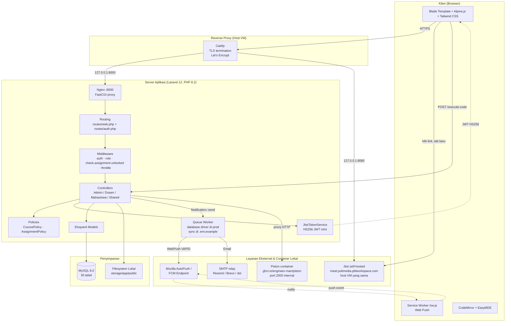
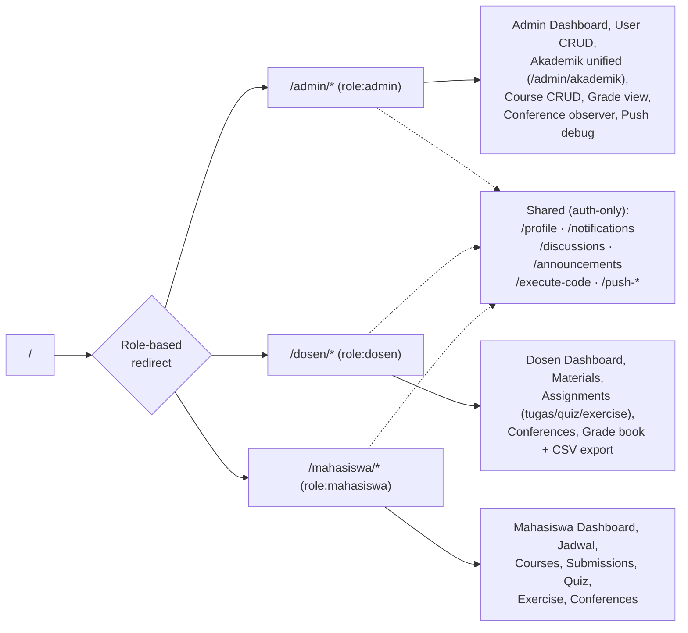
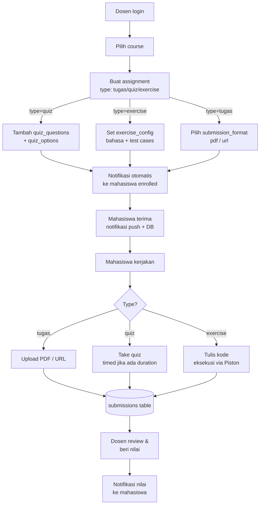
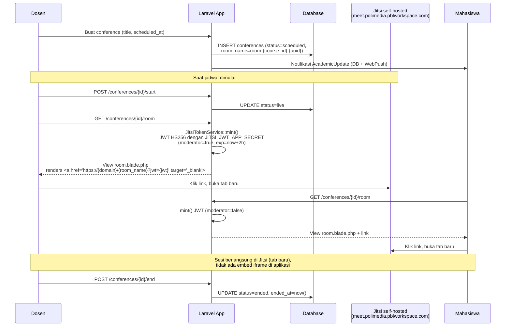
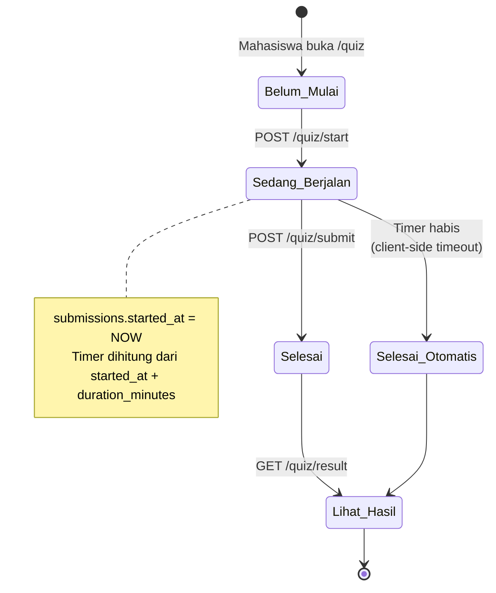
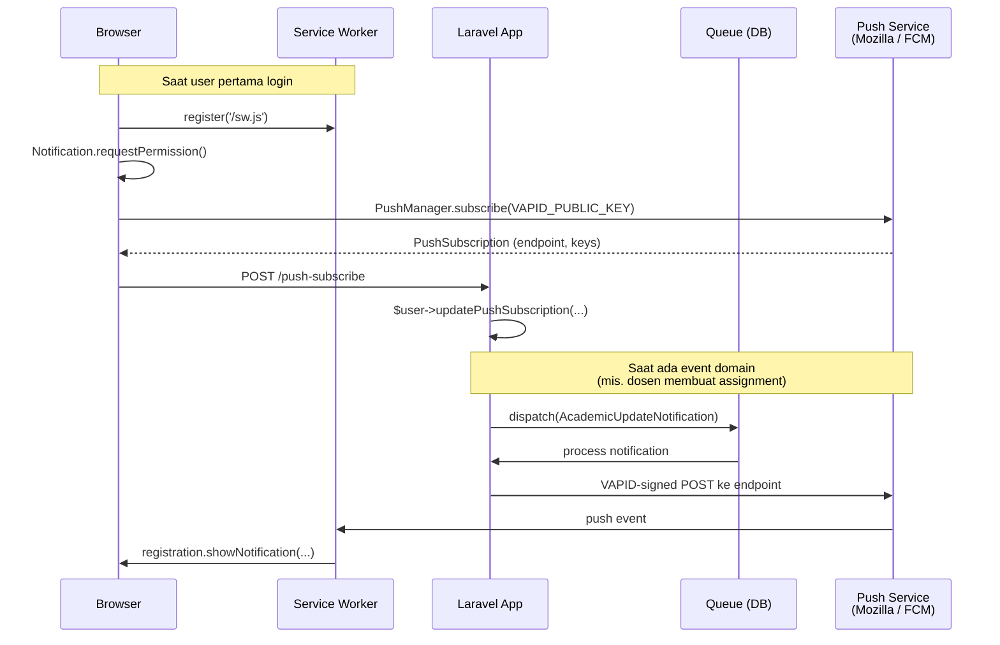

# BAB 4 — Implementasi dan Pengujian Sistem

> **Catatan untuk pengguna dokumen ini:**
> File ini adalah **dokumen sumber** (bukan BAB 4 final). Isinya adalah inventaris fakta tentang aplikasi PBL Workspace yang ditarik langsung dari kode di `D:\Projects\pjbl\`. Pakai dokumen ini sebagai konteks ketika berkolaborasi dengan Claude untuk menulis narasi BAB 4 di Word/LaTeX. Setiap fakta disertai pointer ke file/tabel sumbernya, sehingga mudah diverifikasi ulang.

---

## Daftar Isi

- [4.1 Implementasi Sistem](#41-implementasi-sistem)
  - [4.1.1 Lingkungan Implementasi](#411-lingkungan-implementasi)
  - [4.1.2 Arsitektur Sistem](#412-arsitektur-sistem)
  - [4.1.3 Implementasi Basis Data](#413-implementasi-basis-data)
  - [4.1.4 Implementasi Modul/Fitur per Peran](#414-implementasi-modulfitur-per-peran)
  - [4.1.5 Implementasi Antarmuka Pengguna](#415-implementasi-antarmuka-pengguna)
  - [4.1.6 Implementasi Integrasi Eksternal](#416-implementasi-integrasi-eksternal)
  - [4.1.7 Implementasi Keamanan](#417-implementasi-keamanan)
- [4.2 Pengujian Sistem](#42-pengujian-sistem)
  - [4.2.1 Rencana Pengujian](#421-rencana-pengujian)
  - [4.2.2 Skenario Pengujian Black-Box](#422-skenario-pengujian-black-box)
  - [4.2.3 Pengujian Otomatis](#423-pengujian-otomatis)
  - [4.2.4 Hasil Pengujian](#424-hasil-pengujian)
- [Lampiran A — Inventaris Route Lengkap](#lampiran-a--inventaris-route-lengkap)
- [Lampiran B — Variabel Lingkungan](#lampiran-b--variabel-lingkungan)
- [Lampiran C — Akun Uji Default](#lampiran-c--akun-uji-default)
- [Lampiran D — Daftar Screenshot Antarmuka (TODO)](#lampiran-d--daftar-screenshot-antarmuka-todo)

---

## Profil Singkat Aplikasi

**PBL Workspace** adalah platform Project-Based Learning berbasis web untuk mendukung pembelajaran berbasis proyek di lingkungan kampus politeknik/universitas. Aplikasi ini melayani tiga peran pengguna — **admin**, **dosen** (lecturer), dan **mahasiswa** (student) — di atas struktur akademik berjenjang: jurusan (department) → program studi (study program) → kelas (student class) → mata kuliah (course).

| Atribut | Nilai |
|---|---|
| Nama aplikasi | PBL Workspace (`APP_NAME` di `.env`) |
| Domain bisnis | E-learning / LMS berorientasi project-based learning |
| Bahasa domain | Indonesia (`mata_kuliah`, `kode_matkul`, `sks`, `nim`, `nip`) |
| Pola arsitektur | Monolith MVC, server-rendered (Blade), bukan SPA |
| Repository | `D:\Projects\pjbl\` (Git, branch utama: `main`) |

---

## 4.1 Implementasi Sistem

### 4.1.1 Lingkungan Implementasi

#### 4.1.1.1 Spesifikasi Perangkat Keras (Minimum Pengembangan)

| Komponen | Spesifikasi |
|---|---|
| Prosesor | Intel Core i3 generasi 8 atau setara (mendukung x86_64) |
| RAM | 8 GB (16 GB direkomendasikan untuk menjalankan Docker + Vite + queue worker secara paralel) |
| Penyimpanan | 5 GB ruang kosong (kode + database + node_modules) |
| Koneksi internet | Wajib untuk pengambilan dependensi (`composer install`, `npm install`), pull container Piston, dan delivery WebPush. Konferensi Jitsi di-host di VM yang sama sehingga tidak melibatkan provider eksternal. |

#### 4.1.1.2 Spesifikasi Perangkat Lunak

| Kategori | Perangkat Lunak | Versi |
|---|---|---|
| Sistem Operasi (dev) | Windows 11 Pro / Linux / macOS | — |
| Web Server (dev/prod) | PHP Built-in Server (dev) / `nginx:alpine` di container + Caddy di host (TLS + Brotli/Gzip) di prod | — |
| Bahasa Pemrograman | PHP | ≥ 8.2 |
| Framework Backend | Laravel | 12.x |
| Bahasa Frontend | JavaScript (ES2022) | — |
| Build Tool Frontend | Vite | 7.0.7 |
| Manajer Paket PHP | Composer | 2.x |
| Manajer Paket JS | NPM | 10.x (Node.js ≥ 18) |
| Database (produksi) | MySQL (image `mysql:8.0` di compose) | 8.x |
| Database (testing) | SQLite (in-memory) | bawaan PHP |
| Cache & Session | Database (default) atau Redis (opsional) | — |
| Queue Driver | Database (default) | — |
| Broadcast Driver | `log` (belum ada Pusher/Reverb) | — |

#### 4.1.1.3 Daftar Dependensi Inti

**Backend (`composer.json`):**

| Paket | Versi | Fungsi |
|---|---|---|
| `laravel/framework` | ^12.0 | Framework MVC inti |
| `livewire/livewire` | ^3.x | Komponen reaktif (dipakai untuk thread diskusi) |
| `laravel/breeze` | (dev) | Scaffolding autentikasi |
| `laravel/dusk` | (dev) | Browser testing E2E |
| `laravel-notification-channels/webpush` | ^10.5 | Notifikasi push W3C berbasis VAPID |
| `firebase/php-jwt` | ^7.0 | Penanda-tangan JWT HS256 untuk Jitsi self-hosted (`JitsiTokenService::mint`) |
| `pestphp/pest` | ^3.8 | Test runner (Pest atas PHPUnit) |
| `pestphp/pest-plugin-laravel` | ^3.x | Helper Pest untuk Laravel |
| `laravel/pint` | ^1.24 | PHP code formatter (PSR-12) |
| `laravel/pail` | — | Real-time log tail untuk dev |

**Frontend (`package.json`):**

| Paket | Versi | Fungsi |
|---|---|---|
| `alpinejs` | ^3.4.2 | Reaktivitas UI ringan (modal, dropdown, sidebar) |
| `tailwindcss` | ^3.1.0 | Utility-first CSS framework |
| `@tailwindcss/forms` | — | Reset styling form |
| `vite` | ^7.0.7 | Bundler & dev server (HMR) |
| `laravel-vite-plugin` | ^2.0.0 | Integrasi Laravel ↔ Vite |
| `codemirror` | ^5.65.20 | Editor kode untuk modul exercise (multi-bahasa: HTML/CSS/JS/Java/PHP/C#) |
| `easymde` | ^2.20.0 | Markdown editor untuk pembuatan materi oleh dosen |
| `marked` | ^17.0.1 | Parser Markdown → HTML di sisi klien |
| `highlight.js` | ^11.11.1 | Syntax highlighting pada konten yang ter-render |
| `axios` | ^1.11.0 | HTTP client (CSRF-aware) |
| `chart.js` | ^4.4.0 | Charting library untuk grafik analitik di dashboard (admin, dosen, mahasiswa) |
| `@playwright/test` | ^1.59.1 | E2E testing (suite WIP, branch `feat/playwright-qa-suite`) |
| `concurrently` | — | Menjalankan banyak proses dev secara paralel |
| `fast-glob` | ^3.3.0 | Resolusi entry point CSS per halaman |

#### 4.1.1.4 Skrip Pengembangan

Ringkasan dari `composer.json` dan `package.json`:

| Perintah | Tujuan |
|---|---|
| `composer setup` | Setup awal: install deps, salin `.env`, generate key, migrate, install npm, build aset, kemudian `composer optimize` |
| `composer optimize` | Cache config + routes + views + events — wajib dijalankan setelah setiap deploy produksi |
| `composer dev` | Jalankan 4 proses paralel: `php artisan serve`, `queue:listen`, `pail`, `vite` |
| `composer test` | `config:clear` + `php artisan test` (Pest) |
| `vendor/bin/pint` | Format kode PHP sesuai PSR-12 |
| `npm run dev` | Vite dev server (HMR) |
| `npm run build` | Build aset produksi |
| `npm run audit:contrast` | Audit kontras warna design system (`scripts/audit-contrast.mjs`) |
| `npm run test:pw` | Playwright (varian: `:headed`, `:ui`, `:report`) |

#### 4.1.1.5 Variabel Lingkungan Wajib

Semua variabel integrasi sudah tercantum di `.env.example` repo (dengan nilai placeholder kosong untuk secret). Daftar lengkap di [Lampiran B](#lampiran-b--variabel-lingkungan). Ringkasan:

- **Wajib bawaan Laravel**: `APP_NAME`, `APP_KEY`, `APP_URL`, `DB_*`, `MAIL_*`, `SESSION_*`
- **Konferensi (Jitsi self-hosted, HS256 JWT)**: `JITSI_DOMAIN`, `JITSI_JWT_APP_ID`, `JITSI_JWT_APP_SECRET` — ketiganya wajib diisi sebelum fitur konferensi berfungsi (`JitsiTokenService::mint()` melempar `RuntimeException` jika app_id atau secret kosong)
- **Push notification**: `VAPID_PUBLIC_KEY`, `VAPID_PRIVATE_KEY`, `VAPID_SUBJECT`
- **Eksekusi kode**: `PISTON_URL` (default `http://piston:2000/api/v2` — menunjuk ke container Piston yang ikut di-bundle di `docker-compose.yml`), `PISTON_TIMEOUT` (default `10` detik)

#### 4.1.1.6 Konfigurasi Infrastruktur (Docker / Caddy / Nginx)

`docker-compose.yml` mendefinisikan stack berikut:

| Service | Image | Port | Peran |
|---|---|---|---|
| `app` | custom (Dockerfile) — PHP-FPM 8.2 | internal | Proses PHP Laravel |
| `web` | `nginx:alpine` | `127.0.0.1:8000:80` | Nginx — reverse proxy ke `app:9000` (FastCGI) |
| `db` | `mysql:8.0` | internal | MySQL 8 |
| `phpmyadmin` | `phpmyadmin:latest` | `8081:80` | DB GUI |
| `mailhog` | `mailhog/mailhog` | `8025:8025` | Mail catcher (dev) |
| `piston` | `ghcr.io/engineer-man/piston` | internal | Sandbox eksekusi kode (`privileged: true`, tmpfs `/piston/jobs`, persistent volume `/piston/packages`) |

**Topologi produksi (GCP VM `pjbl-vm`)**: Caddy berjalan langsung di host VM (bukan di docker), bertindak sebagai reverse proxy yang menerminasi TLS Let's Encrypt untuk dua subdomain:

```caddy
polimedia.pblworkspace.com   { reverse_proxy 127.0.0.1:8000 }
meet.polimedia.pblworkspace.com { reverse_proxy 127.0.0.1:8080 }
```

Port `8000` mengarah ke container nginx aplikasi; `8080` ke web container Jitsi (lihat 4.1.6.2). Nginx aplikasi sendiri terikat hanya ke `127.0.0.1`, sehingga seluruh traffic eksternal wajib melalui Caddy (HTTPS).

**Fitur nginx aplikasi** (`docker/nginx/conf.d/app.conf`):
- Brotli + Gzip compression untuk text assets (oleh Caddy di host) plus header `Cache-Control: immutable, max-age=31536000` untuk aset Vite yang sudah ber-fingerprint di `/build/`
- FastCGI ke `app:9000` (PHP-FPM)
- `try_files $uri $uri/ /index.php?$query_string` untuk routing Laravel

---

### 4.1.2 Arsitektur Sistem

#### 4.1.2.1 Pola Arsitektur

Aplikasi mengikuti pola **Model-View-Controller (MVC)** bawaan Laravel dengan tambahan lapisan **Policy** (otorisasi) dan satu lapisan **Service** minimal (`JitsiTokenService` — single-purpose, hanya untuk minting JWT konferensi). Aplikasi adalah **monolith server-rendered**, bukan Single Page Application — render HTML dilakukan di sisi server menggunakan template Blade, dengan interaktivitas tipis di klien menggunakan Alpine.js (Alpine ikut otomatis dengan `@livewireScripts`).

**Catatan arsitektur penting:**
- Hanya **satu** komponen Livewire di seluruh aplikasi (`app/Livewire/Discussion/Show.php`); selebihnya Blade biasa.
- Tidak menggunakan Inertia.js, Vue, atau React.
- Mahasiswa flow memakai **query pivot langsung** (`DB::table('enrollments')->where(...)`) di sebagian besar controller untuk performa. Pengecualian: `Mahasiswa\ScheduleController`, `Mahasiswa\SubmissionController`, dan `Mahasiswa\DashboardController` memakai relasi Eloquent `User::enrollments()`.
- Tidak ada `NotificationService` lagi — controller memanggil `Notification::send($users, new XxxNotification(...))` atau `$user->notify(...)` secara langsung.

#### 4.1.2.2 Diagram Arsitektur Tingkat Tinggi



#### 4.1.2.2.1 Optimasi Performa & Caching

Beberapa lapisan menerapkan cache untuk mengurangi query berulang:

| Lokasi | Strategi | TTL / Invalidasi |
|---|---|---|
| `SidebarComposer` | `Cache::remember("sidebar:dosen:{id}", 300, ...)` — daftar course dosen di sidebar | 5 menit; otomatis di-flush saat `Course` di-create/update/delete |
| `Course::booted()` | `Cache::forget("sidebar:dosen:{dosen_id}")` di event `created`, `updated`, `deleted` | Per event |
| `Discussion::booted()` | `Cache::forget('discussions:index:sidebar')` di event `created`, `updated`, `deleted` | Per event |
| `Course::siblings()` | Hasil disimpan di properti instance (`$cachedSiblings`) — memoized selama satu request | Request lifecycle |

#### 4.1.2.3 Pembagian Tanggung Jawab Lapisan

| Lapisan | Lokasi | Tanggung Jawab |
|---|---|---|
| Routing | `routes/web.php`, `routes/auth.php` | Mendaftarkan endpoint per peran (`/admin`, `/dosen`, `/mahasiswa`) |
| Middleware | `app/Http/Middleware/` | Otorisasi peran (`CheckRole`), prasyarat tugas (`CheckAssignmentUnlocked`). Auth + throttle bawaan Laravel. |
| Controllers | `app/Http/Controllers/{Admin,Dosen,Mahasiswa,Auth,...}/` | Validasi input inline, orkestrasi domain, render view |
| Policies | `app/Policies/` | Otorisasi granular per-instance (`CoursePolicy`, `AssignmentPolicy`) |
| Services | `app/Services/` | Hanya satu kelas: `JitsiTokenService` — minting JWT HS256 untuk konferensi |
| Models | `app/Models/` | Eloquent ORM, relasi, mutator/accessor |
| Notifications | `app/Notifications/` | Channel database, mail, dan webpush — 7 class, semua `ShouldQueue` kecuali `TestNotification` |
| Views | `resources/views/` | Template Blade per peran |
| Komponen UI | `resources/views/components/`, `app/View/Components/` | Komponen reusable Blade |
| Aset Frontend | `resources/{css,js}/` | Bundling Vite (HMR di dev) |

#### 4.1.2.4 Pemetaan URL → Peran



---

### 4.1.3 Implementasi Basis Data

#### 4.1.3.1 Ringkasan

- **Total tabel**: 30 (24 domain + 6 framework)
- **Total file migrasi**: 25 (`database/migrations/`)
- **Total model Eloquent**: 20 (`app/Models/`)
- **Total seeder**: 10 (`database/seeders/`)
- **Total factory**: 11 (`database/factories/`)
- **Konvensi penamaan**: tabel `snake_case_plural`, kolom `snake_case`. Istilah domain Indonesia dipertahankan: `mata_kuliah` (dipotong jadi `nama_matkul`/`kode_matkul`), `mahasiswa_id`, `dosen_id`, `nim`, `nip`, `sks`.

#### 4.1.3.2 Diagram Hubungan Antar Entitas (ERD)

ERD di bawah menampilkan **entitas inti domain** (mengabaikan tabel framework seperti `cache`, `jobs`, `sessions`, `notifications`, dan `password_reset_tokens` untuk kejelasan).


#### 4.1.3.3 Daftar Tabel (Ringkas)

| # | Tabel | Domain | Deskripsi |
|---|---|---|---|
| 1 | `users` | Auth | Akun pengguna, kolom `role` membedakan admin/dosen/mahasiswa |
| 2 | `password_reset_tokens` | Auth | Token reset password (default Laravel) |
| 3 | `sessions` | Auth | Session DB-based |
| 4 | `cache` | Framework | Cache key-value |
| 5 | `cache_locks` | Framework | Atomic locks untuk cache |
| 6 | `jobs` | Framework | Queue jobs (driver: database) |
| 7 | `job_batches` | Framework | Batch jobs |
| 8 | `failed_jobs` | Framework | Job yang gagal eksekusi |
| 9 | `academic_years` | Akademik | Tahun ajaran (mis. 2025/2026) |
| 10 | `semesters` | Akademik | Semester (Ganjil/Genap) per tahun ajaran |
| 11 | `departments` | Akademik | Jurusan (mis. TIK, TE) |
| 12 | `study_programs` | Akademik | Program studi (mis. D4 Teknik Informatika) |
| 13 | `student_classes` | Akademik | Kelas mahasiswa (mis. TI-1A) |
| 14 | `courses` | Pembelajaran | Mata kuliah (course) |
| 15 | `enrollments` | Pembelajaran | Pivot mahasiswa ↔ mata kuliah + nilai akhir |
| 16 | `materials` | Pembelajaran | Materi kuliah (markdown + lampiran) |
| 17 | `material_views` | Tracking | Catatan mahasiswa yang sudah membaca materi (untuk gating prasyarat) |
| 18 | `assignments` | PBL | Tugas/quiz/exercise (kolom `type`) |
| 19 | `submissions` | PBL | Pengumpulan tugas oleh mahasiswa (file/url/quiz/code) |
| 20 | `groups` | PBL | Kelompok untuk tugas berkelompok |
| 21 | `group_members` | PBL | Anggota kelompok |
| 22 | `quiz_questions` | PBL | Soal quiz (essay / pilihan ganda / code snippet) |
| 23 | `quiz_options` | PBL | Opsi jawaban untuk soal pilihan ganda |
| 24 | `conferences` | Konferensi | Jadwal kelas virtual (Jitsi room) |
| 25 | `discussions` | Kolaborasi | Thread diskusi (per topik, bukan per course) |
| 26 | `discussion_comments` | Kolaborasi | Komentar pada thread |
| 27 | `announcements` | Komunikasi | Pengumuman (broadcast / per peran / per user) |
| 28 | `announcement_user` | Pivot | Penargetan pengumuman ke user spesifik |
| 29 | `notifications` | Notifikasi | Notifikasi database polymorphic (default Laravel) |
| 30 | `push_subscriptions` | Notifikasi | Subscription Web Push polymorphic (paket webpush) |

#### 4.1.3.4 Detail Tabel Domain Inti

Berikut struktur detail untuk 15 tabel domain utama. Tabel framework (cache, jobs, sessions) tidak dijabarkan karena bawaan Laravel.

##### Tabel `users`

| Kolom | Tipe | Null | Default | Catatan |
|---|---|---|---|---|
| `id` | bigint | No | auto | PK |
| `name` | string(255) | No | — | |
| `email` | string(255) | No | — | UNIQUE |
| `email_verified_at` | timestamp | Yes | NULL | |
| `password` | string(255) | No | — | bcrypt hash |
| `role` | enum | No | `mahasiswa` | nilai: `mahasiswa`, `dosen`, `admin` |
| `nim` | string(255) | Yes | NULL | UNIQUE, identitas mahasiswa |
| `nip` | string(255) | Yes | NULL | UNIQUE, identitas dosen |
| `sso_id` | string(255) | Yes | NULL | reservasi untuk integrasi SSO kampus |
| `student_class_id` | foreignId | Yes | NULL | FK → `student_classes.id`, ON DELETE SET NULL |
| `is_active` | boolean | No | `true` | toggle aktivasi akun |
| `remember_token` | string(100) | Yes | NULL | |
| `created_at` / `updated_at` | timestamp | Yes | NULL | |

Indeks: `role`, `is_active`, `student_class_id`.

##### Tabel `academic_years`

| Kolom | Tipe | Null | Default | Catatan |
|---|---|---|---|---|
| `id` | bigint | No | auto | PK |
| `year_start` | string(255) | No | — | mis. "2025" |
| `year_end` | string(255) | No | — | mis. "2026" |
| `is_active` | boolean | No | `false` | hanya satu yang `true` per waktu (konvensi seeder) |
| `created_at` / `updated_at` | timestamp | Yes | NULL | |

##### Tabel `semesters`

| Kolom | Tipe | Null | Default | Catatan |
|---|---|---|---|---|
| `id` | bigint | No | auto | PK |
| `academic_year_id` | foreignId | No | — | FK → `academic_years.id`, ON DELETE CASCADE |
| `name` | string(255) | No | — | mis. "Ganjil", "Genap" |
| `start_date` | date | No | — | |
| `end_date` | date | No | — | |
| `is_active` | boolean | No | `false` | |

##### Tabel `departments`

| Kolom | Tipe | Null | Default | Catatan |
|---|---|---|---|---|
| `id` | bigint | No | auto | PK |
| `name` | string(255) | No | — | |
| `code` | string(255) | No | — | UNIQUE |

##### Tabel `study_programs`

| Kolom | Tipe | Null | Default | Catatan |
|---|---|---|---|---|
| `id` | bigint | No | auto | PK |
| `department_id` | foreignId | No | — | FK → `departments.id`, ON DELETE CASCADE |
| `name` | string(255) | No | — | mis. "D4 Teknik Informatika" |
| `code` | string(255) | No | — | UNIQUE |
| `level` | enum | No | `D4` | nilai: `D3`, `D4`, `S1`, `S2`, `S3` |

##### Tabel `student_classes`

| Kolom | Tipe | Null | Default | Catatan |
|---|---|---|---|---|
| `id` | bigint | No | auto | PK |
| `study_program_id` | foreignId | No | — | FK → `study_programs.id`, ON DELETE CASCADE |
| `semester_id` | foreignId | No | — | FK → `semesters.id`, ON DELETE CASCADE |
| `name` | string(255) | No | — | mis. "TI-1A" |

##### Tabel `courses`

| Kolom | Tipe | Null | Default | Catatan |
|---|---|---|---|---|
| `id` | bigint | No | auto | PK |
| `kode_matkul` | string(255) | No | — | kode mata kuliah (tidak global unique — lihat catatan) |
| `nama_matkul` | string(255) | No | — | |
| `sks` | integer | No | `3` | satuan kredit semester |
| `dosen_id` | foreignId | No | — | FK → `users.id`, ON DELETE CASCADE |
| `semester_id` | foreignId | Yes | NULL | FK → `semesters.id`, ON DELETE SET NULL |
| `student_class_id` | foreignId | Yes | NULL | FK → `student_classes.id`, ON DELETE SET NULL |
| `course_img` | string(255) | Yes | NULL | path gambar sampul |
| `description` | text | Yes | NULL | |

**Catatan composite unique**: Migrasi `2026_05_14_000001_relax_course_kode_matkul_unique.php` menghapus unique global pada `kode_matkul` dan menggantinya dengan composite unique `(kode_matkul, semester_id, student_class_id)` (`courses_code_semester_class_unique`). Artinya satu dosen dapat mengajar `kode_matkul` yang sama untuk beberapa kelas berbeda di semester yang sama — model ini disebut **sibling courses** (lihat `Course::siblings()`).

##### Tabel `enrollments`

| Kolom | Tipe | Null | Default | Catatan |
|---|---|---|---|---|
| `id` | bigint | No | auto | PK |
| `course_id` | foreignId | No | — | FK → `courses.id`, ON DELETE CASCADE |
| `mahasiswa_id` | foreignId | No | — | FK → `users.id`, ON DELETE CASCADE |
| `final_grade` | decimal(5,2) | Yes | NULL | nilai akhir |
| `enrolled_at` | timestamp | No | CURRENT_TIMESTAMP | |

UNIQUE: (`course_id`, `mahasiswa_id`).

##### Tabel `materials`

| Kolom | Tipe | Null | Default | Catatan |
|---|---|---|---|---|
| `id` | bigint | No | auto | PK |
| `course_id` | foreignId | No | — | FK → `courses.id`, ON DELETE CASCADE |
| `title` | string(255) | No | — | |
| `content` | text | Yes | NULL | konten markdown |
| `file_path` | string(255) | Yes | NULL | lampiran |
| `order` | integer | No | `0` | urutan tampilan, ditata via drag & drop |

##### Tabel `material_views`

| Kolom | Tipe | Null | Default | Catatan |
|---|---|---|---|---|
| `id` | bigint | No | auto | PK |
| `material_id` | foreignId | No | — | FK → `materials.id`, ON DELETE CASCADE |
| `student_id` | foreignId | No | — | FK → `users.id`, ON DELETE CASCADE |
| `viewed_at` | timestamp | No | — | |

UNIQUE: (`material_id`, `student_id`) — satu catatan per mahasiswa per materi.

##### Tabel `assignments`

| Kolom | Tipe | Null | Default | Catatan |
|---|---|---|---|---|
| `id` | bigint | No | auto | PK |
| `course_id` | foreignId | No | — | FK → `courses.id`, ON DELETE CASCADE |
| `title` | string(255) | No | — | |
| `order` | integer | No | `0` | urutan tampilan |
| `assignment_number` | integer | Yes | NULL | nomor tugas (informatif) |
| `description` | text | Yes | NULL | markdown |
| `type` | enum | No | `tugas` | nilai: `tugas`, `quiz`, `exercise` |
| `submission_format` | enum | No | `pdf` | nilai: `pdf`, `url` (untuk type `tugas`) |
| `exercise_config` | json | Yes | NULL | konfigurasi coding exercise (bahasa, test cases) |
| `deadline` | datetime | No | — | |
| `max_score` | integer | No | `100` | |
| `required_material_id` | foreignId | Yes | NULL | FK → `materials.id`, ON DELETE SET NULL — prasyarat baca |
| `duration_minutes` | integer | Yes | NULL | durasi (untuk quiz timed) |
| `quiz_number` | integer | Yes | NULL | nomor quiz |
| `is_group` | boolean | No | `false` | tugas kelompok |
| `max_group_size` | unsignedInteger | Yes | NULL | maksimum anggota grup |
| `grading_mode` | enum | No | `equal` | nilai: `equal`, `individual` (untuk tugas grup) |

##### Tabel `submissions`

| Kolom | Tipe | Null | Default | Catatan |
|---|---|---|---|---|
| `id` | bigint | No | auto | PK |
| `assignment_id` | foreignId | No | — | FK → `assignments.id`, ON DELETE CASCADE |
| `mahasiswa_id` | foreignId | No | — | FK → `users.id`, ON DELETE CASCADE |
| `group_id` | foreignId | Yes | NULL | FK → `groups.id`, ON DELETE SET NULL |
| `file_path` | string(255) | Yes | NULL | jika submission_format=pdf |
| `url_link` | string(255) | Yes | NULL | jika submission_format=url |
| `code_answer` | text | Yes | NULL | jika type=exercise |
| `answers` | json | Yes | NULL | jawaban quiz (key: question_id) |
| `validation_result` | json | Yes | NULL | hasil eksekusi kode dari Piston |
| `notes` | text | Yes | NULL | catatan mahasiswa |
| `submitted_at` | timestamp | Yes | NULL | |
| `started_at` | timestamp | Yes | NULL | mulai mengerjakan quiz |
| `finished_at` | timestamp | Yes | NULL | selesai quiz |
| `score` | integer | Yes | NULL | |
| `feedback` | text | Yes | NULL | umpan balik dosen |
| `auto_graded` | boolean | No | `false` | |
| `status` | enum | No | `submitted` | nilai: `submitted`, `late`, `graded` |

##### Tabel `groups` & `group_members`

`groups`:
| Kolom | Tipe | Catatan |
|---|---|---|
| `id` | bigint | PK |
| `assignment_id` | foreignId | FK → `assignments.id`, ON DELETE CASCADE |
| `group_name` | string(255) | |
| `created_by_mahasiswa_id` | foreignId | FK → `users.id`, ON DELETE SET NULL |

`group_members`:
| Kolom | Tipe | Catatan |
|---|---|---|
| `id` | bigint | PK |
| `group_id` | foreignId | FK → `groups.id`, ON DELETE CASCADE |
| `mahasiswa_id` | foreignId | FK → `users.id`, ON DELETE CASCADE |

UNIQUE: (`group_id`, `mahasiswa_id`).

##### Tabel `quiz_questions` & `quiz_options`

`quiz_questions`:
| Kolom | Tipe | Catatan |
|---|---|---|
| `id` | bigint | PK |
| `assignment_id` | foreignId | FK → `assignments.id`, ON DELETE CASCADE |
| `question_text` | text | |
| `question_type` | enum | nilai: `essay`, `pilihan_ganda`, `code_snippet` |
| `correct_answer` | text | NULL untuk essay |
| `score_weight` | integer | default `1` |

`quiz_options`:
| Kolom | Tipe | Catatan |
|---|---|---|
| `id` | bigint | PK |
| `question_id` | foreignId | FK → `quiz_questions.id`, ON DELETE CASCADE |
| `option_text` | string(255) | |
| `is_correct` | boolean | default `false` |

##### Tabel `conferences`

| Kolom | Tipe | Null | Default | Catatan |
|---|---|---|---|---|
| `id` | bigint | No | auto | PK |
| `course_id` | foreignId | No | — | FK → `courses.id`, ON DELETE CASCADE |
| `dosen_id` | foreignId | No | — | FK → `users.id`, ON DELETE CASCADE |
| `title` | string(255) | No | — | |
| `description` | text | Yes | NULL | |
| `room_name` | string(255) | No | — | UNIQUE — identifier Jitsi room |
| `scheduled_at` | datetime | No | — | jadwal mulai |
| `ended_at` | datetime | Yes | NULL | timestamp berakhir |
| `status` | enum | No | `scheduled` | nilai: `scheduled`, `live`, `ended` |

##### Tabel `discussions` & `discussion_comments`

`discussions`:
| Kolom | Tipe | Catatan |
|---|---|---|
| `id` | bigint | PK |
| `user_id` | foreignId | FK → `users.id`, ON DELETE CASCADE |
| `topic` | string(255) | topik diskusi (semula `course_id`, di-migrate jadi `topic` — migrasi `2026_03_12_065022_alter_discussions_table_replace_course_with_topic.php`) |
| `title` | string(255) | |
| `content` | text | |

`discussion_comments`:
| Kolom | Tipe | Catatan |
|---|---|---|
| `id` | bigint | PK |
| `discussion_id` | foreignId | FK → `discussions.id`, ON DELETE CASCADE |
| `user_id` | foreignId | FK → `users.id`, ON DELETE CASCADE |
| `content` | text | |

##### Tabel `announcements` & `announcement_user`

`announcements`:
| Kolom | Tipe | Catatan |
|---|---|---|
| `id` | bigint | PK |
| `user_id` | foreignId | penulis (FK → `users.id`) |
| `title` | string(255) | |
| `content` | text | |
| `target_audience` | enum | nilai: `all`, `dosen`, `mahasiswa`, `specific` |
| `attachment_path` | string(255) | NULL |
| `attachment_name` | string(255) | NULL |
| `attachment_mime` | string(100) | NULL |

`announcement_user` (pivot, untuk audience=`specific`):
| Kolom | Tipe | Catatan |
|---|---|---|
| `id` | bigint | PK |
| `announcement_id` | foreignId | FK → `announcements.id`, ON DELETE CASCADE |
| `user_id` | foreignId | FK → `users.id`, ON DELETE CASCADE |

UNIQUE: (`announcement_id`, `user_id`).

##### Tabel `notifications`

Default Laravel polymorphic notification table:

| Kolom | Tipe | Catatan |
|---|---|---|
| `id` | uuid | PK |
| `type` | string(255) | nama class notifikasi |
| `notifiable_type` | string(255) | morph type (biasanya `App\Models\User`) |
| `notifiable_id` | unsignedBigInteger | morph id |
| `data` | text (JSON) | payload notifikasi |
| `read_at` | timestamp | NULL = belum dibaca |

##### Tabel `push_subscriptions`

Disediakan oleh paket `laravel-notification-channels/webpush`:

| Kolom | Tipe | Catatan |
|---|---|---|
| `id` | bigint | PK |
| `subscribable_type` | string(255) | morph type |
| `subscribable_id` | unsignedBigInteger | morph id |
| `endpoint` | string(500) | UNIQUE — URL push service browser |
| `public_key` | string(255) | p256dh key |
| `auth_token` | string(255) | auth key |
| `content_encoding` | string(255) | mis. `aesgcm` |

#### 4.1.3.5 Daftar Enum

| Tabel.Kolom | Nilai |
|---|---|
| `users.role` | `mahasiswa`, `dosen`, `admin` |
| `study_programs.level` | `D3`, `D4`, `S1`, `S2`, `S3` |
| `assignments.type` | `tugas`, `quiz`, `exercise` |
| `assignments.submission_format` | `pdf`, `url` |
| `assignments.grading_mode` | `equal`, `individual` |
| `submissions.status` | `submitted`, `late`, `graded` |
| `quiz_questions.question_type` | `essay`, `pilihan_ganda`, `code_snippet` |
| `announcements.target_audience` | `all`, `dosen`, `mahasiswa`, `specific` |
| `conferences.status` | `scheduled`, `live`, `ended` |

#### 4.1.3.6 Daftar Seeder

| Seeder | Fungsi |
|---|---|
| `DatabaseSeeder` | Master orchestrator — memanggil seeder lain berurutan |
| `AcademicYearSeeder` | Tahun ajaran 2025/2026 (`is_active=true`) |
| `SemesterSeeder` | Semester Ganjil aktif untuk tahun ajaran tersebut |
| `DepartmentSeeder` | Jurusan TIK & TE |
| `StudyProgramSeeder` | 3 prodi: D4 TI, D3 TK, D3 TL |
| `StudentClassSeeder` | 3 kelas: TI-1A, TI-1B, TK-1A |
| `UserSeeder` | 1 admin, 3 dosen, 6 mahasiswa dengan kredensial tetap |
| `CourseSeeder` | 2 mata kuliah (WEB101, DB201) + materi + tugas + enrollment |
| `AssignmentSeeder` | 5 tipe tugas per mata kuliah (tugas PDF/URL, quiz pilihan ganda + essay, exercise) |
| `DummyDataSeeder` | Data uji komprehensif: 3 dosen, 15 mahasiswa, 3 mata kuliah, dst. |

Akun uji yang dihasilkan: lihat [Lampiran C](#lampiran-c--akun-uji-default).

#### 4.1.3.7 Daftar Factory

`UserFactory`, `AcademicYearFactory`, `SemesterFactory`, `CourseFactory`, `MaterialFactory`, `AssignmentFactory`, `SubmissionFactory`, `ConferenceFactory`, `DepartmentFactory`, `StudyProgramFactory`, `StudentClassFactory`.

---

### 4.1.4 Implementasi Modul/Fitur per Peran

Total **36 controller** (10 Auth Breeze, 12 Admin termasuk `Admin\Auth\LoginController`, 6 Dosen, 8 Mahasiswa, 6 Shared) dan **~140 endpoint**. Daftar lengkap: [Lampiran A](#lampiran-a--inventaris-route-lengkap).

#### 4.1.4.1 Modul Admin

Akses: pengguna dengan `role = admin` (URL prefix `/admin`, middleware `auth` + `role:admin`).

**Fitur:**

- **Autentikasi**: halaman login khusus admin (`/admin/login` → `Admin\Auth\LoginController`) — terpisah dari login bersama. Login dengan akun non-admin di endpoint ini langsung di-logout dengan error.
- **Dashboard**: ringkasan statistik (jumlah user per role, jumlah course, dst.) beserta dua grafik Chart.js — (1) line chart aktivitas 30 hari terakhir (submissions + material views per hari), (2) donut chart distribusi peran pengguna.
- **Manajemen Pengguna** (`UserController`):
  - CRUD pengguna (admin/dosen/mahasiswa)
  - Filter: search (nama/email/nim/nip), role, status (active/inactive)
  - Bulk delete (`DELETE /users/bulk-destroy`)
  - Toggle aktif/nonaktif (`PATCH /users/{id}/toggle-active`) — dipakai untuk approve akun dosen yang mendaftar mandiri (mahasiswa langsung aktif setelah OTP)
- **Halaman Akademik Terpadu** (`AkademikController` di `/admin/akademik`): **menggantikan** `HierarchyController` (dihapus dari kode). Satu halaman tunggal dengan query-string selection (`?ay`, `?sem`, `?dep`, `?prog`) untuk mengelola semua tingkat hierarki dalam satu UI. Sub-aksi:
  - Tahun ajaran: store/update/destroy/activate
  - Semester: store/update/destroy/activate (validasi `name` ∈ `{Ganjil, Genap}`)
  - Department / Study Program / Student Class: full CRUD
  - Assign mahasiswa ke kelas (`POST /akademik/classes/{kelas}/students`) — mengubah `users.student_class_id`
  - Tambah/hapus mata kuliah dengan `scope` = `semester` atau `class`
  - URL legacy `/admin/hierarchy/*` di-redirect permanen ke `/admin/akademik`
- **Per-level Resource Routes (legacy)**: route lama `admin.academic-years.*`, `admin.semesters.*`, `admin.departments.*`, `admin.study-programs.*`, `admin.student-classes.*` tetap terdaftar untuk back-compat — masing-masing menampilkan flat list dan dipakai untuk akses langsung.
- **Mata Kuliah** (`CourseController`): CRUD course + endpoint enroll/unenroll mahasiswa. Validasi unique menggunakan `Rule::unique` composite 4-kolom `(kode_matkul, dosen_id, semester_id, student_class_id)`.
- **Nilai** (`GradeController`): tampilan agregat nilai lintas course dengan filter semester/tahun ajaran/dosen (read-only).
- **Konferensi Observer** (`Admin\ConferenceController`): daftar seluruh konferensi (active + ended), masuk room sebagai moderator, force-end session.
- **Push Debug** (`PushDebugController`): UI testing push notification (`/admin/debug/push`) — kirim `TestNotification` ke user yang dipilih.

**Pemetaan fitur ↔ controller@method ↔ view:**

| Fitur | Controller@method | View |
|---|---|---|
| Dashboard admin | `Admin\DashboardController@index` | `admin/dashboard.blade.php` |
| Daftar user | `Admin\UserController@index` | `admin/users/index.blade.php` |
| Form tambah user | `Admin\UserController@create` | `admin/users/create.blade.php` |
| Simpan user | `Admin\UserController@store` | (redirect) |
| Bulk delete user | `Admin\UserController@bulkDestroy` | (redirect) |
| Halaman akademik utama | `Admin\AkademikController@index` | `admin/akademik/index.blade.php` |
| Tambah course (semester scope) | `Admin\AkademikController@storeCourse` | (redirect) |
| Assign mahasiswa ke kelas | `Admin\AkademikController@assignStudents` | (redirect) |
| Activate tahun ajaran | `Admin\AkademikController@activateAcademicYear` | (redirect) |
| Konferensi observer | `Admin\ConferenceController@index` | `admin/conferences/index.blade.php` |
| Force-end konferensi | `Admin\ConferenceController@end` | (redirect / JSON) |
| Push debug | `Admin\PushDebugController@index/send` | `admin/debug/push.blade.php` |

#### 4.1.4.2 Modul Dosen

Akses: pengguna dengan `role = dosen` (URL prefix `/dosen`, middleware `auth` + `role:dosen`).

**Fitur:**

- **Dashboard**: course yang diajar, jumlah mahasiswa, deadline tugas, ditambah bar chart Chart.js submission 7 hari terakhir per kelas, dan penghitung "pengumpulan menunggu review" (`submissions` dengan `score = null`).
- **Materi** (`MaterialController`): CRUD materi per course + reorder drag-and-drop (`POST /courses/{course}/materials/reorder`). Editor Markdown menggunakan EasyMDE.
- **Tugas / Quiz / Exercise** (`AssignmentController` — kontroler tunggal lintas tiga tipe):
  - CRUD assignment dengan kolom `type` (`tugas`/`quiz`/`exercise`) menentukan format
  - Reorder assignment per course
  - Manajemen soal quiz (`questions/*`): CRUD soal + opsi
  - Daftar submission per assignment (`/assignments/{assignment}/submissions`)
  - Penilaian individu (`POST /submissions/{submission}/grade`) atau per grup (`POST /groups/{group}/grade`)
  - Lihat detail percobaan quiz (`GET /assignments/{assignment}/submissions/{submission}`)
- **Exercise (Coding)** (`ExerciseController` — terpisah dari `AssignmentController` karena form & validasi berbeda): create/store/edit/update assignment bertipe `exercise` dengan editor CodeMirror dan konfigurasi `exercise_config`.
- **Konferensi Virtual** (`ConferenceController`): CRUD jadwal + start (`POST /conferences/{conference}/start`) + end (`POST /conferences/{conference}/end`) + room view (`GET /conferences/{conference}/room`).
- **Nilai** (`GradeController`):
  - `index`: rekap nilai per course — filter bertingkat: tahun ajaran, semester, jurusan, program studi, kelas. Hasil dikelompokkan per `course_group_key` (sibling kelas). Filter options (department, study_program, student_class) kini disediakan ke view.
  - `export` (`GET /grades/{course}/export`): unduh rekap nilai kelas sebagai CSV (kolom: NIM, nama, skor per assignment, rata-rata).
  - `quickGrade` (`PATCH /grades/{assignment}/{mahasiswa}/quick-grade`): endpoint JSON untuk inline grade editing di tabel nilai — `updateOrCreate` submission, kembalikan `{ok, score, status}`.

**Diagram alur — Pembuatan Tugas dan Pengumpulan oleh Mahasiswa:**



**Diagram alur — Konferensi Virtual (Jitsi self-hosted):**



#### 4.1.4.3 Modul Mahasiswa

Akses: pengguna dengan `role = mahasiswa` (URL prefix `/mahasiswa`, middleware `auth` + `role:mahasiswa`).

**Fitur:**

- **Dashboard**: course yang diikuti, deadline tugas mendatang, pengumuman terbaru, ditambah dua grafik Chart.js — (1) line chart aktivitas submission pribadi 30 hari terakhir, (2) histogram distribusi skor (bucket: 0–50, 51–70, 71–85, 86–100).
- **Course** (`CourseController`):
  - Daftar course (`/mahasiswa/courses`)
  - Detail course (`GET /courses/{course}`)
  - Enroll diri sendiri ke course (`POST /courses/{course}/enroll`)
  - Lihat materi (`GET /courses/{course}/materials/{material}`) — pembukaan materi mencatat `material_views`.
- **Submission** (`SubmissionController`, dilindungi middleware `check.assignment.unlocked`):
  - Create/store/edit/update/destroy submission
  - Validasi tipe submission sesuai assignment (PDF / URL / kode / kuis)
- **Quiz** (`QuizController` — alur khusus karena timed):
  - Show pengantar (`GET /assignments/{assignment}/quiz`)
  - Start attempt (`POST /assignments/{assignment}/quiz/start`) — set `submissions.started_at`
  - Take (`GET /assignments/{assignment}/quiz/take`) — render soal
  - Submit (`POST /assignments/{assignment}/quiz/submit`) — set `finished_at`, hitung skor
  - Result (`GET /assignments/{assignment}/quiz/result`)
- **Exercise** (`ExerciseController`, dilindungi `check.assignment.unlocked`):
  - Solve (`GET /exercises/{assignment}/solve`) — editor CodeMirror
  - Submit (`POST /exercises/submit`) — eksekusi via Piston, simpan `validation_result`
- **Konferensi**: list (`/mahasiswa/courses/{course}/conferences`), join room (`/mahasiswa/conferences/{conference}/room`).
- **Nilai**: rekap nilai diri sendiri.

**Diagram alur — Quiz Timed:**



#### 4.1.4.4 Modul Bersama (Shared)

Tersedia untuk semua peran yang sudah login (middleware `auth`).

**Fitur:**

| Fitur | Endpoint Utama | Controller |
|---|---|---|
| Profil | `GET/PATCH/DELETE /profile` | `ProfileController` (memakai `ProfileUpdateRequest` — salah satu dari hanya dua FormRequest di aplikasi) |
| Notifikasi | `GET /notifications`, mark-read, redirect | `NotificationController` |
| Eksekusi Kode | `POST /execute-code` (throttle 10/menit) | `CodeExecutionController` — fully implemented, proxy ke Piston (bahasa: `java`, `php`, `csharp`) |
| Web Push Subscription | `POST /push-subscribe`, `/push-unsubscribe` | `PushSubscriptionController` |
| Diskusi | `Route::resource('discussions', ...)` | `DiscussionController` (+ Livewire `Discussion\Show` untuk komentar reaktif) |
| Pengumuman | `Route::resource('announcements', ...)` | `AnnouncementController` (gate visibilitas per peran + target_audience) |

**Diagram alur — Notifikasi Push:**



---

### 4.1.5 Implementasi Antarmuka Pengguna

#### 4.1.5.1 Tata Letak (Layout)

| Layout | File | Pemakaian |
|---|---|---|
| `<x-app-layout>` | `resources/views/layouts/app.blade.php` | Halaman setelah login — sidebar, topbar, notification bell, inline Web Push service worker bootstrap |
| `<x-guest-layout>` | `resources/views/layouts/guest.blade.php` | Halaman tamu (login, register, lupa password, verify-otp) |
| `layouts/sidebar.blade.php` | partial | Sidebar yang collapsible di mobile, di-compose oleh `SidebarComposer` |
| `layouts/topbar.blade.php` | partial | Topbar dengan dropdown profil |
| `layouts/notifications.blade.php` | partial | Bell + dropdown daftar notifikasi (read dari `auth()->user()->unreadNotifications`) |

> Catatan: `layouts/navigation.blade.php` sudah dihapus dari repo — navigasi peran sekarang sepenuhnya melalui `SidebarComposer`.

#### 4.1.5.2 Komponen Reusable

Lokasi: `resources/views/components/` (Anonymous Components Blade).

| Komponen | Fungsi |
|---|---|
| `<x-application-logo>` | Logo SVG aplikasi |
| `<x-input-label>` | Label form (Tailwind) |
| `<x-input-error>` | Daftar pesan validasi |
| `<x-text-input>` | Input field bergaya |
| `<x-primary-button>` | Tombol aksi utama (gradient, shadow, active scale) |
| `<x-secondary-button>` | Tombol aksi sekunder |
| `<x-danger-button>` | Tombol aksi destruktif (merah) |
| `<x-modal>` | Modal Alpine.js dengan focus trap dan handler ESC |
| `<x-dropdown>` | Dropdown Alpine.js |
| `<x-dropdown-link>` | Item dalam dropdown |
| `<x-nav-link>` | Link navigasi dengan state aktif |
| `<x-responsive-nav-link>` | Link navigasi versi mobile |
| `<x-auth-session-status>` | Pesan flash sesi auth |
| `<x-assignment-card>` | Kartu tugas/quiz/exercise dengan badge tipe, deadline, jumlah submission |

`app/View/Components/`:
- `AppLayout.php` → render `layouts.app`
- `GuestLayout.php` → render `layouts.guest`

#### 4.1.5.3 Komponen Livewire

Hanya satu komponen Livewire di seluruh aplikasi:

- **`App\Livewire\Discussion\Show`** — render thread diskusi + form komentar reaktif. View: `resources/views/livewire/discussion/show.blade.php`. Validasi: `content` max 1000 karakter.

#### 4.1.5.4 Editor Khusus

| Editor / Modul | Library | File Entry | Pemakaian |
|---|---|---|---|
| Markdown editor | EasyMDE | `markdown-editor.js` | Pembuatan materi oleh dosen (`materials/create`, `materials/edit`) |
| Code editor | CodeMirror 5 | `code-editor.js` | Pembuatan exercise oleh dosen, dan pengerjaan exercise oleh mahasiswa |
| Markdown render | `marked` + `highlight.js` | `markdown-renderer.js` | Render konten materi dan deskripsi tugas di sisi klien |
| Grafik analitik | Chart.js 4 | `charts.js` | Dashboard admin (aktivitas 30 hari, donut role), dosen (bar submission 7 hari), mahasiswa (aktivitas + histogram skor) |
| Konferensi | — (tanpa JS bundle) | — | View `conferences/room.blade.php` hanya merender `<a href="https://{JITSI_DOMAIN}/{room_name}?jwt={jwt}" target="_blank">`. Tidak ada embed iframe, tidak ada SDK Jitsi yang di-load oleh Laravel — Jitsi dibuka di tab baru. |

Mode CodeMirror yang aktif: HTML, CSS, JavaScript, htmlmixed, Java, PHP, C#. Bahasa client-side (HTML/CSS/JS) dieksekusi di iframe sandbox di browser tanpa request server; bahasa server-side (Java/PHP/C#) dikirim ke endpoint `/execute-code` yang mem-proxy ke Piston container (lihat 4.1.6.3).

#### 4.1.5.5 Sistem Desain (Tailwind + Material 3 Tokens)

Lokasi: `tailwind.config.js`, `resources/css/design-system.css`, `resources/css/app.css`, `resources/css/pages/**/*.css`.

- **Plugin Tailwind**: `@tailwindcss/forms`
- **Palette warna** (Material 3):
  - `primary: #004ac6`
  - `secondary: #006c49`
  - `tertiary: #3e3fcc`
- **Tipografi**: Manrope (heading), Inter (body)
- **Custom shadows**: `shadow-ambient` (`0 12px 32px`), `shadow-ambient-lg` (`0 16px 48px`)
- **Border radius**: skala custom dari `0.25rem` sampai `1.5rem`
- **Dark mode**: class-based (toggle via JavaScript)
- **Per-page CSS**: 27 file di `resources/css/pages/` digabung otomatis oleh Vite via `fast-glob` di `vite.config.js`
- **Audit kontras**: `npm run audit:contrast` (`scripts/audit-contrast.mjs`) memeriksa rasio kontras WCAG

#### 4.1.5.6 Inventaris View

Direktori utama di `resources/views/`:

| Direktori | Jumlah file (approx) | Fungsi |
|---|---|---|
| `layouts/` | 6 | Layout utama dan partial |
| `components/` | 14 | Komponen Blade reusable |
| `auth/` | 6 | Halaman autentikasi (login, register, dst.) |
| `admin/` | 30 | View peran admin (dashboard, CRUD, hierarchy) |
| `dosen/` | 23 | View peran dosen (dashboard, materials, assignments, conferences) |
| `mahasiswa/` | 14 | View peran mahasiswa (dashboard, courses, submissions, quiz, exercise) |
| `discussions/` | 5 | Halaman diskusi |
| `announcements/` | 4 | Halaman pengumuman |
| `notifications/` | 1 | Daftar notifikasi |
| `profile/` | 3 | Partial form profil |
| `livewire/discussion/` | 1 | View untuk komponen Livewire diskusi |
| `errors/` | 1 | Halaman 403 |

---

### 4.1.6 Implementasi Integrasi Eksternal

#### 4.1.6.1 Ringkasan Integrasi

| Integrasi | Tujuan | Status | Env Vars |
|---|---|---|---|
| Jitsi (self-hosted, GCP VM) | Konferensi virtual real-time | Aktif | `JITSI_DOMAIN`, `JITSI_JWT_APP_ID`, `JITSI_JWT_APP_SECRET` |
| Piston (container bundled / public fallback) | Eksekusi kode server-side (Java/PHP/C#) | Aktif — `CodeExecutionController` implemented, container bawaan `ghcr.io/engineer-man/piston` di `docker-compose.yml` | `PISTON_URL`, `PISTON_TIMEOUT` |
| WebPush (W3C VAPID) | Notifikasi push real-time | Aktif | `VAPID_PUBLIC_KEY`, `VAPID_PRIVATE_KEY`, `VAPID_SUBJECT` |
| SMTP (Resend / Brevo / Mailgun / SES) | Email reset password + OTP verifikasi | Aktif. Default dev: Mailhog container. GCP memblok port 25 jadi produksi harus pakai relay pihak ketiga. | `MAIL_HOST`, `MAIL_PORT`, `MAIL_USERNAME`, `MAIL_PASSWORD`, `MAIL_FROM_ADDRESS` |

#### 4.1.6.2 Jitsi (self-hosted)

**Latar belakang**: Sistem konferensi virtual mengalami dua kali migrasi. Awalnya menggunakan **LiveKit** self-hosted, lalu sempat di-host melalui **Jitsi JaaS** (`8x8.vc`) untuk mempercepat iterasi awal, dan akhirnya dimigrasikan ke **Jitsi self-hosted** di GCP VM (`meet.polimedia.pblworkspace.com`) untuk menghapus ketergantungan pada penyedia pihak ketiga, mengontrol biaya, dan memastikan data residency. Seluruh kode dan env var LiveKit / JaaS telah dihapus dari repo.

**Arsitektur deployment**: Stack `docker-jitsi-meet` (Prosody + Jicofo + JVB + Jitsi Meet web) berjalan di VM yang sama dengan aplikasi Laravel. Caddy di host VM bertindak sebagai reverse proxy yang menerminasi TLS untuk dua subdomain (`polimedia.pblworkspace.com` → app, `meet.polimedia.pblworkspace.com` → Jitsi). Container web Jitsi dijalankan dengan `DISABLE_HTTPS=1` agar TLS hanya dikelola Caddy di satu tempat. Media JVB membutuhkan port UDP 10000 terbuka di GCP firewall.

**Otentikasi**: JWT yang ditandatangani dengan algoritma **HS256** menggunakan shared secret (`JITSI_JWT_APP_SECRET`) yang identik antara aplikasi Laravel dan konfigurasi Jitsi server. Setiap request room admin/dosen/mahasiswa men-generate token baru dengan claim:
- `iss` = `aud` = `JITSI_JWT_APP_ID`
- `sub` = `JITSI_DOMAIN` (mis. `meet.polimedia.pblworkspace.com`)
- `room` = `room_name` dari tabel `conferences`
- `context.user.name` / `email` / `moderator` — moderator `true` untuk dosen & admin, `false` untuk mahasiswa
- `iat` / `nbf` / `exp` (umur 2 jam)

**Implementasi**:
- Generator JWT: `app/Services/JitsiTokenService::mint(string $room, int $userId, string $name, bool $moderator, ?string $email)` — dipanggil oleh tiga controller (`Admin\ConferenceController`, `Dosen\ConferenceController`, `Mahasiswa\ConferenceController`) di method `room()`. Throws `RuntimeException` jika env var hilang.
- View room: `resources/views/{admin,dosen,mahasiswa}/conferences/room.blade.php` — **tidak menggunakan iframe atau JS bundle**. View hanya merangkai URL `https://{JITSI_DOMAIN}/{conference->room_name}?jwt={jwt}` dan menampilkannya sebagai `<a href="…" target="_blank" rel="noopener">`. Pengguna mengklik tombol; Jitsi terbuka di tab terpisah dengan token sebagai query param. Karena instance bersifat single-tenant self-hosted, nama room tidak diawali prefix tenant (berbeda dengan JaaS yang membutuhkan `${APP_ID}/${roomName}`).
- Tidak ada `conference-jitsi.js` di repo — file tersebut sudah dihapus saat refactor dari embed iframe ke standalone launcher (`db5378a refactor(conferences): drop iframe, use standalone Jitsi tab launcher`).

**Diagram sekuens**: lihat 4.1.4.2.

#### 4.1.6.3 Piston (Eksekusi Kode)

Piston adalah API open-source untuk eksekusi kode multi-bahasa (project [engineer-man/piston](https://github.com/engineer-man/piston)). Container Piston ikut di-bundle di `docker-compose.yml` (image `ghcr.io/engineer-man/piston`, `privileged: true`, tmpfs `/piston/jobs`, persistent volume `/piston/packages`).

- **Endpoint dalam aplikasi**: `POST /execute-code` (middleware `auth`, throttle `10,1` — 10 request per menit per user)
- **Route**: terdaftar di `routes/web.php` menunjuk ke `App\Http\Controllers\CodeExecutionController@execute` — **fully implemented**.
- **Validasi**: `code` required string max 50000; `language` required dalam allowlist `config('code_execution.piston_language_map')` — saat ini `java`, `php`, `csharp` (untuk Piston, C# = `csharp.net` yang Mono).
- **Request ke Piston**: `POST {PISTON_URL}/execute` body `{language, version: '*', files: [{content: code}]}`
- **Response ke klien**: `{stdout, stderr, exit_code}` — diekstrak dari `response.json('run')`. Pada koneksi gagal / non-2xx, balasan adalah `{stdout: '', stderr: 'Execution service unavailable.', exit_code: -1}` dengan HTTP 502.
- **Pemanggil di klien**: `resources/js/code-editor.js` mengirim payload `{code, language}` melalui `fetch` (X-CSRF-TOKEN); respons memuat `stdout`, `stderr`, `exit_code`.
- **Bahasa client-side** (HTML/CSS/JS/htmlmixed) tidak melalui Piston — dijalankan di `<iframe srcdoc="…">` sandbox di browser tanpa request server.
- **Konfigurasi**: env `PISTON_URL` (default `http://piston:2000/api/v2` — container internal), `PISTON_TIMEOUT` (default `10` detik). Untuk dev native tanpa container, dapat menggunakan public instance `https://emkc.org/api/v2/piston`.
- **Catatan grading**: keluaran Piston **tidak** otomatis menjadi skor. Submit exercise (`Mahasiswa\ExerciseController::submit`) menjalankan keyword match (bukan Piston) dan menyimpan hasilnya sebagai hint di `submissions.validation_result`. Dosen menilai manual via `submissions.grade`.

#### 4.1.6.4 Web Push (W3C Push API + VAPID)

**Stack**:
- Paket Composer: `laravel-notification-channels/webpush ^10.5`
- Service Worker: `public/sw.js` — handle event `push`, panggil `registration.showNotification`
- Frontend bootstrap: `resources/views/layouts/app.blade.php` (baris 88-110) — register service worker, request permission, subscribe via VAPID public key, POST `/push-subscribe`
- Endpoint backend:
  - `POST /push-subscribe` → `PushSubscriptionController@store` (validasi `endpoint`, `keys.auth`, `keys.p256dh`; panggil `$user->updatePushSubscription(...)`)
  - `POST /push-unsubscribe` → `PushSubscriptionController@destroy`

**Notifikasi yang menggunakan channel `webpush`**:
- `TestNotification` — uji manual via halaman `/admin/debug/push`
- `GradeNotification` — saat dosen memberi nilai
- `AcademicUpdateNotification` — saat tugas/konferensi baru dibuat atau diubah

#### 4.1.6.5 SMTP (Gmail)

Saat ini hanya satu notifikasi yang dikirim via email (`mail`):

- **`ResetPasswordNotification`** (`app/Notifications/ResetPasswordNotification.php`, `ShouldQueue`) — email reset password dengan signed URL berlaku 60 menit, terjemahan Indonesia.

Driver email default di `.env.example` adalah `log` (untuk dev) — produksi mengoverride jadi `smtp` dengan host `smtp.gmail.com:587` (TLS).

#### 4.1.6.6 Daftar Notification Class

Lokasi: `app/Notifications/` — total 7 class.

| Class | Channel | Trigger | ShouldQueue |
|---|---|---|---|
| `TestNotification` | database, webpush | Tombol uji di halaman `/admin/debug/push` | Tidak |
| `GradeNotification` | database, webpush | Saat dosen menyimpan nilai submission (individual atau grup) | Ya |
| `AcademicUpdateNotification` | database, webpush | Saat material/assignment/conference baru atau diupdate, atau mahasiswa ditambahkan ke grup | Ya |
| `SubmissionNotification` | database | Saat mahasiswa submit tugas (notifikasi ke dosen) | Ya |
| `AnnouncementNotification` | database | Saat pengumuman dipublikasikan | Ya |
| `OtpVerificationNotification` | mail | Saat user mendaftar atau klik "Kirim Ulang OTP" | Ya |
| `ResetPasswordNotification` | mail | Saat user request reset password (override template Indonesia dari Breeze default) | Ya |

#### 4.1.6.7 Tanpa Service Class — Dispatch Langsung dari Controller

Aplikasi **tidak lagi** memiliki `NotificationService`. Controller memanggil facade `Notification::send($users, new XxxNotification(...))` atau trait method `$user->notify(...)` secara langsung. Contoh dari `Dosen\AssignmentController::store`:

```php
use Illuminate\Support\Facades\Notification;

$students = User::whereHas('enrollments', fn($q) => $q->where('course_id', $course->id))->get();
if ($students->isNotEmpty()) {
    Notification::send($students, new AcademicUpdateNotification(
        "{$typeLabel} Baru Ditambahkan",
        "{$typeLabel} baru '{$assignment->title}' telah ditambahkan pada mata kuliah {$course->nama_matkul}.",
        route('mahasiswa.courses.show', $course)
    ));
}
```

**Kuirk queue**: meski semua notification implement `ShouldQueue`, default `.env.example` adalah `QUEUE_CONNECTION=sync` — sehingga di dev mereka dispatch inline. Di produksi (`QUEUE_CONNECTION=database`) worker `php artisan queue:work` wajib berjalan, **atau notifikasi tidak akan terkirim**.

---

### 4.1.7 Implementasi Keamanan

#### 4.1.7.1 Autentikasi

- **Driver**: session-based (cookie HTTP-only) dengan `SESSION_DRIVER=database`
- **Scaffolding**: Laravel Breeze
- **Hashing password**: bcrypt (default `BCRYPT_ROUNDS=10` di `.env.example`; `4` di `phpunit.xml` untuk speed test)
- **Registrasi + OTP**: registrasi mandiri mahasiswa/dosen menghasilkan akun `is_active=false` dengan `otp_code` 6-digit dan `otp_expires_at = now + 10 menit`. User diarahkan ke `/verify-otp` (`OtpVerificationController`). Setelah OTP verified:
  - Mahasiswa: `is_active=true` otomatis, langsung login.
  - Dosen: `otp_verified_at` di-set namun `is_active` tetap `false` sampai admin meng-approve via `/admin/users/{id}/toggle-active`.
- **Login gate**: `AuthenticatedSessionController::store` menolak `is_active=false` — user dengan OTP belum diverifikasi di-redirect ke `/verify-otp`; user dosen yang menunggu approval dapat pesan "Akun belum diaktifkan, hubungi admin".
- **Reset password**: signed URL berlaku 60 menit (`ResetPasswordNotification` dengan template Indonesia)
- **Email verification standar Breeze**: route `verification.notice`, `verification.verify`, `verification.send` tetap terdaftar untuk perubahan email pasca-login (di `ProfileController::update`, ubah email me-null-kan `email_verified_at`), throttle pengiriman ulang 6 per menit
- **Login admin terpisah**: `/admin/login` (`Admin\Auth\LoginController`) — login dengan role non-admin langsung di-logout dengan pesan "Access denied"

#### 4.1.7.2 Otorisasi

**Middleware kustom** (`app/Http/Middleware/`):

| Middleware | Alias | Fungsi |
|---|---|---|
| `CheckRole` | `role:{nama}` | Verifikasi `auth()->user()->role` cocok argumen; redirect ke dashboard role-nya jika tidak cocok |
| `CheckAssignmentUnlocked` | `check.assignment.unlocked` | Cek `Assignment::isUnlockedFor($user)` — blokir akses jika materi prasyarat belum dibaca |

**Policy** (`app/Policies/`):

| Policy | Ability |
|---|---|
| `CoursePolicy` | `viewAny`, `view`, `create`, `update`, `delete` — admin bypass; selain itu memeriksa `dosen_id` |
| `AssignmentPolicy` | `viewAny`, `view`, `create`, `update`, `delete` — admin bypass; selain itu memeriksa kepemilikan course |

**Konvensi**: gunakan `$this->authorize('view', $model)` di controller, **bukan** `Gate::allows()`. Tambahkan policy baru sebelum menambah pemeriksaan role di controller (catatan dari `CLAUDE.md`).

#### 4.1.7.3 CSRF

- Token CSRF disisipkan di form lewat `@csrf`
- Untuk request AJAX, `axios` di `resources/js/bootstrap.js` set header default `X-Requested-With: XMLHttpRequest`; meta `csrf-token` di layout dipakai untuk POST JSON

#### 4.1.7.4 Throttling

| Endpoint | Limit |
|---|---|
| `POST /execute-code` | 10 per menit per user |
| `POST /login` | 5 percobaan, lockout dihitung via `LoginRequest::ensureIsNotRateLimited()` |
| `GET /verify-email/{id}/{hash}` | 6 per menit + signed URL |
| `POST /email/verification-notification` | 6 per menit |
| `POST /verify-otp/resend` | 3 per menit |

#### 4.1.7.5 Validasi

Konvensi: **inline validation di controller**, bukan FormRequest class (kecuali bawaan auth seperti `LoginRequest`, `ProfileUpdateRequest`).

Contoh dari `Dosen\ConferenceController@store`:

```php
$validated = $request->validate([
    'title' => 'required|string|max:255',
    'description' => 'nullable|string',
    'scheduled_at' => 'required|date|after:now',
]);
```

**Catatan kuirk Boolean**: form HTML mengirim `"1"`/`"0"` sebagai string. Rule `boolean` Laravel sebenarnya menerima `"1"`, `"0"`, `1`, `0`, `true`, `false` — sehingga `nullable|boolean` cukup untuk sebagian besar kasus, lalu cast di model:

```php
// Controller
$request->validate([
    'is_group' => 'nullable|boolean',
]);

// Model
protected function casts(): array
{
    return ['is_group' => 'boolean'];
}
```

Beberapa controller lama masih menggunakan pola eksplisit `'nullable|in:0,1,true,false'` (mis. di `Dosen\AssignmentController` untuk `has_duration`) — keduanya bekerja, pakai `boolean` untuk kode baru.

#### 4.1.7.6 Konfigurasi Keamanan Lain

- **Bcrypt rounds testing**: `BCRYPT_ROUNDS=4` di `phpunit.xml` agar test cepat
- **HTTPS**: tidak di-enforce di kode (tergantung deployment / reverse proxy)
- **Mass assignment**: setiap model mendefinisikan `$fillable` eksplisit
- **SQL Injection**: query Eloquent dan `DB::table` dengan parameter binding default; tidak ada `DB::raw` dengan input user

---

## 4.2 Pengujian Sistem

### 4.2.1 Rencana Pengujian

**Tujuan pengujian**: memastikan semua fitur fungsional bekerja sesuai spesifikasi, otorisasi peran berjalan dengan benar, dan integrasi eksternal (Jitsi, Web Push, SMTP) ter-konfigurasi dengan baik.

**Metode pengujian**:
1. **Black-box (manual)** — skenario fungsional per modul; tester berperan sebagai admin/dosen/mahasiswa.
2. **White-box (otomatis)** — Pest Feature/Unit test untuk model, controller, middleware.
3. **End-to-End** — Laravel Dusk (`tests/Browser`) dan Playwright (WIP).

**Lingkungan pengujian**:

| Aspek | Konfigurasi |
|---|---|
| `APP_ENV` | `testing` |
| Database | SQLite in-memory (`DB_CONNECTION=sqlite`, `DB_DATABASE=:memory:`) |
| Cache | array driver |
| Session | array driver |
| Mail | array driver (capture, tidak benar-benar kirim) |
| Queue | sync (eksekusi langsung) |
| Bcrypt rounds | 4 (cepat) |
| Pulse / Telescope / Nightwatch | dimatikan |

**Akun uji**: tersedia 1 admin, 3 dosen, 6+ mahasiswa hasil seeder. Detail di [Lampiran C](#lampiran-c--akun-uji-default).

**Cara menjalankan**:

```bash
composer test                # Pest Feature + Unit
php artisan dusk             # Browser tests (jika .env.dusk.local terkonfigurasi)
npm run test:pw              # Playwright (suite WIP)
```

---

### 4.2.2 Skenario Pengujian Black-Box

Tabel skenario di bawah menggunakan format:

| ID | Modul | Skenario | Langkah | Input | Hasil yang Diharapkan | Hasil Aktual | Status |

> Kolom **Hasil Aktual** dan **Status** **dikosongkan** — diisi setelah eksekusi pengujian.

#### 4.2.2.1 Modul Autentikasi

| ID | Skenario | Langkah | Input | Hasil yang Diharapkan | Hasil Aktual | Status |
|---|---|---|---|---|---|---|
| TC-AUTH-01 | Login dengan kredensial valid (mahasiswa) | Buka `/login`, isi form, submit | email: `mahasiswa@pjbl.test`, password: `password` | Redirect ke `/mahasiswa/dashboard` | | |
| TC-AUTH-02 | Login dengan kredensial valid (dosen) | Buka `/login`, isi form, submit | email: `dosen@pjbl.test`, password: `password` | Redirect ke `/dosen/dashboard` | | |
| TC-AUTH-03 | Login admin via halaman umum (harus gagal/redirect) | Buka `/login`, login dengan email admin | email: `admin@pjbl.test`, password: `password` | Login berhasil → redirect ke `/admin/dashboard` (atau ditolak sesuai aturan repo) | | |
| TC-AUTH-04 | Login admin via halaman khusus | Buka `/admin/login`, isi form | email: `admin@pjbl.test`, password: `password` | Redirect ke `/admin/dashboard` | | |
| TC-AUTH-05 | Login dengan password salah | Buka `/login`, isi form | email valid, password salah | Form ditolak, pesan error muncul | | |
| TC-AUTH-06 | Lupa password | Buka `/forgot-password`, kirim email | email user terdaftar | Email reset password masuk; URL signed valid 60 menit | | |
| TC-AUTH-07 | Reset password via link | Klik link di email, isi password baru | password baru ≥ 8 karakter | Password berubah, redirect ke login | | |
| TC-AUTH-08 | Logout | Klik tombol logout | — | Session hancur, redirect ke `/login` | | |
| TC-AUTH-09 | Akses halaman terlindungi tanpa login | Buka `/mahasiswa/dashboard` tanpa login | — | Redirect ke `/login` | | |
| TC-AUTH-10 | Akses lintas role | Login sebagai mahasiswa, buka `/admin/users` | — | HTTP 403 atau redirect ke `/mahasiswa/dashboard` | | |

#### 4.2.2.2 Modul Manajemen Pengguna (Admin)

| ID | Skenario | Langkah | Input | Hasil yang Diharapkan | Hasil Aktual | Status |
|---|---|---|---|---|---|---|
| TC-USR-01 | Lihat daftar user | Login admin → `/admin/users` | — | Tabel user tampil, paginasi berfungsi | | |
| TC-USR-02 | Tambah user dosen baru | Klik "Tambah" → isi form | nama, email unik, role=dosen, NIP, password | User tersimpan, muncul di daftar | | |
| TC-USR-03 | Tambah user dengan email duplikat | Isi form dengan email sudah ada | email duplikat | Validasi error "email sudah dipakai" | | |
| TC-USR-04 | Edit user | Klik "Edit" → ubah nama | nama baru | Nama berubah di daftar | | |
| TC-USR-05 | Toggle aktif/nonaktif | Klik tombol toggle | — | `is_active` berubah; user nonaktif tidak bisa login | | |
| TC-USR-06 | Bulk delete user | Centang beberapa user → "Hapus terpilih" | — | User terhapus dari daftar | | |
| TC-USR-07 | Hapus user terakhir admin | Pilih satu-satunya admin, klik hapus | — | Sistem mencegah / peringatan (jika diimplementasikan) | | |

#### 4.2.2.3 Modul Struktur Akademik (Admin)

| ID | Skenario | Hasil yang Diharapkan | Hasil Aktual | Status |
|---|---|---|---|---|
| TC-AKAD-01 | CRUD academic year | Tahun ajaran dapat dibuat, di-edit, dihapus; hanya satu yang `is_active=true` | | |
| TC-AKAD-02 | CRUD semester di bawah tahun ajaran aktif | Semester muncul di tahun ajaran terkait | | |
| TC-AKAD-03 | CRUD department, study program, student class secara hierarkis | Drill-down hierarchy menampilkan struktur dengan benar | | |
| TC-AKAD-04 | Tambah course ke semester via hierarchy | Course terhubung dengan semester + (opsional) student class | | |
| TC-AKAD-05 | Hapus department dengan study program di bawahnya | Cascade delete (study programs ikut terhapus) | | |

#### 4.2.2.4 Modul Mata Kuliah & Materi

| ID | Skenario | Hasil yang Diharapkan | Hasil Aktual | Status |
|---|---|---|---|---|
| TC-MK-01 | Admin tambah course dengan dosen | Course tersimpan, terhubung ke dosen | | |
| TC-MK-02 | Admin enroll mahasiswa ke course | Pivot `enrollments` terisi; mahasiswa lihat course di dashboardnya | | |
| TC-MK-03 | Mahasiswa enroll mandiri | Tombol enroll di `/mahasiswa/courses/{course}` membuat pivot | | |
| TC-MK-04 | Dosen tambah materi (markdown) | Materi tersimpan; render markdown benar | | |
| TC-MK-05 | Dosen reorder materi via drag-drop | Kolom `order` ter-update | | |
| TC-MK-06 | Mahasiswa buka materi pertama kali | `material_views` baru tercatat | | |
| TC-MK-07 | Mahasiswa buka materi yang sudah dibaca | Tidak duplikat di `material_views` (UNIQUE constraint) | | |

#### 4.2.2.5 Modul Tugas (Type: tugas)

| ID | Skenario | Hasil yang Diharapkan | Hasil Aktual | Status |
|---|---|---|---|---|
| TC-TUG-01 | Dosen buat tugas PDF | Assignment tersimpan; mahasiswa dapat notifikasi push + DB | | |
| TC-TUG-02 | Mahasiswa upload PDF sebagai submission | File tersimpan di `storage/app`; record `submissions` ter-create | | |
| TC-TUG-03 | Mahasiswa upload sebelum deadline | `status=submitted` | | |
| TC-TUG-04 | Mahasiswa upload setelah deadline | `status=late` | | |
| TC-TUG-05 | Dosen review submission | Daftar submission tampil di `/dosen/assignments/{id}/submissions` | | |
| TC-TUG-06 | Dosen beri nilai dan feedback | Skor dan feedback tersimpan; mahasiswa dapat notifikasi `GradeNotification` | | |
| TC-TUG-07 | Tugas dengan prasyarat materi (`required_material_id`) | Mahasiswa belum baca materi → diblokir middleware `check.assignment.unlocked` | | |
| TC-TUG-08 | Tugas kelompok (`is_group=true`) | Mahasiswa membentuk grup; satu submission per grup | | |
| TC-TUG-09 | Penilaian grup mode `equal` | Semua anggota grup dapat nilai yang sama | | |
| TC-TUG-10 | Penilaian grup mode `individual` | Tiap anggota dinilai berbeda | | |

#### 4.2.2.6 Modul Quiz (Type: quiz)

| ID | Skenario | Hasil yang Diharapkan | Hasil Aktual | Status |
|---|---|---|---|---|
| TC-QZ-01 | Dosen buat quiz tanpa durasi | Mahasiswa dapat take quiz tanpa timer | | |
| TC-QZ-02 | Dosen buat quiz dengan durasi 30 menit | Timer client-side dimulai dari `started_at` | | |
| TC-QZ-03 | Dosen tambah soal pilihan ganda + opsi | `quiz_questions` + `quiz_options` ter-create | | |
| TC-QZ-04 | Dosen tambah soal essay | `correct_answer` boleh NULL | | |
| TC-QZ-05 | Mahasiswa start quiz | `submissions.started_at = NOW`; status `submitted` | | |
| TC-QZ-06 | Mahasiswa submit quiz tepat waktu | `finished_at` terisi; skor pilihan ganda terhitung otomatis | | |
| TC-QZ-07 | Mahasiswa lewat batas waktu | Submit otomatis (client-side) | | |
| TC-QZ-08 | Mahasiswa lihat hasil | Halaman result menampilkan nilai dan jawaban benar | | |
| TC-QZ-09 | Dosen review attempt | Detail jawaban per soal tampil | | |

#### 4.2.2.7 Modul Exercise (Type: exercise)

| ID | Skenario | Hasil yang Diharapkan | Hasil Aktual | Status |
|---|---|---|---|---|
| TC-EX-01 | Dosen buat exercise dengan `exercise_config` | Konfigurasi tersimpan sebagai JSON | | |
| TC-EX-02 | Mahasiswa buka editor solve | CodeMirror ter-load dengan template | | |
| TC-EX-03 | Mahasiswa run code (HTML/CSS/JS) | Preview iframe muncul, tanpa request server | | |
| TC-EX-04 | Mahasiswa run code (Java/PHP/C#) | Request POST `/execute-code` ke Piston, output tampil | | |
| TC-EX-05 | Throttle `/execute-code` | Request ke-11 dalam 1 menit ditolak HTTP 429 | | |
| TC-EX-06 | Mahasiswa submit exercise | `code_answer` dan `validation_result` tersimpan | | |

#### 4.2.2.7b Modul Nilai — Export & Quick-Grade

| ID | Skenario | Hasil yang Diharapkan | Hasil Aktual | Status |
|---|---|---|---|---|
| TC-NILAI-01 | Dosen export CSV satu kelas | File CSV terunduh; baris = mahasiswa enrolled; kolom = assignment + rata-rata | | |
| TC-NILAI-02 | Quick-grade via PATCH | Respons JSON `{ok:true, score, status}`; `submissions` ter-update atau ter-create | | |
| TC-NILAI-03 | Filter nilai per jurusan/prodi/kelas | Hanya course yang cocok dengan filter yang tampil | | |

#### 4.2.2.8 Modul Konferensi Virtual

| ID | Skenario | Hasil yang Diharapkan | Hasil Aktual | Status |
|---|---|---|---|---|
| TC-KONF-01 | Dosen buat jadwal conference | `conferences` ter-create dengan `status=scheduled` dan `room_name` unik | | |
| TC-KONF-02 | Notifikasi ke mahasiswa enrolled | `AcademicUpdateNotification` masuk via DB & WebPush | | |
| TC-KONF-03 | Dosen klik "Mulai" | `status=live` | | |
| TC-KONF-04 | Dosen masuk room | JWT HS256 valid; tab baru terbuka ke `https://{JITSI_DOMAIN}/{room_name}?jwt=…`; toolbar moderator tampil | | |
| TC-KONF-05 | Mahasiswa join room | JWT non-moderator; tab baru terbuka; user join sebagai peserta | | |
| TC-KONF-06 | Dosen klik "Akhiri" | `status=ended`, `ended_at=NOW` | | |
| TC-KONF-07 | Akses room oleh mahasiswa luar course | Ditolak oleh policy (HTTP 403) | | |

#### 4.2.2.9 Modul Diskusi & Pengumuman

| ID | Skenario | Hasil yang Diharapkan | Hasil Aktual | Status |
|---|---|---|---|---|
| TC-DSK-01 | User buat thread diskusi dengan topic | Thread tampil di daftar | | |
| TC-DSK-02 | User komentar di thread (Livewire) | Komentar muncul tanpa reload halaman | | |
| TC-DSK-03 | Komentar > 1000 karakter | Validasi error, tidak tersimpan | | |
| TC-PNG-01 | Admin buat pengumuman target=all | `AnnouncementNotification` ke semua user | | |
| TC-PNG-02 | Admin buat pengumuman target=specific | Hanya user yang dipilih dapat notifikasi | | |
| TC-PNG-03 | Pengumuman dengan attachment | File terupload dan bisa diunduh | | |

#### 4.2.2.10 Modul Notifikasi & Push

| ID | Skenario | Hasil yang Diharapkan | Hasil Aktual | Status |
|---|---|---|---|---|
| TC-NOT-01 | User buka notifikasi bell | Daftar notifikasi terbaru tampil | | |
| TC-NOT-02 | Mark all as read | `notifications.read_at` semua terisi | | |
| TC-NOT-03 | Klik notifikasi | Redirect ke `actionUrl`, `read_at` terisi | | |
| TC-NOT-04 | Subscribe push pertama kali | Browser minta izin; subscription tersimpan | | |
| TC-NOT-05 | Test push dari `/admin/debug/push` | Push muncul di system tray browser | | |
| TC-NOT-06 | Unsubscribe push | Subscription dihapus; tidak ada push lagi | | |

---

### 4.2.3 Pengujian Otomatis

#### 4.2.3.1 Konfigurasi Pest

`phpunit.xml`:
- Test suite `Unit` (`tests/Unit/`) dan `Feature` (`tests/Feature/`)
- Coverage include: `app/`
- Env override: `APP_ENV=testing`, DB SQLite memory, mail array, queue sync

`tests/Pest.php`:
- Feature test menggunakan `Tests\TestCase` + trait `RefreshDatabase`
- Browser test (Dusk) menggunakan `Tests\DuskTestCase`
- Helper kustom: `expect()->toBeOne()`

#### 4.2.3.2 Daftar Test File

**Unit (2 file)**:
- `tests/Unit/ExampleTest.php`
- `tests/Unit/UserModelTest.php`

**Feature — Auth (6 file)**:
- `AuthenticationTest.php`
- `RegistrationTest.php`
- `PasswordResetTest.php`
- `PasswordUpdateTest.php`
- `PasswordConfirmationTest.php`
- `EmailVerificationTest.php`

**Feature — Domain (sekitar 11 file)**:
- `ExampleTest.php`
- `ProfileTest.php`, `ProfileUpdateTest.php`
- `AssignmentModelTest.php`
- `SubmissionModelTest.php`
- `CourseModelTest.php`
- `DosenMaterialTest.php`
- `DosenAssignmentTest.php`
- `MahasiswaSubmissionTest.php`
- `ConferenceTest.php`
- `MiddlewareTest.php`

#### 4.2.3.3 Pengujian Browser (Dusk)

- Lokasi: `tests/Browser/`
- Konfigurasi: `.env.dusk.local` (SQLite in-memory)
- Seeder: `DuskSeeder` (idempoten — hanya seed bila `User::count() === 0`)
- Cara menjalankan: `php artisan dusk`
- Bersihkan state: `php artisan migrate:fresh --seeder=DuskSeeder`

#### 4.2.3.4 Pengujian E2E (Playwright)

- Status: **scaffolding** (work-in-progress di branch `feat/playwright-qa-suite`)
- Direktori: `tests/playwright/{assets,helpers}` ada, **belum ada spec file** yang di-commit
- Skrip:
  - `npm run test:pw` — headless
  - `npm run test:pw:headed` — bermode kepala (visible)
  - `npm run test:pw:ui` — Playwright UI mode
  - `npm run test:pw:report` — buka HTML report

---

### 4.2.4 Hasil Pengujian

> Section ini **placeholder**. Diisi setelah pengujian dieksekusi.
> Format yang disarankan untuk setiap skenario di [4.2.2](#422-skenario-pengujian-black-box) — kolom **Hasil Aktual** diisi dengan observasi (mis. "Sesuai", atau "Gagal: [pesan error]"), kolom **Status** diisi `Passed`/`Failed`/`Blocked`.

#### 4.2.4.1 Ringkasan Hasil

| Modul | Total Skenario | Passed | Failed | Blocked |
|---|---|---|---|---|
| Autentikasi | 10 | | | |
| Manajemen Pengguna | 7 | | | |
| Struktur Akademik | 5 | | | |
| Mata Kuliah & Materi | 7 | | | |
| Tugas (tugas) | 10 | | | |
| Quiz | 9 | | | |
| Exercise | 6 | | | |
| Konferensi | 7 | | | |
| Diskusi & Pengumuman | 6 | | | |
| Notifikasi & Push | 6 | | | |
| Nilai (Export & Quick-Grade) | 3 | | | |
| **TOTAL** | **76** | | | |

#### 4.2.4.2 Hasil Pengujian Otomatis

```
[Diisi setelah eksekusi `composer test`]
PASS  Tests\Unit\UserModelTest
PASS  Tests\Feature\Auth\AuthenticationTest
...
Tests:  N passed
Time:   M.MMs
```

#### 4.2.4.3 Catatan & Temuan

> Diisi dengan observasi penting selama pengujian (bug minor, saran perbaikan, dst.).

---

## Lampiran A — Inventaris Route Lengkap

### A.1 Route Admin (`/admin`, `auth` + `role:admin`)

#### Autentikasi Admin (guest)

| Verb | URI | Action | Name |
|---|---|---|---|
| GET | `/admin/login` | `Admin\Auth\LoginController@create` | `admin.login` |
| POST | `/admin/login` | `Admin\Auth\LoginController@store` | `admin.login.store` |

#### Dashboard & Nilai

| Verb | URI | Action | Name |
|---|---|---|---|
| GET | `/admin/dashboard` | `Admin\DashboardController@index` | `admin.dashboard` |
| GET | `/admin/grades` | `Admin\GradeController@index` | `admin.grades.index` |

#### Manajemen Pengguna

| Verb | URI | Action | Name |
|---|---|---|---|
| GET | `/admin/users` | `Admin\UserController@index` | `admin.users.index` |
| GET | `/admin/users/create` | `@create` | `admin.users.create` |
| POST | `/admin/users` | `@store` | `admin.users.store` |
| GET | `/admin/users/{id}/edit` | `@edit` | `admin.users.edit` |
| PUT | `/admin/users/{id}` | `@update` | `admin.users.update` |
| DELETE | `/admin/users/{id}` | `@destroy` | `admin.users.destroy` |
| DELETE | `/admin/users/bulk-destroy` | `@bulkDestroy` | `admin.users.bulk-destroy` |
| PATCH | `/admin/users/{id}/toggle-active` | `@toggleActive` | `admin.users.toggle-active` |

#### Manajemen Mata Kuliah

| Verb | URI | Action | Name |
|---|---|---|---|
| GET | `/admin/courses` | `Admin\CourseController@index` | `admin.courses.index` |
| GET | `/admin/courses/create` | `@create` | `admin.courses.create` |
| POST | `/admin/courses` | `@store` | `admin.courses.store` |
| GET | `/admin/courses/{id}` | `@show` | `admin.courses.show` |
| GET | `/admin/courses/{id}/edit` | `@edit` | `admin.courses.edit` |
| PUT | `/admin/courses/{id}` | `@update` | `admin.courses.update` |
| DELETE | `/admin/courses/{id}` | `@destroy` | `admin.courses.destroy` |
| POST | `/admin/courses/{course}/enroll` | `@enroll` | `admin.courses.enroll` |
| DELETE | `/admin/courses/{course}/enroll/{student}` | `@unenroll` | `admin.courses.unenroll` |

#### Struktur Akademik (5 resource)

| Resource | URI Prefix | Controller |
|---|---|---|
| Academic Year | `/admin/academic-years` | `Admin\AcademicYearController` |
| Semester | `/admin/semesters` | `Admin\SemesterController` |
| Department | `/admin/departments` | `Admin\DepartmentController` |
| Study Program | `/admin/study-programs` | `Admin\StudyProgramController` |
| Student Class | `/admin/student-classes` | `Admin\StudentClassController` |

Setiap resource menyediakan `index`, `create`, `store`, `edit`, `update`, `destroy`.

#### Halaman Akademik Terpadu (`/admin/akademik`)

`HierarchyController` sudah dihapus. URL `/admin/hierarchy/*` di-redirect permanen ke `/admin/akademik`. Semua sub-aksi sekarang melalui `Admin\AkademikController`:

| Verb | URI | Action | Name |
|---|---|---|---|
| GET | `/admin/akademik` | `Admin\AkademikController@index` | `admin.akademik.index` |
| POST | `/admin/akademik/academic-years` | `@storeAcademicYear` | `admin.akademik.academic-years.store` |
| PUT | `/admin/akademik/academic-years/{ay}` | `@updateAcademicYear` | `admin.akademik.academic-years.update` |
| DELETE | `/admin/akademik/academic-years/{ay}` | `@destroyAcademicYear` | `admin.akademik.academic-years.destroy` |
| PATCH | `/admin/akademik/academic-years/{ay}/activate` | `@activateAcademicYear` | `admin.akademik.academic-years.activate` |
| POST | `/admin/akademik/semesters` | `@storeSemester` | `admin.akademik.semesters.store` |
| PUT | `/admin/akademik/semesters/{sem}` | `@updateSemester` | `admin.akademik.semesters.update` |
| DELETE | `/admin/akademik/semesters/{sem}` | `@destroySemester` | `admin.akademik.semesters.destroy` |
| PATCH | `/admin/akademik/semesters/{sem}/activate` | `@activateSemester` | `admin.akademik.semesters.activate` |
| POST | `/admin/akademik/departments` | `@storeDepartment` | `admin.akademik.departments.store` |
| PUT | `/admin/akademik/departments/{dep}` | `@updateDepartment` | `admin.akademik.departments.update` |
| DELETE | `/admin/akademik/departments/{dep}` | `@destroyDepartment` | `admin.akademik.departments.destroy` |
| POST | `/admin/akademik/study-programs` | `@storeStudyProgram` | `admin.akademik.study-programs.store` |
| PUT | `/admin/akademik/study-programs/{prog}` | `@updateStudyProgram` | `admin.akademik.study-programs.update` |
| DELETE | `/admin/akademik/study-programs/{prog}` | `@destroyStudyProgram` | `admin.akademik.study-programs.destroy` |
| POST | `/admin/akademik/classes` | `@storeClass` | `admin.akademik.classes.store` |
| PUT | `/admin/akademik/classes/{kelas}` | `@updateClass` | `admin.akademik.classes.update` |
| DELETE | `/admin/akademik/classes/{kelas}` | `@destroyClass` | `admin.akademik.classes.destroy` |
| POST | `/admin/akademik/classes/{kelas}/students` | `@assignStudents` | `admin.akademik.classes.assign-students` |
| DELETE | `/admin/akademik/classes/{kelas}/students/{user}` | `@unassignStudent` | `admin.akademik.classes.unassign-student` |
| POST | `/admin/akademik/courses` | `@storeCourse` | `admin.akademik.courses.store` |
| DELETE | `/admin/akademik/courses/{course}` | `@destroyCourse` | `admin.akademik.courses.destroy` |

#### Konferensi (Observer)

| Verb | URI | Action | Name |
|---|---|---|---|
| GET | `/admin/conferences` | `Admin\ConferenceController@index` | `admin.conferences.index` |
| GET | `/admin/conferences/{conference}/room` | `@room` | `admin.conferences.room` |
| POST | `/admin/conferences/{conference}/end` | `@end` | `admin.conferences.end` |

#### Push Debug

| Verb | URI | Action | Name |
|---|---|---|---|
| GET | `/admin/debug/push` | `Admin\PushDebugController@index` | `admin.debug.push.index` |
| POST | `/admin/debug/push/send` | `@send` | `admin.debug.push.send` |

---

### A.2 Route Dosen (`/dosen`, `auth` + `role:dosen`)

#### Dashboard & Nilai

| Verb | URI | Action | Name |
|---|---|---|---|
| GET | `/dosen/dashboard` | `Dosen\DashboardController@index` | `dosen.dashboard` |
| GET | `/dosen/grades` | `Dosen\GradeController@index` | `dosen.grades.index` |
| GET | `/dosen/grades/{course}/export` | `Dosen\GradeController@export` | `dosen.grades.export` |
| PATCH | `/dosen/grades/{assignment}/{mahasiswa}/quick-grade` | `Dosen\GradeController@quickGrade` | `dosen.grades.quickGrade` |

#### Bare-URL Fallbacks

Closure yang redirect ke course pertama atau halaman "tidak ada course":

| URI | Name |
|---|---|
| GET `/dosen/materials` | `dosen.materials.bare` |
| GET `/dosen/assignments` | `dosen.assignments.bare` |
| GET `/dosen/exercises` | `dosen.exercises.bare` |
| GET `/dosen/conferences` | `dosen.conferences.bare` |

#### Materi

| Verb | URI | Action | Name |
|---|---|---|---|
| GET | `/dosen/courses/{course}/materials` | `Dosen\MaterialController@index` | `dosen.materials.index` |
| GET | `/dosen/courses/{course}/materials/create` | `@create` | `dosen.materials.create` |
| POST | `/dosen/courses/{course}/materials` | `@store` | `dosen.materials.store` |
| POST | `/dosen/courses/{course}/materials/reorder` | `@reorder` | `dosen.materials.reorder` |
| GET | `/dosen/materials/{material}/edit` | `@edit` | `dosen.materials.edit` |
| PUT | `/dosen/materials/{material}` | `@update` | `dosen.materials.update` |
| DELETE | `/dosen/materials/{material}` | `@destroy` | `dosen.materials.destroy` |
| POST | `/dosen/materials/{material}/copy` | `@copy` | `dosen.materials.copy` (fan-out ke sibling kelas) |

#### Tugas / Quiz / Exercise (Generik)

| Verb | URI | Action | Name |
|---|---|---|---|
| GET | `/dosen/courses/{course}/assignments` | `Dosen\AssignmentController@index` | `dosen.assignments.index` |
| GET | `/dosen/courses/{course}/assignments/create` | `@create` | `dosen.assignments.create` |
| POST | `/dosen/courses/{course}/assignments` | `@store` | `dosen.assignments.store` |
| POST | `/dosen/courses/{course}/assignments/reorder` | `@reorder` | `dosen.assignments.reorder` |
| GET | `/dosen/assignments/{assignment}/edit` | `@edit` | `dosen.assignments.edit` |
| PUT | `/dosen/assignments/{assignment}` | `@update` | `dosen.assignments.update` |
| DELETE | `/dosen/assignments/{assignment}` | `@destroy` | `dosen.assignments.destroy` |
| POST | `/dosen/assignments/{assignment}/copy` | `@copy` | `dosen.assignments.copy` (fan-out ke sibling kelas; quiz dicopy sebagai shell tanpa soal) |
| GET | `/dosen/assignments/{assignment}/submissions` | `@submissions` | `dosen.assignments.submissions` |
| POST | `/dosen/submissions/{submission}/grade` | `@grade` | `dosen.submissions.grade` |
| POST | `/dosen/groups/{group}/grade` | `@gradeGroup` | `dosen.groups.grade` |
| GET | `/dosen/assignments/{assignment}/submissions/{submission}` | `@showQuizAttempt` | `dosen.assignments.submissions.show` |

#### Soal Quiz

| Verb | URI | Action | Name |
|---|---|---|---|
| GET | `/dosen/assignments/{assignment}/questions` | `@questions` | `dosen.assignments.questions.index` |
| GET | `/dosen/assignments/{assignment}/questions/create` | `@createQuestion` | `dosen.assignments.questions.create` |
| POST | `/dosen/assignments/{assignment}/questions` | `@storeQuestion` | `dosen.assignments.questions.store` |
| GET | `/dosen/questions/{question}/edit` | `@editQuestion` | `dosen.assignments.questions.edit` |
| PUT | `/dosen/questions/{question}` | `@updateQuestion` | `dosen.assignments.questions.update` |
| DELETE | `/dosen/questions/{question}` | `@destroyQuestion` | `dosen.assignments.questions.destroy` |

#### Exercise (Coding) — alur khusus

| Verb | URI | Action | Name |
|---|---|---|---|
| GET | `/dosen/courses/{course}/exercises/create` | `Dosen\ExerciseController@create` | `dosen.exercises.create` |
| POST | `/dosen/courses/{course}/exercises` | `@store` | `dosen.exercises.store` |
| GET | `/dosen/exercises/{assignment}/edit` | `@edit` | `dosen.exercises.edit` |
| PUT | `/dosen/exercises/{assignment}` | `@update` | `dosen.exercises.update` |

#### Konferensi

| Verb | URI | Action | Name |
|---|---|---|---|
| GET | `/dosen/courses/{course}/conferences` | `Dosen\ConferenceController@index` | `dosen.conferences.index` |
| GET | `/dosen/courses/{course}/conferences/create` | `@create` | `dosen.conferences.create` |
| POST | `/dosen/courses/{course}/conferences` | `@store` | `dosen.conferences.store` |
| GET | `/dosen/conferences/{conference}/edit` | `@edit` | `dosen.conferences.edit` |
| PUT | `/dosen/conferences/{conference}` | `@update` | `dosen.conferences.update` |
| DELETE | `/dosen/conferences/{conference}` | `@destroy` | `dosen.conferences.destroy` |
| POST | `/dosen/conferences/{conference}/copy` | `@copy` | `dosen.conferences.copy` (fan-out, masing-masing dapat `room_name` unik) |
| POST | `/dosen/conferences/{conference}/start` | `@start` | `dosen.conferences.start` |
| POST | `/dosen/conferences/{conference}/end` | `@end` | `dosen.conferences.end` |
| GET | `/dosen/conferences/{conference}/room` | `@room` | `dosen.conferences.room` |

---

### A.3 Route Mahasiswa (`/mahasiswa`, `auth` + `role:mahasiswa`)

#### Dashboard, Jadwal & Nilai

| Verb | URI | Action | Name |
|---|---|---|---|
| GET | `/mahasiswa/dashboard` | `Mahasiswa\DashboardController@index` | `mahasiswa.dashboard` |
| GET | `/mahasiswa/jadwal` | `Mahasiswa\ScheduleController@index` | `mahasiswa.schedule.index` (timeline 14 hari + extras) |
| GET | `/mahasiswa/grades` | `Mahasiswa\GradeController@index` | `mahasiswa.grades.index` |

#### Mata Kuliah & Materi

| Verb | URI | Action | Name |
|---|---|---|---|
| GET | `/mahasiswa/courses` | `Mahasiswa\CourseController@index` | `mahasiswa.courses.index` |
| GET | `/mahasiswa/courses/{course}` | `@show` | `mahasiswa.courses.show` |
| POST | `/mahasiswa/courses/{course}/enroll` | `@enroll` | `mahasiswa.courses.enroll` |
| GET | `/mahasiswa/courses/{course}/materials/{material}` | `@showMaterial` | `mahasiswa.materials.show` |

#### Submission (resource minus index/show, dengan `check.assignment.unlocked`)

| Verb | URI | Action | Name |
|---|---|---|---|
| GET | `/mahasiswa/submissions/create` | `Mahasiswa\SubmissionController@create` | `mahasiswa.submissions.create` |
| POST | `/mahasiswa/submissions` | `@store` | `mahasiswa.submissions.store` |
| GET | `/mahasiswa/submissions/{submission}/edit` | `@edit` | `mahasiswa.submissions.edit` |
| PUT | `/mahasiswa/submissions/{submission}` | `@update` | `mahasiswa.submissions.update` |
| DELETE | `/mahasiswa/submissions/{submission}` | `@destroy` | `mahasiswa.submissions.destroy` |

#### Quiz

| Verb | URI | Action | Name |
|---|---|---|---|
| GET | `/mahasiswa/assignments/{assignment}/quiz` | `Mahasiswa\QuizController@show` | `mahasiswa.quizzes.show` |
| POST | `/mahasiswa/assignments/{assignment}/quiz/start` | `@start` | `mahasiswa.quizzes.start` |
| GET | `/mahasiswa/assignments/{assignment}/quiz/take` | `@take` | `mahasiswa.quizzes.take` |
| POST | `/mahasiswa/assignments/{assignment}/quiz/submit` | `@submit` | `mahasiswa.quizzes.submit` |
| GET | `/mahasiswa/assignments/{assignment}/quiz/result` | `@result` | `mahasiswa.quizzes.result` |

#### Exercise

| Verb | URI | Action | Name |
|---|---|---|---|
| GET | `/mahasiswa/exercises/{assignment}/solve` | `Mahasiswa\ExerciseController@solve` | `mahasiswa.exercises.solve` |
| POST | `/mahasiswa/exercises/submit` | `@submit` | `mahasiswa.exercises.submit` |

#### Konferensi

| Verb | URI | Action | Name |
|---|---|---|---|
| GET | `/mahasiswa/courses/{course}/conferences` | `Mahasiswa\ConferenceController@index` | `mahasiswa.conferences.index` |
| GET | `/mahasiswa/conferences/{conference}/room` | `@room` | `mahasiswa.conferences.room` |

---

### A.4 Route Bersama (auth)

| Verb | URI | Action | Name |
|---|---|---|---|
| GET | `/profile` | `ProfileController@edit` | `profile.edit` |
| PATCH | `/profile` | `@update` | `profile.update` |
| DELETE | `/profile` | `@destroy` | `profile.destroy` |
| GET | `/notifications` | `NotificationController@index` | `notifications.index` |
| POST | `/notifications/mark-all-read` | `@markAllRead` | `notifications.markAllRead` |
| POST | `/notifications/{id}/mark-read` | `@markRead` | `notifications.markRead` |
| GET | `/notifications/{id}/redirect` | `@readAndRedirect` | `notifications.readAndRedirect` |
| POST | `/execute-code` | `CodeExecutionController@execute` (throttle 10/min) | `execute.code` |
| POST | `/push-subscribe` | `PushSubscriptionController@store` | — |
| POST | `/push-unsubscribe` | `PushSubscriptionController@destroy` | — |
| (resource) | `/discussions` | `DiscussionController` | `discussions.*` |
| (resource) | `/announcements` | `AnnouncementController` | `announcements.*` |

---

### A.5 Route Auth (Breeze, `routes/auth.php`)

| Verb | URI | Name | Middleware |
|---|---|---|---|
| GET | `/register` | `register` | `guest` |
| POST | `/register` | — | `guest` |
| GET | `/login` | `login` | `guest` |
| POST | `/login` | — | `guest` |
| GET | `/forgot-password` | `password.request` | `guest` |
| POST | `/forgot-password` | `password.email` | `guest` |
| GET | `/reset-password/{token}` | `password.reset` | `guest` |
| POST | `/reset-password` | `password.store` | `guest` |
| GET | `/verify-otp` | `verification.otp` | `guest` |
| POST | `/verify-otp` | `verification.otp.store` | `guest` |
| POST | `/verify-otp/resend` | `verification.otp.resend` | `guest`, `throttle:3,1` |
| GET | `/verify-email` | `verification.notice` | `auth` |
| GET | `/verify-email/{id}/{hash}` | `verification.verify` | `auth`, `signed`, `throttle:6,1` |
| POST | `/email/verification-notification` | `verification.send` | `auth`, `throttle:6,1` |
| GET | `/confirm-password` | `password.confirm` | `auth` |
| POST | `/confirm-password` | — | `auth` |
| PUT | `/password` | `password.update` | `auth` |
| POST | `/logout` | `logout` | `auth` |

---

## Lampiran B — Variabel Lingkungan

Daftar lengkap variabel `.env` yang dibaca aplikasi. Default di kolom merefleksikan nilai pada `.env.example` repo.

### B.1 Aplikasi Dasar

| Variabel | Wajib | Default | Keterangan |
|---|---|---|---|
| `APP_NAME` | Ya | `"PBL Workspace"` | Nama aplikasi |
| `APP_ENV` | Ya | `local` | `local`/`testing`/`production` |
| `APP_KEY` | Ya | (kosong) | `php artisan key:generate` |
| `APP_DEBUG` | Ya | `true` | Set `false` di produksi |
| `APP_URL` | Ya | `http://localhost:8000` | URL base; produksi: `https://polimedia.pblworkspace.com` |
| `APP_LOCALE` | Tidak | `id` | UI Indonesia, format Carbon mengikuti locale |
| `APP_FALLBACK_LOCALE` | Tidak | `en` | |
| `APP_FAKER_LOCALE` | Tidak | `en_US` | Untuk factory test |
| `BCRYPT_ROUNDS` | Tidak | `10` | Cost bcrypt (`4` di `phpunit.xml` untuk speed) |

### B.2 Database

| Variabel | Wajib | Default | Keterangan |
|---|---|---|---|
| `DB_CONNECTION` | Ya | `mysql` | `mysql` di `.env.example` (cocok dengan service `db` di compose). Untuk dev native zero-setup: `sqlite`. |
| `DB_HOST` | Bila bukan SQLite | `db` | Hostname container; native: `127.0.0.1` |
| `DB_PORT` | Bila bukan SQLite | `3306` | |
| `DB_DATABASE` | Ya | `pjbl` | |
| `DB_USERNAME` | Ya | `pjbl` | |
| `DB_PASSWORD` | Ya | `password` | |

### B.3 Session, Cache, Queue

| Variabel | Default | Keterangan |
|---|---|---|
| `SESSION_DRIVER` | `database` | `database`, `file`, `redis` |
| `SESSION_LIFETIME` | `120` (menit) | |
| `SESSION_ENCRYPT` | `false` | |
| `SESSION_DOMAIN` | `null` | Produksi: set ke apex domain (mis. `polimedia.pblworkspace.com`) |
| `CACHE_STORE` | `database` | |
| `QUEUE_CONNECTION` | `sync` | Default `.env.example`. Untuk produksi: `database` + worker `php artisan queue:work`. |
| `BROADCAST_CONNECTION` | `log` | Belum dikonfigurasi Pusher/Reverb — `broadcast()` hanya menulis log |
| `FILESYSTEM_DISK` | `local` | Materi/submission/announcement disimpan di disk `public` (`storage/app/public`); `php artisan storage:link` membuat symlink |

### B.4 Mail

| Variabel | Default | Keterangan |
|---|---|---|
| `MAIL_MAILER` | `smtp` | |
| `MAIL_HOST` | `mailhog` | Docker hostname container Mailhog; native: `127.0.0.1` |
| `MAIL_PORT` | `1025` | Mailhog SMTP port |
| `MAIL_USERNAME` | `null` | |
| `MAIL_PASSWORD` | `null` | |
| `MAIL_ENCRYPTION` | `null` | |
| `MAIL_FROM_ADDRESS` | `noreply@pbl.test` | |
| `MAIL_FROM_NAME` | `${APP_NAME}` | |

Catatan produksi: GCP memblok port 25 outbound. Gunakan relay pihak ketiga (Resend / Brevo / Postmark / Mailgun / SES).

### B.5 Konferensi (Jitsi self-hosted, HS256)

| Variabel | Default | Keterangan |
|---|---|---|
| `JITSI_DOMAIN` | `meet.polimedia.pblworkspace.com` | hostname publik Jitsi self-hosted. Front-end merangkai URL room: `https://{domain}/{room_name}?jwt={jwt}` |
| `JITSI_JWT_APP_ID` | (kosong) | identifier aplikasi JWT, mis. `pjbl`. Harus sama dengan `JWT_APP_ID` di Jitsi server. **Wajib** — `JitsiTokenService::mint()` throws tanpa ini. |
| `JITSI_JWT_APP_SECRET` | (kosong) | shared secret HS256 (32-byte hex dari `openssl rand -hex 32`). Harus sama dengan `JWT_APP_SECRET` di Jitsi server. Jangan commit. |

### B.6 Web Push (VAPID)

| Variabel | Default | Keterangan |
|---|---|---|
| `VAPID_PUBLIC_KEY` | (kosong) | Public key VAPID untuk `pushManager.subscribe`. Tanpa nilai ini, bootstrap service worker di layout tidak men-subscribe browser. Generate: `php artisan webpush:vapid`. |
| `VAPID_PRIVATE_KEY` | (kosong) | Private key untuk sign push payload. |
| `VAPID_SUBJECT` | `mailto:admin@example.com` | Contact email untuk push service. |

### B.7 Eksekusi Kode (Piston)

| Variabel | Default | Keterangan |
|---|---|---|
| `PISTON_URL` | `http://piston:2000/api/v2` | URL internal ke container Piston. Untuk dev native (tanpa container Piston): `https://emkc.org/api/v2/piston`. |
| `PISTON_TIMEOUT` | `10` | Detik sebelum proxy mengembalikan 502 "Execution service unavailable." |

---

## Lampiran C — Akun Uji Default

Semua akun uji menggunakan password yang **sama**: `password`. Akun ini dibuat oleh `UserSeeder` (`database/seeders/UserSeeder.php`) yang dipanggil oleh `DatabaseSeeder`. Tambahan akun dummy tersedia melalui `DummyDataSeeder`.

### C.1 Akun Admin

| Nama | Email | Role |
|---|---|---|
| Administrator | `admin@pjbl.test` | admin |

### C.2 Akun Dosen

| Nama | Email | Role |
|---|---|---|
| Dosen Utama | `dosen@pjbl.test` | dosen |
| Dr. Budi Santoso | `budi.dosen@pjbl.test` | dosen |
| Prof. Siti Nurhaliza | `siti.dosen@pjbl.test` | dosen |

### C.3 Akun Mahasiswa

| Nama | Email | Role | Catatan |
|---|---|---|---|
| Mahasiswa Utama | `mahasiswa@pjbl.test` | mahasiswa | Akun utama untuk uji manual |
| Ahmad Rizky | `ahmad.mhs@pjbl.test` | mahasiswa | |
| Dewi Lestari | `dewi.mhs@pjbl.test` | mahasiswa | |
| Cahya Pratama | `cahya.mhs@pjbl.test` | mahasiswa | |
| Rina Wijaya | `rina.mhs@pjbl.test` | mahasiswa | |
| Fajar Kurniawan | `fajar.mhs@pjbl.test` | mahasiswa | |

### C.4 Mahasiswa Dummy (15 akun)

Dari `DummyDataSeeder`:
- Email: `student1@pjbl.test` … `student15@pjbl.test`
- NIM: `20240001` … `20240015` (zero-padded)
- Password: `password`
- Tersebar acak ke kelas yang ada

### C.5 Cara Reset Database ke State Bersih

```bash
php artisan migrate:fresh --seed                # production seeder
php artisan migrate:fresh --seeder=DummyDataSeeder  # data dummy untuk demo
php artisan migrate:fresh --seeder=DuskSeeder       # untuk Dusk testing
```

---

## Lampiran D — Daftar Screenshot Antarmuka (TODO)

Daftar gambar yang perlu di-capture manual dan disisipkan ke draft BAB 4. Format penomoran disarankan: **Gambar 4.X — Caption**.

### D.1 Modul Autentikasi
- [ ] Halaman login (`/login`)
- [ ] Halaman login admin (`/admin/login`)
- [ ] Halaman registrasi (`/register`)
- [ ] Halaman lupa password (`/forgot-password`)
- [ ] Halaman reset password (`/reset-password/{token}`)
- [ ] Email reset password (di inbox)

### D.2 Modul Admin
- [ ] Dashboard admin (`/admin/dashboard`)
- [ ] Daftar pengguna (`/admin/users`)
- [ ] Form tambah pengguna (`/admin/users/create`)
- [ ] Daftar mata kuliah (`/admin/courses`)
- [ ] Hierarchy: tampilan jurusan (`/admin/hierarchy/departments`)
- [ ] Hierarchy: drill-down sampai kelas
- [ ] Halaman push debug (`/admin/debug/push`)
- [ ] Halaman nilai (`/admin/grades`)

### D.3 Modul Dosen
- [ ] Dashboard dosen (`/dosen/dashboard`)
- [ ] Daftar materi course (`/dosen/courses/{id}/materials`)
- [ ] Editor markdown (EasyMDE) — pembuatan materi
- [ ] Daftar tugas (`/dosen/courses/{id}/assignments`)
- [ ] Form tambah tugas (tugas/quiz/exercise)
- [ ] Daftar soal quiz
- [ ] Daftar submission masuk
- [ ] Halaman penilaian individu
- [ ] Halaman penilaian grup
- [ ] Daftar konferensi (`/dosen/courses/{id}/conferences`)
- [ ] Form jadwal konferensi
- [ ] Room konferensi (Jitsi embed)

### D.4 Modul Mahasiswa
- [ ] Dashboard mahasiswa (`/mahasiswa/dashboard`)
- [ ] Daftar mata kuliah (`/mahasiswa/courses`)
- [ ] Detail course (`/mahasiswa/courses/{id}`)
- [ ] Tampilan materi (markdown ter-render + highlight.js)
- [ ] Form pengumpulan tugas (PDF / URL)
- [ ] Halaman intro quiz
- [ ] Halaman take quiz (timer aktif)
- [ ] Halaman hasil quiz
- [ ] Editor exercise (CodeMirror) dengan output
- [ ] Daftar konferensi mahasiswa
- [ ] Room konferensi mahasiswa (Jitsi embed)
- [ ] Halaman nilai (`/mahasiswa/grades`)

### D.5 Modul Bersama
- [ ] Halaman profil (`/profile`)
- [ ] Bell notifikasi (dropdown)
- [ ] Halaman notifikasi (`/notifications`)
- [ ] Daftar diskusi (`/discussions`)
- [ ] Detail thread diskusi (Livewire — submit komentar)
- [ ] Daftar pengumuman (`/announcements`)
- [ ] Detail pengumuman dengan attachment
- [ ] Toast permintaan izin push notification (browser)
- [ ] Push notification yang muncul di system tray

### D.6 Layout & Komponen
- [ ] Sidebar collapsed (mobile)
- [ ] Sidebar expanded (desktop)
- [ ] Topbar dengan dropdown profil
- [ ] Modal contoh (mis. konfirmasi hapus)
- [ ] Halaman 403 Forbidden

---

# Bagian II — Penataan Ulang Sesuai Outline ADDIE / PjBL / SUS

> Bagian II disusun untuk memetakan inventaris fakta di Bagian I (subbab 4.1–4.2 + Lampiran A–D) ke outline akademik yang dipakai dalam draft BAB 4 final. **Setiap kotak `[ISI: …]` adalah placeholder untuk data yang harus dikumpulkan penulis** — penulis tidak menebak data observasi, statistik literatur, atau skor responden.

---

## 4.3 Pengembangan LMS dengan Model ADDIE (Rumusan Masalah 1)

### 4.3.1 Analyze (Analisis)

#### 4.3.1.1 Hasil Observasi Partisipatoris di Prodi TRM Polimedia

> Sumber data: catatan lapangan penulis selama semester 2–7. **Tidak ada data observasi yang dimasukkan secara otomatis ke dokumen ini.**

Kerangka pengisian:

- **Periode pengamatan**: [ISI: rentang tanggal/semester]
- **Lokasi**: Program Studi Teknologi Rekayasa Multimedia, Politeknik Negeri Media Kreatif (Polimedia)
- **Subjek pengamatan**: dosen dan mahasiswa Prodi TRM
- **Metode pencatatan**: [ISI: jurnal harian, wawancara informal, dst.]
- **Temuan utama**:
  1. [ISI: masalah distribusi materi yang teridentifikasi — mis. kanal yang dipakai, fragmentasi, masalah versioning]
  2. [ISI: masalah pengumpulan tugas — kanal yang dipakai, masalah keterlambatan, kesulitan rekap]
  3. [ISI: masalah pengelolaan nilai — apakah tersebar di excel/whatsapp/dst.]
  4. [ISI: masalah komunikasi sinkron/asinkron]

#### 4.3.1.2 Kebutuhan Tiga Peran Pengguna

Tabel 4.X — Identifikasi kebutuhan per peran (turunan dari hasil observasi 4.3.1.1).

| Peran | Kebutuhan inti yang teridentifikasi | Bagaimana dipenuhi sistem |
|---|---|---|
| Admin | Kelola hierarki akademik (tahun ajaran → semester → jurusan → prodi → kelas), kelola seluruh akun, kelola mata kuliah, awasi konferensi virtual, awasi push notification | Modul Admin (4.1.4.1) + Halaman Akademik Terpadu di `/admin/akademik` + Conference Observer + Push Debug |
| Dosen | Otoring materi PjBL, membuat tugas/quiz/exercise, menjadwalkan konferensi, menilai pengumpulan (individual + kelompok), melihat rekap nilai per kelas | Modul Dosen (4.1.4.2) + EasyMDE editor + CodeMirror + `JitsiTokenService` + `Dosen\GradeController` |
| Mahasiswa | Mengakses materi, mengumpulkan tugas (PDF/URL/kode/quiz), berdiskusi sinkron (konferensi) dan asinkron (forum), menerima notifikasi update, melihat jadwal terpadu | Modul Mahasiswa (4.1.4.3) + `CheckAssignmentUnlocked` middleware + `Mahasiswa\ScheduleController` |

#### 4.3.1.3 Gap antara LMS Umum dan Kebutuhan PjBL

Kerangka analisis kesenjangan:

| Dimensi PjBL | LMS umum yang ditinjau | Kebutuhan PjBL di TRM Polimedia | Implementasi pada sistem |
|---|---|---|---|
| Multi-kelas oleh satu dosen | [ISI: bagaimana LMS umum menangani — mis. Moodle, Google Classroom] | Satu dosen bisa mengampu `kode_matkul` yang sama di beberapa kelas dalam satu semester | Model **sibling courses** (lihat 4.1.3 catatan composite unique) + fan-out kopi materi/tugas/konferensi |
| Penilaian individu vs kelompok | [ISI] | Tugas PjBL berbasis tim, namun butuh fleksibilitas nilai per anggota | Kolom `assignments.grading_mode` (`equal\|individual`) + `Group` + `GroupMember` (4.1.3) |
| Prasyarat pembelajaran (gating) | [ISI] | Mahasiswa harus membaca materi prasyarat sebelum mengerjakan tugas | `assignments.required_material_id` + middleware `CheckAssignmentUnlocked` |
| Konferensi sinkron terintegrasi | [ISI] | Sesi sinkron harus terikat ke mata kuliah, bukan link Zoom/Meet manual | `Conference` model + Jitsi self-hosted JWT (4.1.6.2) |
| Notifikasi event akademik | [ISI] | Mahasiswa harus tahu real-time bila ada materi/tugas/konferensi baru | `AcademicUpdateNotification` via WebPush (4.1.6.4) |
| Eksekusi kode di kuliah praktek | [ISI] | Mahasiswa multimedia mengerjakan latihan HTML/CSS/JS + bahasa server | Endpoint `/execute-code` proxy ke Piston + iframe sandbox untuk web client (4.1.6.3) |
| Istilah domain | LMS internasional pakai istilah Inggris | TRM butuh `mata_kuliah`, `kode_matkul`, `sks`, `nim`, `nip`, `dosen`, `mahasiswa` | Skema database mempertahankan istilah Indonesia (4.1.3) |

#### 4.3.1.4 Data Pendukung dari Studi Pustaka

> Daftar di bawah adalah **slot sitasi**. Penulis mengisi parafrase + halaman.

- **WEF 2025** — Future of Jobs Report. [ISI: kutipan tentang keterampilan abad-21, kolaborasi, problem-solving, dengan parafrase + (WEF, 2025: hlm. X)]
- **APJII 2025** — Survei Pengguna Internet Indonesia. [ISI: kutipan tentang penetrasi internet di kalangan mahasiswa / pemakaian gawai untuk pembelajaran, parafrase + (APJII, 2025: hlm. X)]
- **Jurnal PjBL — referensi inti**:
  - [ISI: Sitasi 1, mis. Krajcik & Czerniak. Parafrase + halaman.]
  - [ISI: Sitasi 2, mis. Bell, S. (2010). Project-Based Learning for the 21st Century. Parafrase + halaman.]
  - [ISI: Sitasi 3, jurnal lokal Indonesia tentang PjBL di vokasi/politeknik.]
- **Standar PjBL (BIE / PBLWorks)** — enam tahap PjBL klasik (Blumenfeld et al., 1991 atau referensi setara):
  1. Start with the essential question
  2. Design a plan for the project
  3. Create a schedule
  4. Monitor the students and progress of the project
  5. Assess the outcome
  6. Evaluate the experience

  [ISI: parafrase definisi tiap tahap + sitasi]

### 4.3.2 Design (Perancangan)

#### 4.3.2.1 Diagram Arsitektur Sistem

Lihat **Gambar 4.X (Arsitektur Sistem)** yang sudah dirangkai dalam Mermaid di subbab 4.1.2.2 (Bagian I). Diagram tersebut menampilkan tiga lapisan: klien (browser + Service Worker), server aplikasi (Caddy → Nginx → PHP-FPM Laravel), dan layanan eksternal/container lokal (Jitsi self-hosted, Piston, SMTP, Push Service).

> Aset rendering siap-tempel (PNG/SVG): [ISI: path file di folder `diagrams/` thesis penulis bila sudah di-export].

#### 4.3.2.2 Rancangan Basis Data

Lihat **Gambar 4.X (ERD)** dan **Tabel 4.X – 4.X** di subbab 4.1.3 (Bagian I).

- Total tabel: **30** (24 domain + 6 framework Laravel: `cache`, `cache_locks`, `jobs`, `job_batches`, `failed_jobs`, `sessions`).
- Total model Eloquent: **20** (`app/Models/`).
- Enum domain: lihat Tabel 4.1.3.5 (Bagian I) — 9 enum (role, level prodi, type tugas, format submission, grading mode, status submission, tipe soal quiz, target pengumuman, status konferensi).
- Composite unique penting: `courses_code_semester_class_unique` pada `(kode_matkul, semester_id, student_class_id)`.

#### 4.3.2.3 Rancangan Antarmuka (Wireframe / Mockup)

> Wireframe biasanya dibuat dengan Figma/Excalidraw sebelum coding. Slot pengisian:

| Layar | Wireframe file | Implementasi Blade |
|---|---|---|
| Login mahasiswa/dosen | [ISI: path PNG] | `resources/views/auth/login.blade.php` |
| Login admin | [ISI] | `resources/views/admin/auth/login.blade.php` |
| Dashboard admin | [ISI] | `resources/views/admin/dashboard.blade.php` |
| Halaman akademik terpadu | [ISI] | `resources/views/admin/akademik/index.blade.php` |
| Dashboard dosen | [ISI] | `resources/views/dosen/dashboard.blade.php` |
| Form authoring tugas | [ISI] | `resources/views/dosen/assignments/create.blade.php` |
| Form authoring exercise (CodeMirror) | [ISI] | `resources/views/dosen/exercises/create.blade.php` |
| Submission mahasiswa | [ISI] | `resources/views/mahasiswa/submissions/create.blade.php` |
| Quiz take page | [ISI] | `resources/views/mahasiswa/quizzes/take.blade.php` |
| Room konferensi | [ISI] | `resources/views/{admin,dosen,mahasiswa}/conferences/room.blade.php` |
| Jadwal mahasiswa | [ISI] | `resources/views/mahasiswa/schedule/index.blade.php` |

#### 4.3.2.4 Pemilihan Tech Stack dan Justifikasinya

Tabel 4.X — Justifikasi pemilihan teknologi.

| Komponen | Pilihan | Justifikasi singkat |
|---|---|---|
| Framework backend | **Laravel 12 (PHP 8.2)** | LTS-track Laravel, ekosistem mature (Breeze, Pest, Vite plugin), dokumentasi resmi luas, gratis & open-source |
| Pola render | **Server-rendered Blade** (bukan SPA) | Lebih sederhana untuk dipelihara satu pengembang; SEO + accessibility lebih mudah; tidak ada beban runtime client untuk routing |
| Interaktivitas klien | **Alpine.js 3** + **Livewire 4** (1 komponen) | Alpine lightweight untuk modal/dropdown/tab; Livewire dipakai hanya untuk forum diskusi yang butuh re-render reaktif komentar |
| Styling | **Tailwind CSS 3** + Material 3 tokens | Utility-first untuk velocity; token MD3 untuk konsistensi visual |
| Bundler | **Vite 7** | Cepat (esbuild), HMR, integrasi resmi Laravel |
| Database | **MySQL 8** (prod) / **SQLite** (test) | MySQL: maturity + replication; SQLite in-memory: kecepatan test |
| Konferensi | **Jitsi self-hosted (HS256 JWT)** | Self-hosting menjamin data residency + tanpa biaya per-menit JaaS; HS256 cukup karena single-tenant |
| Eksekusi kode | **Piston container ber-bundle** (`ghcr.io/engineer-man/piston`) | Sandbox proven, mendukung banyak bahasa, run-local (tidak butuh layanan SaaS) |
| Push notification | **W3C Web Push (VAPID)** via `laravel-notification-channels/webpush` | Standar terbuka W3C, tidak terikat vendor (Firebase/OneSignal), gratis |

> Sitasi pendukung pilihan teknologi: [ISI: sitasi Laravel (Otwell, dokumen resmi tahun X), sitasi PHP 8.2 (PHP Foundation, tahun X), sitasi Tailwind (Wathan, tahun X), sitasi Jitsi (dokumentasi resmi), bila dosen pembimbing meminta sitasi vendor.]

#### 4.3.2.5 Rancangan Alur PjBL dalam Sistem

```
Tahap PjBL  →  Komponen sistem pemfasilitasi
1. Start with essential question  →  Dosen membuat Assignment (description), Material pengantar
2. Design a plan for the project  →  Group + GroupMember (untuk tugas tim), exercise_config (kode awal)
3. Create a schedule              →  assignments.deadline, conferences.scheduled_at, mahasiswa.jadwal view
4. Monitor progress               →  MaterialView tracking, Submission status, Conference live indicator, Push notification
5. Assess outcome                 →  Dosen grading (individu / quickGrade / gradeGroup), score, feedback, CSV export
6. Evaluate experience            →  Discussion forum (refleksi pasca-proyek), Announcements (review/closure)
```

Detail per fitur — lihat **subbab 4.4** (pemetaan fitur ke tahap PjBL).

### 4.3.3 Develop (Pengembangan)

> Seluruh bukti implementasi sudah diuraikan di subbab 4.1 (Bagian I). Subbab 4.3.3 cukup merangkum + menunjuk:

#### 4.3.3.1 Implementasi Backend (Laravel 12)

- Struktur direktori: lihat 4.1.2.3 (pembagian lapisan Routing, Middleware, Controllers, Policies, Models, Notifications).
- Konvensi kode: lihat ringkasan di Bagian I (validasi inline, Policy bukan Gate, query pivot langsung untuk performa mahasiswa, satu Service class `JitsiTokenService`, semua Notification `ShouldQueue`).
- Total controller: 36 (10 Auth Breeze, 12 Admin, 6 Dosen, 8 Mahasiswa, 6 Shared) — daftar di Lampiran A.
- Total model Eloquent: 20.
- Middleware kustom: 2 (`CheckRole`, `CheckAssignmentUnlocked`).
- Total endpoint: ±140 (lengkap di Lampiran A).

#### 4.3.3.2 Implementasi Frontend (Blade + Alpine + Tailwind + Vite)

- Layout utama: `<x-app-layout>` + sidebar yang di-compose oleh `SidebarComposer` (4.1.5.1).
- Komponen reusable: 14 anonymous components (4.1.5.2).
- Editor khusus: EasyMDE (markdown), CodeMirror 5 (kode), marked + highlight.js (render), Chart.js (grafik dashboard).
- Vite entry points: 5 JS + 1 CSS + glob CSS per halaman (4.1.5.5).
- Sistem desain MD3 tokens: `resources/css/design-system.css`.

#### 4.3.3.3 Integrasi Pihak Ketiga / Container Lokal

| Integrasi | File implementasi | Subbab Bagian I |
|---|---|---|
| Jitsi self-hosted (HS256 JWT) | `app/Services/JitsiTokenService.php`, `resources/views/*/conferences/room.blade.php` | 4.1.6.2 |
| Piston (eksekusi kode) | `app/Http/Controllers/CodeExecutionController.php`, `config/code_execution.php` | 4.1.6.3 |
| Web Push (VAPID) | `app/Notifications/*::toWebPush()`, `public/sw.js`, `app/Http/Controllers/PushSubscriptionController.php` | 4.1.6.4 |
| SMTP | `config/mail.php` + env `MAIL_*` | 4.1.6.5 |

> **Catatan migrasi konferensi**: BAB 4 outline yang penulis kirim menyebut "Jitsi JaaS". Implementasi aktual saat dokumen ini disusun **bukan JaaS** melainkan Jitsi **self-hosted** di GCP VM. Penulis disarankan menyamakan istilah pada naskah BAB 4 final agar konsisten dengan kode yang dideploy (lihat Catatan Akhir untuk daftar komit migrasi).

#### 4.3.3.4 Konfigurasi Deployment (Docker / Caddy / Nginx)

Lihat 4.1.1.6 dan 4.1.6.2 untuk topologi lengkap.

- Stack: 6 container (`app`, `web=nginx:alpine`, `db=mysql:8.0`, `phpmyadmin`, `mailhog`, `piston`).
- Caddy di host VM = TLS termination (Let's Encrypt) + reverse proxy ke `127.0.0.1:8000` (app) dan `127.0.0.1:8080` (Jitsi web container).
- File konfigurasi kunci: `docker-compose.yml`, `docker/nginx/conf.d/app.conf`, `/etc/caddy/Caddyfile` di host.

### 4.3.4 Implement (Implementasi)

#### 4.3.4.1 Lingkungan Deployment

| Aspek | Nilai |
|---|---|
| Cloud provider | Google Cloud Platform |
| Project ID | `pjbl-app-btgs6` |
| VM | `pjbl-vm`, IP `34.50.107.24` |
| Domain aplikasi | `polimedia.pblworkspace.com` |
| Domain Jitsi | `meet.polimedia.pblworkspace.com` |
| OS host | [ISI: misal Ubuntu 22.04 LTS] |
| Spek VM yang dipakai | [ISI: machine type GCP — minimal `e2-standard-4` per `ops/jitsi-self-host.md` 0.2] |

#### 4.3.4.2 Migrasi dan Seeding Data

Perintah produksi yang dijalankan setelah deploy:

```bash
composer install --no-dev --optimize-autoloader
php artisan key:generate            # bila .env baru
php artisan migrate --force
php artisan db:seed --force         # opsional, bila perlu data dummy
npm install
npm run build
composer optimize                   # config:cache + route:cache + view:cache + event:cache
php artisan storage:link
```

Seeder berjalan berurutan: `AcademicYearSeeder` → `SemesterSeeder` → `DepartmentSeeder` → `StudyProgramSeeder` → `StudentClassSeeder` → `UserSeeder` → `CourseSeeder` → `DummyDataSeeder` → `AssignmentSeeder` (4.1.3.6).

Akun uji default — lihat Lampiran C.

#### 4.3.4.3 Cuplikan Antarmuka Aplikasi (6+ screenshot)

Daftar lengkap di Lampiran D (Bagian I). Status: **semua masih TODO** (capture manual setelah deploy stabil).

Minimal 6 screenshot yang ditargetkan untuk BAB 4 final:

- [ ] Gambar 4.X — Halaman login mahasiswa
- [ ] Gambar 4.X — Dashboard mahasiswa
- [ ] Gambar 4.X — Dashboard dosen
- [ ] Gambar 4.X — Halaman akademik admin
- [ ] Gambar 4.X — Room konferensi (tab Jitsi)
- [ ] Gambar 4.X — Daftar notifikasi (bell + halaman /notifications)

### 4.3.5 Evaluate (Evaluasi)

#### 4.3.5.1 Black-Box Testing — Skenario per Fitur

Daftar lengkap di subbab 4.2.2 (Bagian I) — total **76 skenario** di 11 modul. Status: kolom *Hasil Aktual* dan *Status* **belum diisi** (menunggu eksekusi manual).

Rangkuman jumlah skenario per modul:

| Modul | Subbab Bagian I | Total Skenario |
|---|---|---|
| Autentikasi | 4.2.2.1 | 10 |
| Manajemen Pengguna | 4.2.2.2 | 7 |
| Struktur Akademik | 4.2.2.3 | 5 |
| Mata Kuliah & Materi | 4.2.2.4 | 7 |
| Tugas (tugas) | 4.2.2.5 | 10 |
| Quiz | 4.2.2.6 | 9 |
| Exercise | 4.2.2.7 | 6 |
| Nilai (Export & Quick-Grade) | 4.2.2.7b | 3 |
| Konferensi Virtual | 4.2.2.8 | 7 |
| Diskusi & Pengumuman | 4.2.2.9 | 6 |
| Notifikasi & Push | 4.2.2.10 | 6 |
| **TOTAL** | — | **76** |

#### 4.3.5.2 Pest Testing — Hasil Unit + Feature Test Otomatis

Daftar file test sudah di subbab 4.2.3 (Bagian I): **2 Unit + 17 Feature** test.

Cara menjalankan:

```bash
composer test
```

Hasil yang harus dipaste setelah eksekusi:

```text
[ISI: keluaran `php artisan test` mulai dari "PASS Tests\..." sampai baris "Tests: N passed, M failed (X assertions). Time: Y.YYs"]
```

#### 4.3.5.3 Tabel Ringkasan Hasil Pengujian

Tabel 4.X — Ringkasan hasil pengujian (diisi setelah eksekusi).

| Modul | Total Skenario | Passed | Failed | Blocked |
|---|---|---|---|---|
| Autentikasi | 10 | [ISI] | [ISI] | [ISI] |
| Manajemen Pengguna | 7 | [ISI] | [ISI] | [ISI] |
| Struktur Akademik | 5 | [ISI] | [ISI] | [ISI] |
| Mata Kuliah & Materi | 7 | [ISI] | [ISI] | [ISI] |
| Tugas | 10 | [ISI] | [ISI] | [ISI] |
| Quiz | 9 | [ISI] | [ISI] | [ISI] |
| Exercise | 6 | [ISI] | [ISI] | [ISI] |
| Nilai | 3 | [ISI] | [ISI] | [ISI] |
| Konferensi | 7 | [ISI] | [ISI] | [ISI] |
| Diskusi & Pengumuman | 6 | [ISI] | [ISI] | [ISI] |
| Notifikasi & Push | 6 | [ISI] | [ISI] | [ISI] |
| **Total Black-Box** | **76** | [ISI] | [ISI] | [ISI] |
| Pest Unit | 2 file | [ISI] | [ISI] | [ISI] |
| Pest Feature | 17 file | [ISI] | [ISI] | [ISI] |

---

## 4.4 Integrasi Fitur Pendukung PjBL (Rumusan Masalah 2)

> Mapping enam tahap PjBL klasik (Blumenfeld et al., 1991 — sitasi penuh diisi penulis) ke fitur yang sudah diimplementasikan. Setiap fitur dijabarkan dengan: **(a) Tujuan PjBL**, **(b) Alur kerja**, **(c) Peran**, **(d) Slot tangkapan layar**, **(e) Tahap PjBL yang difasilitasi**.

### 4.4.1 Pemetaan Ringkas Fitur ↔ Tahap PjBL

Tabel 4.X — Pemetaan fitur sistem ke tahap PjBL.

| Tahap PjBL | Fitur utama | Fitur pendukung |
|---|---|---|
| 1. Start with essential question | Materials (Markdown brief), Assignments (description) | Announcements |
| 2. Design a plan for the project | Assignments (`is_group`, `group` + `group_members`), Exercise (`exercise_config.starter_code`) | Discussions (brainstorming) |
| 3. Create a schedule | Conferences (`scheduled_at`), Assignments (`deadline`), Jadwal mahasiswa (`/mahasiswa/jadwal`) | Notifications (reminder) |
| 4. Monitor progress | MaterialView tracking, Submission status, Conferences (sesi live), Notifications | Dashboard analitik (Chart.js series) |
| 5. Assess outcome | Submissions grading (`grade`, `gradeGroup`, `quickGrade`), CSV export | `validation_result` (hint mesin), Quiz auto-score |
| 6. Evaluate experience | Discussions (forum refleksi), Announcements (closure) | Mahasiswa grade view |

### 4.4.2 Assignments (tugas / quiz / exercise)

**(a) Tujuan PjBL**: menyediakan "essential question" yang otentik (tahap 1) sekaligus instrumen asesmen output (tahap 5). Tiga tipe mendukung gaya proyek yang berbeda: `tugas` (deliverable produk PDF/URL), `quiz` (uji pengetahuan dengan auto-score MC), `exercise` (eksekusi kode untuk kompetensi praktis).

**(b) Alur kerja**: lihat **diagram alur Pembuatan Tugas dan Pengumpulan** di 4.1.4.2 (Bagian I). Ringkas:

```
Dosen pilih course → buat Assignment dengan type → (jika quiz) tambah QuizQuestion + QuizOption →
  (jika exercise) isi exercise_config → notifikasi otomatis ke mahasiswa enrolled (+ sibling kelas bila fan-out)
```

**(c) Peran**: Dosen (authoring + grading), Mahasiswa (submission), Admin (observer via `/admin/grades`).

**(d) Tangkapan layar yang dibutuhkan**:
- [ ] Form authoring assignment (`dosen.assignments.create`)
- [ ] Form authoring exercise dengan CodeMirror (`dosen.exercises.create`)
- [ ] Form authoring quiz question (`dosen.assignments.questions.create`)
- [ ] Mahasiswa view assignment di learning path (`mahasiswa.courses.show`)

**(e) Tahap PjBL yang difasilitasi**: Tahap 1 (essential question via judul + deskripsi assignment), Tahap 2 (design plan via `is_group` formation + `exercise_config.starter_code`), Tahap 3 (schedule via `deadline` + `duration_minutes`), Tahap 5 (assess outcome via grading).

**Detail teknis pendukung**: 4.1.4.2, 4.1.3 (tabel `assignments`), Lampiran A.2.

### 4.4.3 Materials (distribusi materi)

**(a) Tujuan PjBL**: menyediakan basis pengetahuan + brief proyek (tahap 1) dan instrumen monitoring keterlibatan baca (tahap 4).

**(b) Alur kerja**:

```
Dosen create Material (Markdown via EasyMDE + opsional file lampiran) →
  (opsional) checkbox fan-out ke sibling kelas → notifikasi AcademicUpdate ke mahasiswa enrolled →
  Mahasiswa buka Material → MaterialView row dibuat (updateOrCreate) →
  Bila Material dipakai sebagai required_material_id, mahasiswa otomatis "unlock" tugas yang bergantung
```

**(c) Peran**: Dosen (authoring), Mahasiswa (konsumsi + auto-tracked).

**(d) Tangkapan layar yang dibutuhkan**:
- [ ] Editor materi (EasyMDE) di `dosen.materials.create`
- [ ] Drag-drop reorder material di `dosen.materials.index`
- [ ] Render materi sisi mahasiswa (`mahasiswa.materials.show`) — Markdown + highlight.js

**(e) Tahap PjBL yang difasilitasi**: Tahap 1 (sumber pengetahuan awal), Tahap 4 (monitor: `material_views` jadi indikator keterlibatan).

**Detail teknis**: 4.1.4.2 (Materi), 4.1.3 (`materials`, `material_views`), 4.1.7.2 (`CheckAssignmentUnlocked`).

### 4.4.4 Submissions (pengumpulan & penilaian)

**(a) Tujuan PjBL**: kanal terstandar untuk deliverable proyek (tahap 5) sekaligus medium feedback dosen.

**(b) Alur kerja**:

```
Mahasiswa POST /mahasiswa/submissions (file/URL/code/quiz answers) →
  (jika is_group) buat Group + GroupMember + mirror Submission row per anggota →
  SubmissionNotification ke dosen →
  Dosen grade individual (POST /dosen/submissions/{sub}/grade) atau
    grade group (POST /dosen/groups/{group}/grade dengan mode equal/individual) →
  GradeNotification ke mahasiswa (DB + WebPush)
```

**(c) Peran**: Mahasiswa (submitter; group creator memegang hak edit/delete), Dosen (penilai), Admin (read-only di `/admin/grades`).

**(d) Tangkapan layar yang dibutuhkan**:
- [ ] Form submission PDF (`mahasiswa.submissions.create`)
- [ ] Form submission grup dengan classmate picker
- [ ] Daftar submission masuk (`dosen.assignments.submissions`)
- [ ] Form grade individu + grade group (mode `equal` dan `individual`)

**(e) Tahap PjBL yang difasilitasi**: Tahap 2 (design plan via pembentukan grup), Tahap 5 (assess outcome — primer).

**Detail teknis**: 4.1.4.3, 4.1.3 (`submissions`, `groups`, `group_members`).

### 4.4.5 Conferences (diskusi sinkron via Jitsi self-hosted)

**(a) Tujuan PjBL**: ruang sinkron untuk briefing proyek (tahap 1), check-in progres (tahap 4), dan presentasi akhir (tahap 6).

**(b) Alur kerja**: lihat **diagram sekuens Konferensi Virtual** di 4.1.4.2 (Bagian I). Ringkas:

```
Dosen create Conference (status=scheduled) → notifikasi ke mahasiswa enrolled →
  Pada jadwal: dosen klik Mulai (status=live) →
  Dosen/mahasiswa klik "Buka Ruang Konferensi" → tab baru ke https://meet.polimedia.pblworkspace.com/{room_name}?jwt={hs256_jwt} →
  Setelah selesai: dosen klik Akhiri (status=ended, ended_at=now)
```

**(c) Peran**: Dosen (moderator), Mahasiswa (peserta), Admin (observer + force-end).

**(d) Tangkapan layar yang dibutuhkan**:
- [ ] Form buat konferensi (`dosen.conferences.create`)
- [ ] Daftar konferensi dosen (aktif vs ended)
- [ ] Halaman room dengan tombol "Buka Ruang Konferensi"
- [ ] Tab Jitsi setelah klik (peserta join via JWT)

**(e) Tahap PjBL yang difasilitasi**: Tahap 1 (briefing), Tahap 3 (schedule via `scheduled_at`), Tahap 4 (monitor sinkron), Tahap 6 (presentasi/refleksi).

> **Catatan**: outline awal menyebut "Jitsi JaaS". Implementasi aktual adalah **Jitsi self-hosted** (HS256). Lihat 4.1.6.2 untuk detail token dan rasionale migrasi.

**Detail teknis**: 4.1.4.2 (Konferensi), 4.1.6.2 (Jitsi), 4.1.3 (`conferences`).

### 4.4.6 Notifications (VAPID WebPush + database channel)

**(a) Tujuan PjBL**: menjaga kesadaran progres proyek (tahap 4) — push real-time saat ada materi/tugas/konferensi/nilai baru.

**(b) Alur kerja**: lihat **diagram sekuens Notifikasi Push** di 4.1.4.4 (Bagian I). Ringkas:

```
Saat login pertama: browser register /sw.js → request permission → subscribe via VAPID_PUBLIC_KEY → POST /push-subscribe
Event domain (mis. dosen create assignment) → Controller dispatch Notification → Queue/sync:
  database channel → row di `notifications` (bell badge update)
  webpush channel → VAPID-signed POST ke endpoint browser → Service Worker .showNotification()
```

**(c) Peran**: pengirim = sistem (otomatis dari controller); penerima = mahasiswa/dosen sesuai event.

**(d) Tangkapan layar yang dibutuhkan**:
- [ ] Prompt izin push di browser
- [ ] Notifikasi muncul di system tray
- [ ] Bell + dropdown di topbar
- [ ] Halaman daftar `/notifications`

**(e) Tahap PjBL yang difasilitasi**: Tahap 4 (monitor) — primer; Tahap 3 (schedule reminder via notifikasi pra-konferensi).

**Detail teknis**: 4.1.6.4 + 4.1.6.6 (daftar 7 Notification class).

### 4.4.7 Discussions (diskusi asinkron via Livewire)

**(a) Tujuan PjBL**: ruang asinkron untuk brainstorming antar tim (tahap 2), debate ide (tahap 4), dan refleksi pasca-proyek (tahap 6).

**(b) Alur kerja**:

```
User buat Discussion (title + content + topic) → tampil di /discussions →
  User lain klik thread → komponen Livewire Discussion\Show me-render thread + form komentar reaktif →
  Submit komentar → DiscussionComment created → comment list re-render tanpa full page reload
```

**(c) Peran**: semua peran (admin/dosen/mahasiswa) dapat menulis dan berkomentar (auth-only group).

**(d) Tangkapan layar yang dibutuhkan**:
- [ ] Daftar diskusi dengan filter topik (`discussions.index`)
- [ ] Thread + form komentar Livewire (`discussions.show`)
- [ ] Sebelum & sesudah submit komentar (untuk menunjukkan re-render tanpa reload)

**(e) Tahap PjBL yang difasilitasi**: Tahap 2 (brainstorming), Tahap 4 (debate progres), Tahap 6 (refleksi).

**Detail teknis**: `docs/features/discussions.md`, 4.1.3 (`discussions`, `discussion_comments`), 4.1.5.3 (Livewire).

### 4.4.8 Jadwal Mahasiswa (`/mahasiswa/jadwal`)

**(a) Tujuan PjBL**: panel tunggal yang menjadwalkan seluruh deadline tugas + konferensi yang akan datang (tahap 3 — schedule terpadu).

**(b) Alur kerja**:

```
Mahasiswa buka /mahasiswa/jadvalal → ScheduleController query Conferences (live OR scheduled_at >= today) +
  Assignments (deadline >= today OR null) di seluruh course yang di-enroll →
  Render timeline 14 hari + hari tambahan yang masih ada event →
  Per assignment: urgency coloring (lewat / urgent / soon / ok), badge "Sudah Submit" untuk yang sudah di-submit
```

**(c) Peran**: Mahasiswa.

**(d) Tangkapan layar yang dibutuhkan**:
- [ ] Timeline jadwal kosong (mahasiswa baru)
- [ ] Timeline padat dengan urgency colors
- [ ] Bucket "no-deadline" untuk tugas tanpa deadline

**(e) Tahap PjBL yang difasilitasi**: Tahap 3 (schedule view) — primer; Tahap 4 (situational awareness deadline).

**Detail teknis**: `docs/features/schedule.md`, `app/Http/Controllers/Mahasiswa/ScheduleController.php`.

---

## 4.5 Uji Kelayakan dengan System Usability Scale (SUS) — Rumusan Masalah 3

> Subbab ini berisi **kerangka instrumen + tabel kosong**. Tidak ada skor responden, perhitungan, atau interpretasi yang ditulis penulis tanpa data riil. Sitasi metodologi diisi penulis dari literatur.

### 4.5.1 Instrumen SUS

System Usability Scale terdiri dari 10 pernyataan dengan skala Likert 1–5, dikemukakan oleh Brooke (1996). Skor akhir dihitung dengan rumus:

```
Untuk pernyataan ganjil (1,3,5,7,9):   score = (jawaban − 1)
Untuk pernyataan genap (2,4,6,8,10):   score = (5 − jawaban)
SUS = (jumlah seluruh skor) × 2.5     → rentang 0–100
```

> Sitasi: [ISI: Brooke, J. (1996). SUS: A "quick and dirty" usability scale, dalam *Usability Evaluation in Industry*, hlm. 189–194.]

10 pernyataan SUS versi Indonesia yang dipakai dalam penelitian ini:

| # | Pernyataan |
|---|---|
| 1 | [ISI: terjemahan Indonesia P1] |
| 2 | [ISI: terjemahan Indonesia P2] |
| 3 | [ISI: terjemahan Indonesia P3] |
| 4 | [ISI: terjemahan Indonesia P4] |
| 5 | [ISI: terjemahan Indonesia P5] |
| 6 | [ISI: terjemahan Indonesia P6] |
| 7 | [ISI: terjemahan Indonesia P7] |
| 8 | [ISI: terjemahan Indonesia P8] |
| 9 | [ISI: terjemahan Indonesia P9] |
| 10 | [ISI: terjemahan Indonesia P10] |

### 4.5.2 Profil Responden

**Justifikasi ukuran sampel**: penelitian ini menggunakan 12 responden mahasiswa (data agregat) dan 1–2 dosen sebagai expert user (data deskriptif individu).

> Sitasi pendukung: [ISI: Tullis & Stetson (2004) — tentang reliabilitas SUS dengan sampel kecil; Lorincz et al. (2026) — bila relevan dengan justifikasi penulis]

#### 4.5.2.1 Responden Mahasiswa (n = 12)

Tabel 4.X — Profil responden mahasiswa.

| Kode | Jenis Kelamin | Semester | Kelas | Pengalaman pakai LMS lain (Ya/Tidak) |
|---|---|---|---|---|
| R-01 | [ISI] | [ISI] | [ISI] | [ISI] |
| R-02 | [ISI] | [ISI] | [ISI] | [ISI] |
| R-03 | [ISI] | [ISI] | [ISI] | [ISI] |
| R-04 | [ISI] | [ISI] | [ISI] | [ISI] |
| R-05 | [ISI] | [ISI] | [ISI] | [ISI] |
| R-06 | [ISI] | [ISI] | [ISI] | [ISI] |
| R-07 | [ISI] | [ISI] | [ISI] | [ISI] |
| R-08 | [ISI] | [ISI] | [ISI] | [ISI] |
| R-09 | [ISI] | [ISI] | [ISI] | [ISI] |
| R-10 | [ISI] | [ISI] | [ISI] | [ISI] |
| R-11 | [ISI] | [ISI] | [ISI] | [ISI] |
| R-12 | [ISI] | [ISI] | [ISI] | [ISI] |

#### 4.5.2.2 Responden Dosen — Expert User (n = 1–2)

Tabel 4.X — Profil expert user.

| Kode | Bidang Keahlian | Pengalaman Mengajar (tahun) | Peran di TRM Polimedia |
|---|---|---|---|
| E-01 | [ISI] | [ISI] | [ISI] |
| E-02 | [ISI — bila ada] | [ISI] | [ISI] |

### 4.5.3 Hasil SUS Mahasiswa

#### 4.5.3.1 Skor Per Item Per Responden

Tabel 4.X — Skor mentah SUS 10 item × 12 responden (jawaban 1–5).

| Resp. | P1 | P2 | P3 | P4 | P5 | P6 | P7 | P8 | P9 | P10 |
|---|---|---|---|---|---|---|---|---|---|---|
| R-01 | [ISI] | [ISI] | [ISI] | [ISI] | [ISI] | [ISI] | [ISI] | [ISI] | [ISI] | [ISI] |
| R-02 | [ISI] | [ISI] | [ISI] | [ISI] | [ISI] | [ISI] | [ISI] | [ISI] | [ISI] | [ISI] |
| R-03 | [ISI] | [ISI] | [ISI] | [ISI] | [ISI] | [ISI] | [ISI] | [ISI] | [ISI] | [ISI] |
| R-04 | [ISI] | [ISI] | [ISI] | [ISI] | [ISI] | [ISI] | [ISI] | [ISI] | [ISI] | [ISI] |
| R-05 | [ISI] | [ISI] | [ISI] | [ISI] | [ISI] | [ISI] | [ISI] | [ISI] | [ISI] | [ISI] |
| R-06 | [ISI] | [ISI] | [ISI] | [ISI] | [ISI] | [ISI] | [ISI] | [ISI] | [ISI] | [ISI] |
| R-07 | [ISI] | [ISI] | [ISI] | [ISI] | [ISI] | [ISI] | [ISI] | [ISI] | [ISI] | [ISI] |
| R-08 | [ISI] | [ISI] | [ISI] | [ISI] | [ISI] | [ISI] | [ISI] | [ISI] | [ISI] | [ISI] |
| R-09 | [ISI] | [ISI] | [ISI] | [ISI] | [ISI] | [ISI] | [ISI] | [ISI] | [ISI] | [ISI] |
| R-10 | [ISI] | [ISI] | [ISI] | [ISI] | [ISI] | [ISI] | [ISI] | [ISI] | [ISI] | [ISI] |
| R-11 | [ISI] | [ISI] | [ISI] | [ISI] | [ISI] | [ISI] | [ISI] | [ISI] | [ISI] | [ISI] |
| R-12 | [ISI] | [ISI] | [ISI] | [ISI] | [ISI] | [ISI] | [ISI] | [ISI] | [ISI] | [ISI] |

#### 4.5.3.2 Perhitungan Skor SUS

Tabel 4.X — Perhitungan SUS per responden + agregat.

| Resp. | Σ item ganjil (P1+P3+P5+P7+P9) | Σ item genap (P2+P4+P6+P8+P10) | (Σ ganjil − 5) | (25 − Σ genap) | Total × 2.5 = **Skor SUS** |
|---|---|---|---|---|---|
| R-01 | [ISI] | [ISI] | [ISI] | [ISI] | [ISI] |
| R-02 | [ISI] | [ISI] | [ISI] | [ISI] | [ISI] |
| R-03 | [ISI] | [ISI] | [ISI] | [ISI] | [ISI] |
| R-04 | [ISI] | [ISI] | [ISI] | [ISI] | [ISI] |
| R-05 | [ISI] | [ISI] | [ISI] | [ISI] | [ISI] |
| R-06 | [ISI] | [ISI] | [ISI] | [ISI] | [ISI] |
| R-07 | [ISI] | [ISI] | [ISI] | [ISI] | [ISI] |
| R-08 | [ISI] | [ISI] | [ISI] | [ISI] | [ISI] |
| R-09 | [ISI] | [ISI] | [ISI] | [ISI] | [ISI] |
| R-10 | [ISI] | [ISI] | [ISI] | [ISI] | [ISI] |
| R-11 | [ISI] | [ISI] | [ISI] | [ISI] | [ISI] |
| R-12 | [ISI] | [ISI] | [ISI] | [ISI] | [ISI] |
| **Rata-rata** | — | — | — | — | **[ISI]** |
| Median | — | — | — | — | [ISI] |
| Std. Dev. | — | — | — | — | [ISI] |

#### 4.5.3.3 Interpretasi Adjective Rating + Grade Scale + Acceptability

> Sitasi: [ISI: Bangor, A., Kortum, P., & Miller, J. (2009). Determining what individual SUS scores mean: Adding an adjective rating scale. *Journal of Usability Studies*, 4(3), 114–123.]

Tabel 4.X — Posisi rata-rata skor SUS mahasiswa pada skala standar.

| Aspek | Hasil sistem | Kategori (sumber) |
|---|---|---|
| Skor rata-rata | [ISI] | [ISI: best/excellent/good/OK/poor/worst — Bangor et al., 2009] |
| Grade scale | — | [ISI: A/B/C/D/F — Sauro & Lewis, 2016] |
| Acceptability | — | [ISI: acceptable / marginal / not acceptable] |

### 4.5.4 Hasil SUS Expert User (Dosen)

> Data dosen disajikan **deskriptif individu**, tidak diagregasi dengan data mahasiswa (alasan: jumlah ≤2, peran berbeda).

#### 4.5.4.1 Skor Per Expert User

Tabel 4.X — Skor SUS expert user.

| Expert | P1 | P2 | P3 | P4 | P5 | P6 | P7 | P8 | P9 | P10 | **Skor SUS** |
|---|---|---|---|---|---|---|---|---|---|---|---|
| E-01 | [ISI] | [ISI] | [ISI] | [ISI] | [ISI] | [ISI] | [ISI] | [ISI] | [ISI] | [ISI] | [ISI] |
| E-02 | [ISI] | [ISI] | [ISI] | [ISI] | [ISI] | [ISI] | [ISI] | [ISI] | [ISI] | [ISI] | [ISI] |

#### 4.5.4.2 Catatan Kualitatif dari Dosen

> Catatan terbuka di luar skala 1–5 (mis. saran fitur, observasi kualitatif). Diisi penulis dari hasil wawancara pasca-pengisian instrumen.

- **E-01**: [ISI]
- **E-02**: [ISI]

### 4.5.5 Sintesis Uji Kelayakan

#### 4.5.5.1 Posisi Skor pada Skala SUS Standar

[ISI: paragraf yang merangkum (a) rata-rata mahasiswa berada di kategori X pada Bangor et al., (b) skor expert user berada di kategori Y, (c) konsistensi/inkonsistensi antara kedua kelompok, dengan parafrase + sitasi.]

#### 4.5.5.2 Simpulan Kelayakan Sistem

[ISI: kalimat-kalimat simpulan yang menjawab Rumusan Masalah 3 — apakah sistem layak digunakan berdasarkan ambang Bangor/Sauro, dan apakah memenuhi standar untuk dirilis di lingkungan Prodi TRM Polimedia.]

---

## 4.6 Pembahasan

> Pembahasan **menelaah** hasil 4.3–4.5 menggunakan kerangka teori BAB II (bukan deskripsi ulang). Penulis mengisi paragraf kritis dengan parafrase + sitasi APA.

### 4.6.1 Keterkaitan Implementasi ADDIE dengan Literatur

Slot diskusi:

- **Bagaimana fase Analyze hasil observasi memetakan kebutuhan PjBL** sesuai prinsip yang dikemukakan [ISI: Branch (2009) atau referensi ADDIE klasik]. Sorot kesesuaian antara temuan lapangan dan model ADDIE.
- **Bagaimana fase Design** (tech stack + ERD + alur PjBL) mengantisipasi tantangan multi-kelas yang tidak diakomodasi LMS umum (lihat 4.3.1.3).
- **Bagaimana fase Develop** menjawab tantangan integrasi sinkron + asinkron, sesuai literatur tentang [ISI: pembelajaran blended / hybrid].
- **Bagaimana fase Implement** di lingkungan single-VM mencerminkan praktik deployment "cattle, not pets" atau pertimbangan biaya operasional kampus.
- **Bagaimana fase Evaluate** (Black-Box + Pest + SUS) memenuhi triangulasi metode pengujian yang direkomendasikan literatur usability + software testing.

### 4.6.2 Sistem vs Prinsip PjBL Menurut Teori

Slot diskusi:

- Tinjau enam tahap PjBL (4.3.1.4 / 4.4.1) **satu per satu**, bandingkan implementasi sistem (4.4.2–4.4.8) dengan ekspektasi teoritis. Tunjukkan tahap mana yang **terlayani penuh**, **terlayani sebagian**, atau **belum terlayani**.
- Diskusikan **multi-kelas sibling courses** sebagai inovasi sistem yang tidak umum di LMS standar — apakah ini selaras dengan kebutuhan PjBL kolaboratif atau hanya kebutuhan administratif.
- Diskusikan **`exercise_config` JSON cast** sebagai jembatan antara PjBL dan computational thinking [ISI: sitasi Wing (2006) atau setara].
- Diskusikan **forum diskusi Livewire** sebagai medium refleksi pasca-proyek (tahap 6 PjBL) dan komparasi dengan medium asinkron lain dalam literatur.

### 4.6.3 Posisi Skor SUS dibandingkan Benchmark Literatur

Slot diskusi:

- Bandingkan rata-rata SUS mahasiswa terhadap **benchmark Bangor et al. (2009)** (rata-rata 68 sebagai "OK") dan **benchmark Sauro (2011)** (rata-rata 68 pula tetapi dengan distribusi yang berbeda).
- Diskusikan posisi dalam skala adjective + grade + acceptability.
- Diskusikan perbedaan skor mahasiswa vs expert user — apakah ada *expertise bias* atau *novelty effect*.

### 4.6.4 Temuan Tak Terduga / Pola Khusus

Slot diskusi:

- [ISI: temuan kualitatif dari catatan dosen yang menambah/mengoreksi interpretasi skor]
- [ISI: pola pada item SUS spesifik yang skornya menyimpang dari rata-rata — misal P4 ("butuh bantuan teknis") atau P10 ("perlu belajar banyak")]
- [ISI: temuan dari Black-Box / Pest yang memicu refleksi desain]

---

## 4.7 Keterbatasan Kajian

> Keterbatasan **metodologis**, bukan operasional (waktu/biaya/logistik tidak dimasukkan).

### 4.7.1 Cakupan Responden

- Sampel SUS terbatas pada **mahasiswa Prodi TRM Polimedia** — generalisasi ke prodi lain atau institusi lain tidak dapat dilakukan tanpa replikasi.
- Sampel didominasi satu angkatan; perbandingan lintas-angkatan tidak dilakukan.
- Jumlah responden mahasiswa **n = 12** mengikuti justifikasi sampel kecil (Tullis & Stetson, 2004), namun bukan ukuran ideal untuk *generalisability*.
- Expert user dosen hanya 1–2 orang sehingga data dosen disajikan deskriptif, bukan inferensial.

### 4.7.2 Skema Uji SUS Tanpa Task-Based Usability Testing

- SUS dilakukan **setelah** responden memakai sistem secara umum, **tanpa** task-based usability testing (mis. *think-aloud* protokol, pengukuran *time-on-task*, atau *success rate* per task).
- Akibatnya, area antarmuka yang menyebabkan friksi tidak dapat diidentifikasi spesifik dari instrumen SUS saja.
- Studi lanjutan dapat menambahkan task-based usability testing (mis. mengikuti rekomendasi Nielsen Norman Group atau Sauro & Lewis, 2016).

### 4.7.3 Tidak Melibatkan Ahli Materi

- Penelitian ini menguji **kelayakan sistem**, bukan kelayakan materi pembelajaran yang di-host di sistem.
- Validasi konten oleh ahli materi (subject-matter expert) berada di luar lingkup penelitian.

### 4.7.4 Lingkup Fitur yang Diuji

- Black-Box testing mencakup **76 skenario** dari 11 modul (lihat 4.3.5.3). Fitur edge-case dan flow yang jarang dipakai (mis. password reset signed URL kadaluarsa, kombinasi `target_audience=specific` dengan ratusan user, throttle saat eksekusi kode di 11 request per menit) tidak diuji secara eksplisit.
- Pengujian otomatis Pest hanya mencakup `tests/Unit` dan `tests/Feature` — `tests/Browser` (Dusk) belum diisi spec file, dan suite Playwright masih scaffolding (4.2.3.3, 4.2.3.4).
- Pengujian performa (load testing, stress testing) tidak dilakukan; ambang skalabilitas sistem belum diketahui.

---

**Disusun dari**: kode aktual di `D:\Projects\pjbl\` per tanggal 2026-05-28. Branch saat ini: `main`. Komit terakhir relevan untuk konferensi: `094ad88 feat(conferences): brand Jitsi room with app name + watermark logo`, `db5378a refactor(conferences): drop iframe, use standalone Jitsi tab launcher`, `099a07e refactor(conferences): migrate from Jitsi JaaS to self-hosted (HS256 JWT)`.

**Perubahan signifikan setelah audit ulang (2026-05-28)**:
- Stack konferensi: dari Jitsi JaaS (RSA / 8x8.vc / embed iframe) → Jitsi self-hosted (HS256 / `meet.polimedia.pblworkspace.com` / new-tab launcher).
- `NotificationService` dihapus — dispatch sekarang langsung dari controller via `Notification::send(...)`.
- `HierarchyController` dihapus → digantikan `AkademikController` di `/admin/akademik` (URL lama redirect permanen).
- Registrasi sekarang via OTP 6-digit (`OtpVerificationNotification`); dosen masih perlu admin approval setelah OTP. Login menolak `is_active=false`.
- Unique `kode_matkul` global dihapus; sekarang composite `(kode_matkul, semester_id, student_class_id)` — model sibling courses.
- `CodeExecutionController` fully implemented (sebelumnya WIP); container Piston ikut di-bundle di `docker-compose.yml`.

**Cara memakai dokumen ini di Claude cowork**:
1. Buka conversation Claude baru (claude.ai/code atau Claude desktop).
2. Lampirkan file ini sebagai konteks atau paste isinya di awal pesan.
3. Tulis instruksi spesifik, contoh:
   - *"Tuliskan paragraf 4.1.3.1 sampai 4.1.3.3 dalam Bahasa Indonesia formal akademik, panjang ~400 kata, gunakan referensi tabel di Lampiran A bila perlu."*
   - *"Buat narasi untuk 4.1.4.2 (Modul Dosen) dengan format BAB 4 skripsi, sertakan kalimat penutup yang menghubungkan ke subbab 4.1.4.3."*
   - *"Tabel di 4.2.2.1 punya 10 skenario. Susun ulang sebagai prosa naratif paragraf untuk subbab 4.2.2 — tetap sebut ID skenario."*
4. Verifikasi fakta di output Claude dengan cara membandingkan dengan tabel/kode di repo.

**Hal yang TIDAK ada di dokumen ini** (perlu kamu tambahkan manual saat menulis BAB 4):
- Screenshot antarmuka (lihat Lampiran D — TODO)
- Hasil eksekusi pengujian (kolom kosong di 4.2.2 dan section 4.2.4)
- Diagram use case dan diagram class (jika diminta dosen pembimbing — biasanya berada di BAB 3, bukan BAB 4)
- Spesifikasi hardware deployment produksi (jika sudah punya — saat ini diisi generik)
- Analisis perbandingan dengan sistem lain (BAB 5 / pembahasan)
