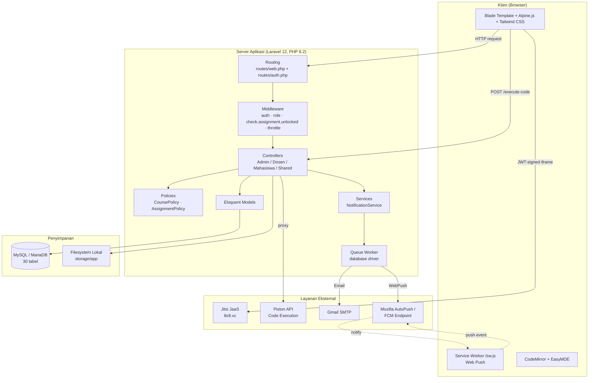
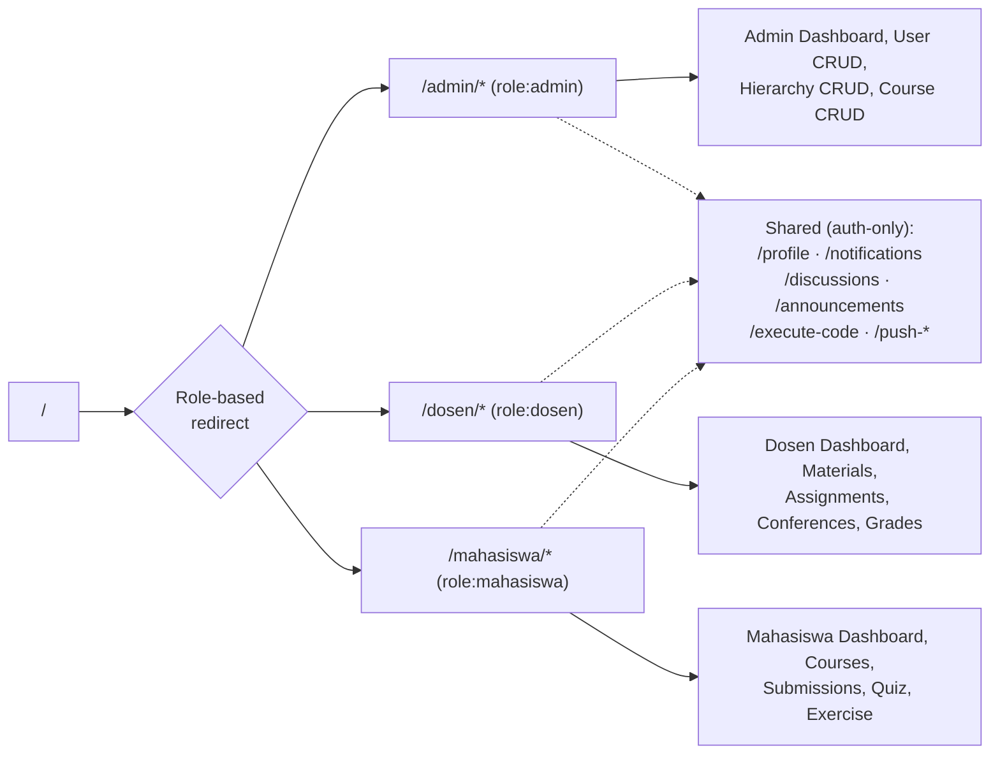
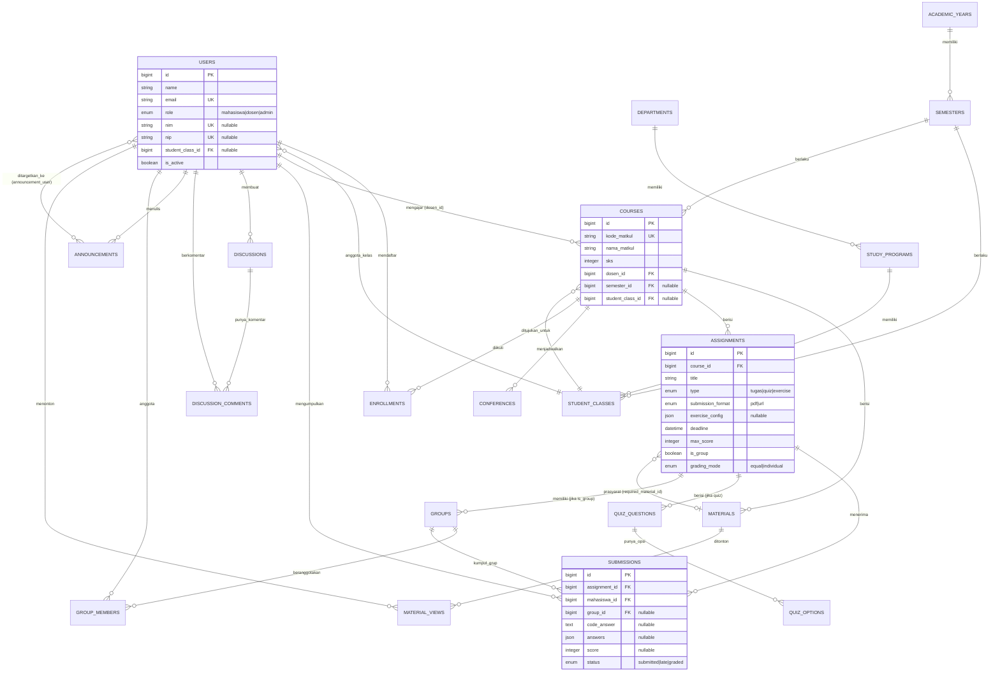
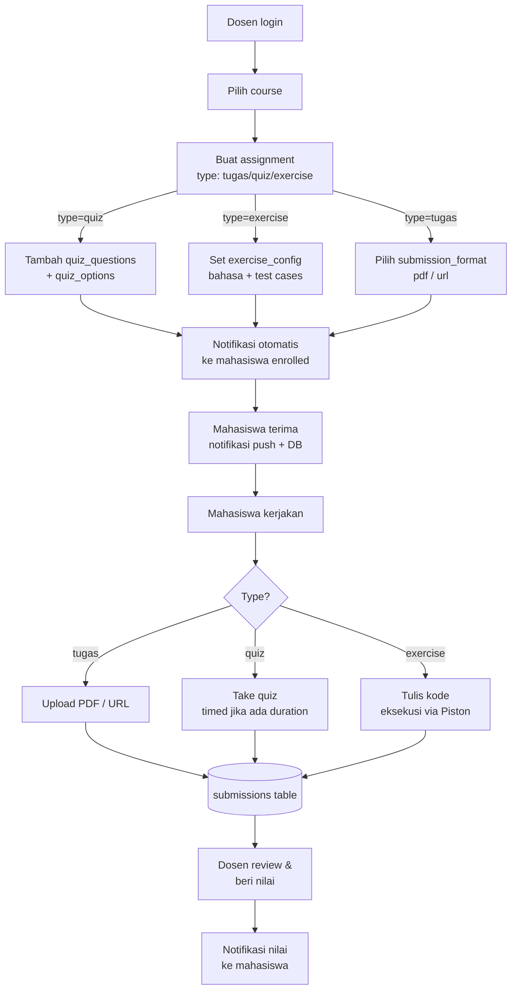
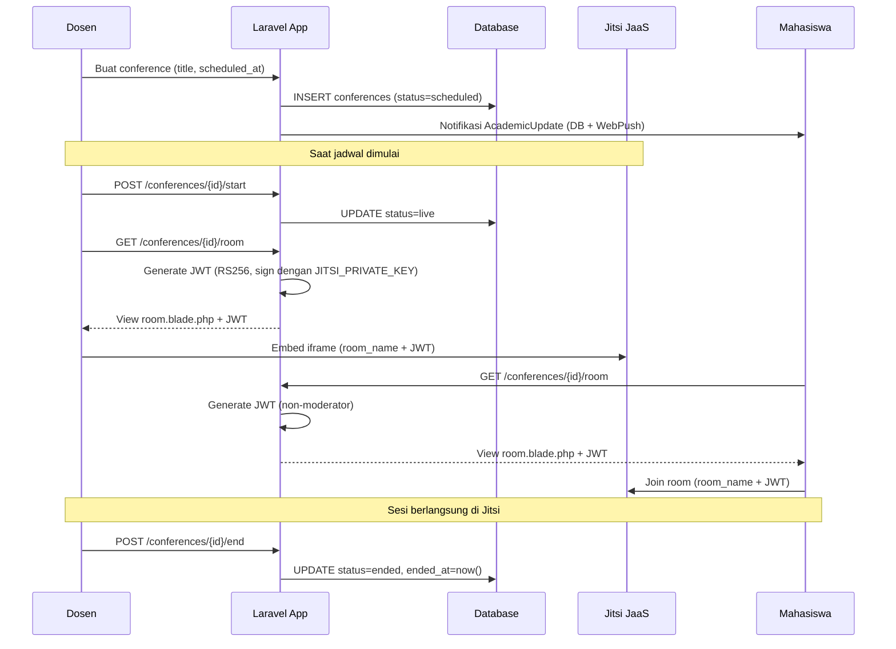
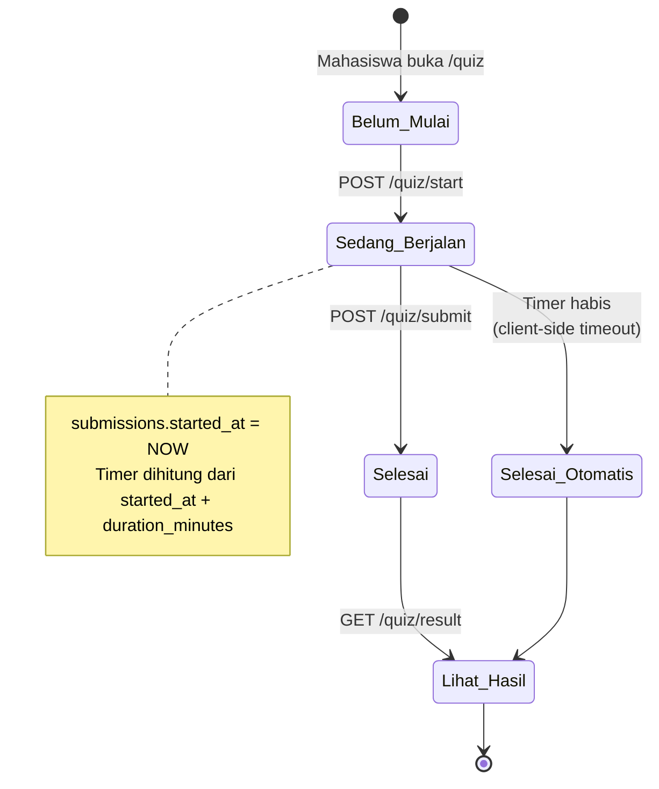
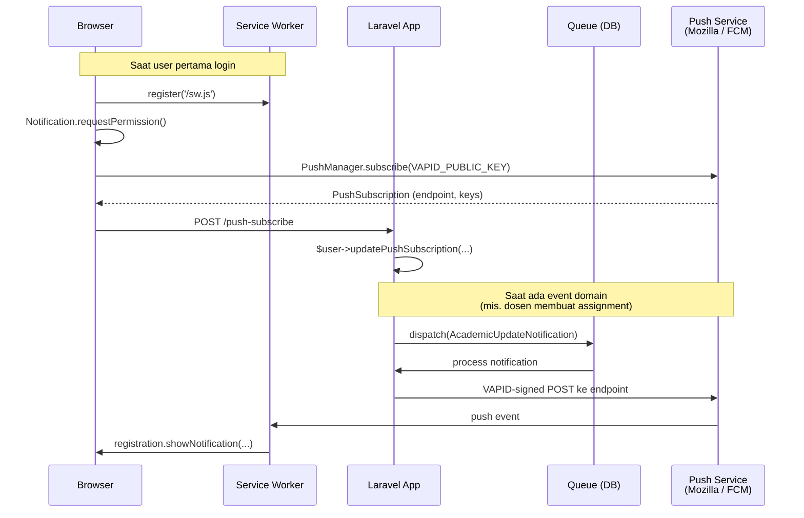

# BAB 4 — Implementasi dan Pengujian Sistem

> **Catatan untuk pengguna dokumen ini:**
> File ini adalah **dokumen sumber** (bukan BAB 4 final). Isinya adalah inventaris fakta tentang aplikasi PBL Workspace yang ditarik langsung dari kode di `D:\Projects\pjbl\`. Pakai dokumen ini sebagai konteks ketika berkolaborasi dengan Claude untuk menulis narasi BAB 4 di Word/LaTeX. Setiap fakta disertai pointer ke file/tabel sumbernya, sehingga mudah diverifikasi ulang.

---

## Daftar Isi

- [4.1 Implementasi Sistem](#41-implementasi-sistem)
  - [4.1.1 Lingkungan Implementasi](#411-lingkungan-implementasi)
  - [4.1.2 Arsitektur Sistem](#412-arsitektur-sistem)
  - [4.1.3 Implementasi Basis Data](#413-implementasi-basis-data)
  - [4.1.4 Implementasi Modul/Fitur per Peran](#414-implementasi-modulfitur-per-peran)
  - [4.1.5 Implementasi Antarmuka Pengguna](#415-implementasi-antarmuka-pengguna)
  - [4.1.6 Implementasi Integrasi Eksternal](#416-implementasi-integrasi-eksternal)
  - [4.1.7 Implementasi Keamanan](#417-implementasi-keamanan)
- [4.2 Pengujian Sistem](#42-pengujian-sistem)
  - [4.2.1 Rencana Pengujian](#421-rencana-pengujian)
  - [4.2.2 Skenario Pengujian Black-Box](#422-skenario-pengujian-black-box)
  - [4.2.3 Pengujian Otomatis](#423-pengujian-otomatis)
  - [4.2.4 Hasil Pengujian](#424-hasil-pengujian)
- [Lampiran A — Inventaris Route Lengkap](#lampiran-a--inventaris-route-lengkap)
- [Lampiran B — Variabel Lingkungan](#lampiran-b--variabel-lingkungan)
- [Lampiran C — Akun Uji Default](#lampiran-c--akun-uji-default)
- [Lampiran D — Daftar Screenshot Antarmuka (TODO)](#lampiran-d--daftar-screenshot-antarmuka-todo)

---

## Profil Singkat Aplikasi

**PBL Workspace** adalah platform Project-Based Learning berbasis web untuk mendukung pembelajaran berbasis proyek di lingkungan kampus politeknik/universitas. Aplikasi ini melayani tiga peran pengguna — **admin**, **dosen** (lecturer), dan **mahasiswa** (student) — di atas struktur akademik berjenjang: jurusan (department) → program studi (study program) → kelas (student class) → mata kuliah (course).

| Atribut | Nilai |
|---|---|
| Nama aplikasi | PBL Workspace (`APP_NAME` di `.env`) |
| Domain bisnis | E-learning / LMS berorientasi project-based learning |
| Bahasa domain | Indonesia (`mata_kuliah`, `kode_matkul`, `sks`, `nim`, `nip`) |
| Pola arsitektur | Monolith MVC, server-rendered (Blade), bukan SPA |
| Repository | `D:\Projects\pjbl\` (Git, branch utama: `main`) |

---

## 4.1 Implementasi Sistem

### 4.1.1 Lingkungan Implementasi

#### 4.1.1.1 Spesifikasi Perangkat Keras (Minimum Pengembangan)

| Komponen | Spesifikasi |
|---|---|
| Prosesor | Intel Core i3 generasi 8 atau setara (mendukung x86_64) |
| RAM | 8 GB (16 GB direkomendasikan untuk menjalankan Docker + Vite + queue worker secara paralel) |
| Penyimpanan | 5 GB ruang kosong (kode + database + node_modules) |
| Koneksi internet | Wajib untuk pengambilan dependensi (`composer install`, `npm install`) dan integrasi pihak ketiga (Jitsi JaaS, Piston API, WebPush) |

#### 4.1.1.2 Spesifikasi Perangkat Lunak

| Kategori | Perangkat Lunak | Versi |
|---|---|---|
| Sistem Operasi (dev) | Windows 11 Pro / Linux / macOS | — |
| Web Server (dev) | PHP Built-in Server via `php artisan serve` | — |
| Bahasa Pemrograman | PHP | ≥ 8.2 |
| Framework Backend | Laravel | 12.x |
| Bahasa Frontend | JavaScript (ES2022) | — |
| Build Tool Frontend | Vite | 7.0.7 |
| Manajer Paket PHP | Composer | 2.x |
| Manajer Paket JS | NPM | 10.x (Node.js ≥ 18) |
| Database (produksi) | MariaDB / MySQL | 10.x / 8.x |
| Database (testing) | SQLite (in-memory) | bawaan PHP |
| Cache & Session | Database (default) atau Redis (opsional) | — |
| Queue Driver | Database (default) | — |
| Broadcast Driver | `log` (belum ada Pusher/Reverb) | — |

#### 4.1.1.3 Daftar Dependensi Inti

**Backend (`composer.json`):**

| Paket | Versi | Fungsi |
|---|---|---|
| `laravel/framework` | ^12.0 | Framework MVC inti |
| `livewire/livewire` | ^3.x | Komponen reaktif (dipakai untuk thread diskusi) |
| `laravel/breeze` | (dev) | Scaffolding autentikasi |
| `laravel/dusk` | (dev) | Browser testing E2E |
| `laravel-notification-channels/webpush` | ^10.5 | Notifikasi push W3C berbasis VAPID |
| `agence104/livekit-server-sdk` | ^1.3 | Generator JWT untuk LiveKit (legacy, lihat 4.1.6) |
| `pestphp/pest` | ^3.8 | Test runner (Pest atas PHPUnit) |
| `pestphp/pest-plugin-laravel` | ^3.x | Helper Pest untuk Laravel |
| `laravel/pint` | ^1.24 | PHP code formatter (PSR-12) |
| `laravel/pail` | — | Real-time log tail untuk dev |

**Frontend (`package.json`):**

| Paket | Versi | Fungsi |
|---|---|---|
| `alpinejs` | ^3.4.2 | Reaktivitas UI ringan (modal, dropdown, sidebar) |
| `tailwindcss` | ^3.1.0 | Utility-first CSS framework |
| `@tailwindcss/forms` | — | Reset styling form |
| `vite` | ^7.0.7 | Bundler & dev server (HMR) |
| `laravel-vite-plugin` | ^2.0.0 | Integrasi Laravel ↔ Vite |
| `codemirror` | ^5.65.20 | Editor kode untuk modul exercise (multi-bahasa: HTML/CSS/JS/Java/PHP/C#) |
| `easymde` | ^2.20.0 | Markdown editor untuk pembuatan materi oleh dosen |
| `marked` | ^17.0.1 | Parser Markdown → HTML di sisi klien |
| `highlight.js` | ^11.11.1 | Syntax highlighting pada konten yang ter-render |
| `axios` | ^1.11.0 | HTTP client (CSRF-aware) |
| `@playwright/test` | ^1.59.1 | E2E testing (suite WIP, branch `feat/playwright-qa-suite`) |
| `concurrently` | — | Menjalankan banyak proses dev secara paralel |
| `fast-glob` | ^3.3.0 | Resolusi entry point CSS per halaman |

#### 4.1.1.4 Skrip Pengembangan

Ringkasan dari `composer.json` dan `package.json`:

| Perintah | Tujuan |
|---|---|
| `composer setup` | Setup awal: install deps, salin `.env`, generate key, migrate, install npm, build aset |
| `composer dev` | Jalankan 4 proses paralel: `php artisan serve`, `queue:listen`, `pail`, `vite` |
| `composer test` | `config:clear` + `php artisan test` (Pest) |
| `vendor/bin/pint` | Format kode PHP sesuai PSR-12 |
| `npm run dev` | Vite dev server (HMR) |
| `npm run build` | Build aset produksi |
| `npm run audit:contrast` | Audit kontras warna design system (`scripts/audit-contrast.mjs`) |
| `npm run test:pw` | Playwright (varian: `:headed`, `:ui`, `:report`) |

#### 4.1.1.5 Variabel Lingkungan Wajib

`.env.example` repo masih varian Laravel default — banyak variabel integrasi **tidak tercantum** dan harus ditambahkan manual saat deploy. Daftar lengkap di [Lampiran B](#lampiran-b--variabel-lingkungan). Ringkasan:

- **Wajib bawaan Laravel**: `APP_NAME`, `APP_KEY`, `APP_URL`, `DB_*`, `MAIL_*`, `SESSION_*`
- **Konferensi (Jitsi JaaS)**: `JITSI_DOMAIN`, `JITSI_APP_ID`, `JITSI_KID`, `JITSI_PRIVATE_KEY_PATH` (*tidak ada di `.env.example`*)
- **Push notification**: `VAPID_PUBLIC_KEY`, `VAPID_PRIVATE_KEY` (*tidak ada di `.env.example`*)
- **Eksekusi kode**: `PISTON_API_URL` (*tidak ada di `.env.example`*)

---

### 4.1.2 Arsitektur Sistem

#### 4.1.2.1 Pola Arsitektur

Aplikasi mengikuti pola **Model-View-Controller (MVC)** bawaan Laravel dengan tambahan lapisan **Policy** (otorisasi) dan **Service** (logika lintas controller). Aplikasi adalah **monolith server-rendered**, bukan Single Page Application — render HTML dilakukan di sisi server menggunakan template Blade, dengan interaktivitas tipis di klien menggunakan Alpine.js.

**Catatan arsitektur penting:**
- Hanya **satu** komponen Livewire di seluruh aplikasi (`app/Livewire/Discussion/Show.php`); selebihnya Blade biasa.
- Tidak menggunakan Inertia.js, Vue, atau React.
- Mahasiswa flow memakai **query pivot langsung** (`DB::table('enrollments')->where(...)`) alih-alih relasi Eloquent untuk performa di endpoint tinggi-trafik.

#### 4.1.2.2 Diagram Arsitektur Tingkat Tinggi



#### 4.1.2.3 Pembagian Tanggung Jawab Lapisan

| Lapisan | Lokasi | Tanggung Jawab |
|---|---|---|
| Routing | `routes/web.php`, `routes/auth.php` | Mendaftarkan endpoint per peran (`/admin`, `/dosen`, `/mahasiswa`) |
| Middleware | `app/Http/Middleware/` | Autentikasi, otorisasi peran, prasyarat tugas, throttling |
| Controllers | `app/Http/Controllers/{Admin,Dosen,Mahasiswa,Auth,...}/` | Validasi input, orkestrasi domain, render view |
| Policies | `app/Policies/` | Otorisasi granular (per-instance) |
| Services | `app/Services/` | Logika lintas controller (notifikasi massal) |
| Models | `app/Models/` | Eloquent ORM, relasi, mutator/accessor |
| Notifications | `app/Notifications/` | Channel database, mail, dan webpush |
| Views | `resources/views/` | Template Blade per peran |
| Komponen UI | `resources/views/components/`, `app/View/Components/` | Komponen reusable Blade |
| Aset Frontend | `resources/{css,js}/` | Bundling Vite (HMR di dev) |

#### 4.1.2.4 Pemetaan URL → Peran



---

### 4.1.3 Implementasi Basis Data

#### 4.1.3.1 Ringkasan

- **Total tabel**: 30 (24 domain + 6 framework)
- **Total file migrasi**: 25 (`database/migrations/`)
- **Total model Eloquent**: 20 (`app/Models/`)
- **Total seeder**: 10 (`database/seeders/`)
- **Total factory**: 11 (`database/factories/`)
- **Konvensi penamaan**: tabel `snake_case_plural`, kolom `snake_case`. Istilah domain Indonesia dipertahankan: `mata_kuliah` (dipotong jadi `nama_matkul`/`kode_matkul`), `mahasiswa_id`, `dosen_id`, `nim`, `nip`, `sks`.

#### 4.1.3.2 Diagram Hubungan Antar Entitas (ERD)

ERD di bawah menampilkan **entitas inti domain** (mengabaikan tabel framework seperti `cache`, `jobs`, `sessions`, `notifications`, dan `password_reset_tokens` untuk kejelasan).



#### 4.1.3.3 Daftar Tabel (Ringkas)

| # | Tabel | Domain | Deskripsi |
|---|---|---|---|
| 1 | `users` | Auth | Akun pengguna, kolom `role` membedakan admin/dosen/mahasiswa |
| 2 | `password_reset_tokens` | Auth | Token reset password (default Laravel) |
| 3 | `sessions` | Auth | Session DB-based |
| 4 | `cache` | Framework | Cache key-value |
| 5 | `cache_locks` | Framework | Atomic locks untuk cache |
| 6 | `jobs` | Framework | Queue jobs (driver: database) |
| 7 | `job_batches` | Framework | Batch jobs |
| 8 | `failed_jobs` | Framework | Job yang gagal eksekusi |
| 9 | `academic_years` | Akademik | Tahun ajaran (mis. 2025/2026) |
| 10 | `semesters` | Akademik | Semester (Ganjil/Genap) per tahun ajaran |
| 11 | `departments` | Akademik | Jurusan (mis. TIK, TE) |
| 12 | `study_programs` | Akademik | Program studi (mis. D4 Teknik Informatika) |
| 13 | `student_classes` | Akademik | Kelas mahasiswa (mis. TI-1A) |
| 14 | `courses` | Pembelajaran | Mata kuliah (course) |
| 15 | `enrollments` | Pembelajaran | Pivot mahasiswa ↔ mata kuliah + nilai akhir |
| 16 | `materials` | Pembelajaran | Materi kuliah (markdown + lampiran) |
| 17 | `material_views` | Tracking | Catatan mahasiswa yang sudah membaca materi (untuk gating prasyarat) |
| 18 | `assignments` | PBL | Tugas/quiz/exercise (kolom `type`) |
| 19 | `submissions` | PBL | Pengumpulan tugas oleh mahasiswa (file/url/quiz/code) |
| 20 | `groups` | PBL | Kelompok untuk tugas berkelompok |
| 21 | `group_members` | PBL | Anggota kelompok |
| 22 | `quiz_questions` | PBL | Soal quiz (essay / pilihan ganda / code snippet) |
| 23 | `quiz_options` | PBL | Opsi jawaban untuk soal pilihan ganda |
| 24 | `conferences` | Konferensi | Jadwal kelas virtual (Jitsi room) |
| 25 | `discussions` | Kolaborasi | Thread diskusi (per topik, bukan per course) |
| 26 | `discussion_comments` | Kolaborasi | Komentar pada thread |
| 27 | `announcements` | Komunikasi | Pengumuman (broadcast / per peran / per user) |
| 28 | `announcement_user` | Pivot | Penargetan pengumuman ke user spesifik |
| 29 | `notifications` | Notifikasi | Notifikasi database polymorphic (default Laravel) |
| 30 | `push_subscriptions` | Notifikasi | Subscription Web Push polymorphic (paket webpush) |

#### 4.1.3.4 Detail Tabel Domain Inti

Berikut struktur detail untuk 15 tabel domain utama. Tabel framework (cache, jobs, sessions) tidak dijabarkan karena bawaan Laravel.

##### Tabel `users`

| Kolom | Tipe | Null | Default | Catatan |
|---|---|---|---|---|
| `id` | bigint | No | auto | PK |
| `name` | string(255) | No | — | |
| `email` | string(255) | No | — | UNIQUE |
| `email_verified_at` | timestamp | Yes | NULL | |
| `password` | string(255) | No | — | bcrypt hash |
| `role` | enum | No | `mahasiswa` | nilai: `mahasiswa`, `dosen`, `admin` |
| `nim` | string(255) | Yes | NULL | UNIQUE, identitas mahasiswa |
| `nip` | string(255) | Yes | NULL | UNIQUE, identitas dosen |
| `sso_id` | string(255) | Yes | NULL | reservasi untuk integrasi SSO kampus |
| `student_class_id` | foreignId | Yes | NULL | FK → `student_classes.id`, ON DELETE SET NULL |
| `is_active` | boolean | No | `true` | toggle aktivasi akun |
| `remember_token` | string(100) | Yes | NULL | |
| `created_at` / `updated_at` | timestamp | Yes | NULL | |

Indeks: `role`, `is_active`, `student_class_id`.

##### Tabel `academic_years`

| Kolom | Tipe | Null | Default | Catatan |
|---|---|---|---|---|
| `id` | bigint | No | auto | PK |
| `year_start` | string(255) | No | — | mis. "2025" |
| `year_end` | string(255) | No | — | mis. "2026" |
| `is_active` | boolean | No | `false` | hanya satu yang `true` per waktu (konvensi seeder) |
| `created_at` / `updated_at` | timestamp | Yes | NULL | |

##### Tabel `semesters`

| Kolom | Tipe | Null | Default | Catatan |
|---|---|---|---|---|
| `id` | bigint | No | auto | PK |
| `academic_year_id` | foreignId | No | — | FK → `academic_years.id`, ON DELETE CASCADE |
| `name` | string(255) | No | — | mis. "Ganjil", "Genap" |
| `start_date` | date | No | — | |
| `end_date` | date | No | — | |
| `is_active` | boolean | No | `false` | |

##### Tabel `departments`

| Kolom | Tipe | Null | Default | Catatan |
|---|---|---|---|---|
| `id` | bigint | No | auto | PK |
| `name` | string(255) | No | — | |
| `code` | string(255) | No | — | UNIQUE |

##### Tabel `study_programs`

| Kolom | Tipe | Null | Default | Catatan |
|---|---|---|---|---|
| `id` | bigint | No | auto | PK |
| `department_id` | foreignId | No | — | FK → `departments.id`, ON DELETE CASCADE |
| `name` | string(255) | No | — | mis. "D4 Teknik Informatika" |
| `code` | string(255) | No | — | UNIQUE |
| `level` | enum | No | `D4` | nilai: `D3`, `D4`, `S1`, `S2`, `S3` |

##### Tabel `student_classes`

| Kolom | Tipe | Null | Default | Catatan |
|---|---|---|---|---|
| `id` | bigint | No | auto | PK |
| `study_program_id` | foreignId | No | — | FK → `study_programs.id`, ON DELETE CASCADE |
| `semester_id` | foreignId | No | — | FK → `semesters.id`, ON DELETE CASCADE |
| `name` | string(255) | No | — | mis. "TI-1A" |

##### Tabel `courses`

| Kolom | Tipe | Null | Default | Catatan |
|---|---|---|---|---|
| `id` | bigint | No | auto | PK |
| `kode_matkul` | string(255) | No | — | UNIQUE, kode mata kuliah |
| `nama_matkul` | string(255) | No | — | |
| `sks` | integer | No | `3` | satuan kredit semester |
| `dosen_id` | foreignId | No | — | FK → `users.id`, ON DELETE CASCADE |
| `semester_id` | foreignId | Yes | NULL | FK → `semesters.id`, ON DELETE SET NULL |
| `student_class_id` | foreignId | Yes | NULL | FK → `student_classes.id`, ON DELETE SET NULL |
| `course_img` | string(255) | Yes | NULL | path gambar sampul |
| `description` | text | Yes | NULL | |

##### Tabel `enrollments`

| Kolom | Tipe | Null | Default | Catatan |
|---|---|---|---|---|
| `id` | bigint | No | auto | PK |
| `course_id` | foreignId | No | — | FK → `courses.id`, ON DELETE CASCADE |
| `mahasiswa_id` | foreignId | No | — | FK → `users.id`, ON DELETE CASCADE |
| `final_grade` | decimal(5,2) | Yes | NULL | nilai akhir |
| `enrolled_at` | timestamp | No | CURRENT_TIMESTAMP | |

UNIQUE: (`course_id`, `mahasiswa_id`).

##### Tabel `materials`

| Kolom | Tipe | Null | Default | Catatan |
|---|---|---|---|---|
| `id` | bigint | No | auto | PK |
| `course_id` | foreignId | No | — | FK → `courses.id`, ON DELETE CASCADE |
| `title` | string(255) | No | — | |
| `content` | text | Yes | NULL | konten markdown |
| `file_path` | string(255) | Yes | NULL | lampiran |
| `order` | integer | No | `0` | urutan tampilan, ditata via drag & drop |

##### Tabel `material_views`

| Kolom | Tipe | Null | Default | Catatan |
|---|---|---|---|---|
| `id` | bigint | No | auto | PK |
| `material_id` | foreignId | No | — | FK → `materials.id`, ON DELETE CASCADE |
| `student_id` | foreignId | No | — | FK → `users.id`, ON DELETE CASCADE |
| `viewed_at` | timestamp | No | — | |

UNIQUE: (`material_id`, `student_id`) — satu catatan per mahasiswa per materi.

##### Tabel `assignments`

| Kolom | Tipe | Null | Default | Catatan |
|---|---|---|---|---|
| `id` | bigint | No | auto | PK |
| `course_id` | foreignId | No | — | FK → `courses.id`, ON DELETE CASCADE |
| `title` | string(255) | No | — | |
| `order` | integer | No | `0` | urutan tampilan |
| `assignment_number` | integer | Yes | NULL | nomor tugas (informatif) |
| `description` | text | Yes | NULL | markdown |
| `type` | enum | No | `tugas` | nilai: `tugas`, `quiz`, `exercise` |
| `submission_format` | enum | No | `pdf` | nilai: `pdf`, `url` (untuk type `tugas`) |
| `exercise_config` | json | Yes | NULL | konfigurasi coding exercise (bahasa, test cases) |
| `deadline` | datetime | No | — | |
| `max_score` | integer | No | `100` | |
| `required_material_id` | foreignId | Yes | NULL | FK → `materials.id`, ON DELETE SET NULL — prasyarat baca |
| `duration_minutes` | integer | Yes | NULL | durasi (untuk quiz timed) |
| `quiz_number` | integer | Yes | NULL | nomor quiz |
| `is_group` | boolean | No | `false` | tugas kelompok |
| `max_group_size` | unsignedInteger | Yes | NULL | maksimum anggota grup |
| `grading_mode` | enum | No | `equal` | nilai: `equal`, `individual` (untuk tugas grup) |

##### Tabel `submissions`

| Kolom | Tipe | Null | Default | Catatan |
|---|---|---|---|---|
| `id` | bigint | No | auto | PK |
| `assignment_id` | foreignId | No | — | FK → `assignments.id`, ON DELETE CASCADE |
| `mahasiswa_id` | foreignId | No | — | FK → `users.id`, ON DELETE CASCADE |
| `group_id` | foreignId | Yes | NULL | FK → `groups.id`, ON DELETE SET NULL |
| `file_path` | string(255) | Yes | NULL | jika submission_format=pdf |
| `url_link` | string(255) | Yes | NULL | jika submission_format=url |
| `code_answer` | text | Yes | NULL | jika type=exercise |
| `answers` | json | Yes | NULL | jawaban quiz (key: question_id) |
| `validation_result` | json | Yes | NULL | hasil eksekusi kode dari Piston |
| `notes` | text | Yes | NULL | catatan mahasiswa |
| `submitted_at` | timestamp | Yes | NULL | |
| `started_at` | timestamp | Yes | NULL | mulai mengerjakan quiz |
| `finished_at` | timestamp | Yes | NULL | selesai quiz |
| `score` | integer | Yes | NULL | |
| `feedback` | text | Yes | NULL | umpan balik dosen |
| `auto_graded` | boolean | No | `false` | |
| `status` | enum | No | `submitted` | nilai: `submitted`, `late`, `graded` |

##### Tabel `groups` & `group_members`

`groups`:
| Kolom | Tipe | Catatan |
|---|---|---|
| `id` | bigint | PK |
| `assignment_id` | foreignId | FK → `assignments.id`, ON DELETE CASCADE |
| `group_name` | string(255) | |
| `created_by_mahasiswa_id` | foreignId | FK → `users.id`, ON DELETE SET NULL |

`group_members`:
| Kolom | Tipe | Catatan |
|---|---|---|
| `id` | bigint | PK |
| `group_id` | foreignId | FK → `groups.id`, ON DELETE CASCADE |
| `mahasiswa_id` | foreignId | FK → `users.id`, ON DELETE CASCADE |

UNIQUE: (`group_id`, `mahasiswa_id`).

##### Tabel `quiz_questions` & `quiz_options`

`quiz_questions`:
| Kolom | Tipe | Catatan |
|---|---|---|
| `id` | bigint | PK |
| `assignment_id` | foreignId | FK → `assignments.id`, ON DELETE CASCADE |
| `question_text` | text | |
| `question_type` | enum | nilai: `essay`, `pilihan_ganda`, `code_snippet` |
| `correct_answer` | text | NULL untuk essay |
| `score_weight` | integer | default `1` |

`quiz_options`:
| Kolom | Tipe | Catatan |
|---|---|---|
| `id` | bigint | PK |
| `question_id` | foreignId | FK → `quiz_questions.id`, ON DELETE CASCADE |
| `option_text` | string(255) | |
| `is_correct` | boolean | default `false` |

##### Tabel `conferences`

| Kolom | Tipe | Null | Default | Catatan |
|---|---|---|---|---|
| `id` | bigint | No | auto | PK |
| `course_id` | foreignId | No | — | FK → `courses.id`, ON DELETE CASCADE |
| `dosen_id` | foreignId | No | — | FK → `users.id`, ON DELETE CASCADE |
| `title` | string(255) | No | — | |
| `description` | text | Yes | NULL | |
| `room_name` | string(255) | No | — | UNIQUE — identifier Jitsi room |
| `scheduled_at` | datetime | No | — | jadwal mulai |
| `ended_at` | datetime | Yes | NULL | timestamp berakhir |
| `status` | enum | No | `scheduled` | nilai: `scheduled`, `live`, `ended` |

##### Tabel `discussions` & `discussion_comments`

`discussions`:
| Kolom | Tipe | Catatan |
|---|---|---|
| `id` | bigint | PK |
| `user_id` | foreignId | FK → `users.id`, ON DELETE CASCADE |
| `topic` | string(255) | topik diskusi (semula `course_id`, di-migrate jadi `topic` — migrasi `2026_03_12_065022_alter_discussions_table_replace_course_with_topic.php`) |
| `title` | string(255) | |
| `content` | text | |

`discussion_comments`:
| Kolom | Tipe | Catatan |
|---|---|---|
| `id` | bigint | PK |
| `discussion_id` | foreignId | FK → `discussions.id`, ON DELETE CASCADE |
| `user_id` | foreignId | FK → `users.id`, ON DELETE CASCADE |
| `content` | text | |

##### Tabel `announcements` & `announcement_user`

`announcements`:
| Kolom | Tipe | Catatan |
|---|---|---|
| `id` | bigint | PK |
| `user_id` | foreignId | penulis (FK → `users.id`) |
| `title` | string(255) | |
| `content` | text | |
| `target_audience` | enum | nilai: `all`, `dosen`, `mahasiswa`, `specific` |
| `attachment_path` | string(255) | NULL |
| `attachment_name` | string(255) | NULL |
| `attachment_mime` | string(100) | NULL |

`announcement_user` (pivot, untuk audience=`specific`):
| Kolom | Tipe | Catatan |
|---|---|---|
| `id` | bigint | PK |
| `announcement_id` | foreignId | FK → `announcements.id`, ON DELETE CASCADE |
| `user_id` | foreignId | FK → `users.id`, ON DELETE CASCADE |

UNIQUE: (`announcement_id`, `user_id`).

##### Tabel `notifications`

Default Laravel polymorphic notification table:

| Kolom | Tipe | Catatan |
|---|---|---|
| `id` | uuid | PK |
| `type` | string(255) | nama class notifikasi |
| `notifiable_type` | string(255) | morph type (biasanya `App\Models\User`) |
| `notifiable_id` | unsignedBigInteger | morph id |
| `data` | text (JSON) | payload notifikasi |
| `read_at` | timestamp | NULL = belum dibaca |

##### Tabel `push_subscriptions`

Disediakan oleh paket `laravel-notification-channels/webpush`:

| Kolom | Tipe | Catatan |
|---|---|---|
| `id` | bigint | PK |
| `subscribable_type` | string(255) | morph type |
| `subscribable_id` | unsignedBigInteger | morph id |
| `endpoint` | string(500) | UNIQUE — URL push service browser |
| `public_key` | string(255) | p256dh key |
| `auth_token` | string(255) | auth key |
| `content_encoding` | string(255) | mis. `aesgcm` |

#### 4.1.3.5 Daftar Enum

| Tabel.Kolom | Nilai |
|---|---|
| `users.role` | `mahasiswa`, `dosen`, `admin` |
| `study_programs.level` | `D3`, `D4`, `S1`, `S2`, `S3` |
| `assignments.type` | `tugas`, `quiz`, `exercise` |
| `assignments.submission_format` | `pdf`, `url` |
| `assignments.grading_mode` | `equal`, `individual` |
| `submissions.status` | `submitted`, `late`, `graded` |
| `quiz_questions.question_type` | `essay`, `pilihan_ganda`, `code_snippet` |
| `announcements.target_audience` | `all`, `dosen`, `mahasiswa`, `specific` |
| `conferences.status` | `scheduled`, `live`, `ended` |

#### 4.1.3.6 Daftar Seeder

| Seeder | Fungsi |
|---|---|
| `DatabaseSeeder` | Master orchestrator — memanggil seeder lain berurutan |
| `AcademicYearSeeder` | Tahun ajaran 2025/2026 (`is_active=true`) |
| `SemesterSeeder` | Semester Ganjil aktif untuk tahun ajaran tersebut |
| `DepartmentSeeder` | Jurusan TIK & TE |
| `StudyProgramSeeder` | 3 prodi: D4 TI, D3 TK, D3 TL |
| `StudentClassSeeder` | 3 kelas: TI-1A, TI-1B, TK-1A |
| `UserSeeder` | 1 admin, 3 dosen, 6 mahasiswa dengan kredensial tetap |
| `CourseSeeder` | 2 mata kuliah (WEB101, DB201) + materi + tugas + enrollment |
| `AssignmentSeeder` | 5 tipe tugas per mata kuliah (tugas PDF/URL, quiz pilihan ganda + essay, exercise) |
| `DummyDataSeeder` | Data uji komprehensif: 3 dosen, 15 mahasiswa, 3 mata kuliah, dst. |

Akun uji yang dihasilkan: lihat [Lampiran C](#lampiran-c--akun-uji-default).

#### 4.1.3.7 Daftar Factory

`UserFactory`, `AcademicYearFactory`, `SemesterFactory`, `CourseFactory`, `MaterialFactory`, `AssignmentFactory`, `SubmissionFactory`, `ConferenceFactory`, `DepartmentFactory`, `StudyProgramFactory`, `StudentClassFactory`.

---

### 4.1.4 Implementasi Modul/Fitur per Peran

Total **34 controller** (3 Auth, 11 Admin, 5 Dosen, 5 Mahasiswa, 2 Auth (admin), 8 Shared) dan **~140 endpoint**. Daftar lengkap: [Lampiran A](#lampiran-a--inventaris-route-lengkap).

#### 4.1.4.1 Modul Admin

Akses: pengguna dengan `role = admin` (URL prefix `/admin`, middleware `auth` + `role:admin`).

**Fitur:**

- **Autentikasi**: halaman login khusus admin (`/admin/login`) — terpisah dari login bersama.
- **Dashboard**: ringkasan statistik (jumlah user per role, jumlah course, dst.).
- **Manajemen Pengguna** (`UserController`):
  - CRUD pengguna (admin/dosen/mahasiswa)
  - Bulk delete (`POST /users/bulk-destroy`)
  - Toggle aktif/nonaktif (`PATCH /users/{id}/toggle-active`)
- **Struktur Akademik** (5 controller terpisah):
  - `AcademicYearController` — CRUD tahun ajaran
  - `SemesterController` — CRUD semester
  - `DepartmentController` — CRUD jurusan
  - `StudyProgramController` — CRUD program studi
  - `StudentClassController` — CRUD kelas mahasiswa
- **Hierarki Drill-down** (`HierarchyController`): navigasi berjenjang Departments → Study Programs → Semesters → Student Classes, plus aksi tambah/hapus mata kuliah ke kombinasi semester/kelas.
- **Mata Kuliah** (`CourseController`): CRUD course + endpoint enroll/unenroll mahasiswa.
- **Nilai** (`GradeController`): tampilan agregat nilai akhir lintas course.
- **Push Debug** (`PushDebugController`): UI testing push notification (`/admin/debug/push`).

**Pemetaan fitur ↔ controller@method ↔ view:**

| Fitur | Controller@method | View |
|---|---|---|
| Dashboard admin | `Admin\DashboardController@index` | `admin/dashboard.blade.php` |
| Daftar user | `Admin\UserController@index` | `admin/users/index.blade.php` |
| Form tambah user | `Admin\UserController@create` | `admin/users/create.blade.php` |
| Simpan user | `Admin\UserController@store` | (redirect) |
| Bulk delete user | `Admin\UserController@bulkDestroy` | (redirect) |
| Hierarki utama | `Admin\HierarchyController@index` | `admin/hierarchy/...` |
| Tambah course ke semester | `Admin\HierarchyController@addSemesterCourse` | (redirect) |
| Push debug | `Admin\PushDebugController@index/send` | `admin/debug/push.blade.php` |

#### 4.1.4.2 Modul Dosen

Akses: pengguna dengan `role = dosen` (URL prefix `/dosen`, middleware `auth` + `role:dosen`).

**Fitur:**

- **Dashboard**: course yang diajar, jumlah mahasiswa, deadline tugas.
- **Materi** (`MaterialController`): CRUD materi per course + reorder drag-and-drop (`POST /courses/{course}/materials/reorder`). Editor Markdown menggunakan EasyMDE.
- **Tugas / Quiz / Exercise** (`AssignmentController` — kontroler tunggal lintas tiga tipe):
  - CRUD assignment dengan kolom `type` (`tugas`/`quiz`/`exercise`) menentukan format
  - Reorder assignment per course
  - Manajemen soal quiz (`questions/*`): CRUD soal + opsi
  - Daftar submission per assignment (`/assignments/{assignment}/submissions`)
  - Penilaian individu (`POST /submissions/{submission}/grade`) atau per grup (`POST /groups/{group}/grade`)
  - Lihat detail percobaan quiz (`GET /assignments/{assignment}/submissions/{submission}`)
- **Exercise (Coding)** (`ExerciseController` — terpisah dari `AssignmentController` karena form & validasi berbeda): create/store/edit/update assignment bertipe `exercise` dengan editor CodeMirror dan konfigurasi `exercise_config`.
- **Konferensi Virtual** (`ConferenceController`): CRUD jadwal + start (`POST /conferences/{conference}/start`) + end (`POST /conferences/{conference}/end`) + room view (`GET /conferences/{conference}/room`).
- **Nilai** (`GradeController`): rekap nilai mahasiswa di course-course yang diajar.

**Diagram alur — Pembuatan Tugas dan Pengumpulan oleh Mahasiswa:**



**Diagram alur — Konferensi Virtual (Jitsi):**



#### 4.1.4.3 Modul Mahasiswa

Akses: pengguna dengan `role = mahasiswa` (URL prefix `/mahasiswa`, middleware `auth` + `role:mahasiswa`).

**Fitur:**

- **Dashboard**: course yang diikuti, deadline tugas mendatang, pengumuman terbaru.
- **Course** (`CourseController`):
  - Daftar course (`/mahasiswa/courses`)
  - Detail course (`GET /courses/{course}`)
  - Enroll diri sendiri ke course (`POST /courses/{course}/enroll`)
  - Lihat materi (`GET /courses/{course}/materials/{material}`) — pembukaan materi mencatat `material_views`.
- **Submission** (`SubmissionController`, dilindungi middleware `check.assignment.unlocked`):
  - Create/store/edit/update/destroy submission
  - Validasi tipe submission sesuai assignment (PDF / URL / kode / kuis)
- **Quiz** (`QuizController` — alur khusus karena timed):
  - Show pengantar (`GET /assignments/{assignment}/quiz`)
  - Start attempt (`POST /assignments/{assignment}/quiz/start`) — set `submissions.started_at`
  - Take (`GET /assignments/{assignment}/quiz/take`) — render soal
  - Submit (`POST /assignments/{assignment}/quiz/submit`) — set `finished_at`, hitung skor
  - Result (`GET /assignments/{assignment}/quiz/result`)
- **Exercise** (`ExerciseController`, dilindungi `check.assignment.unlocked`):
  - Solve (`GET /exercises/{assignment}/solve`) — editor CodeMirror
  - Submit (`POST /exercises/submit`) — eksekusi via Piston, simpan `validation_result`
- **Konferensi**: list (`/mahasiswa/courses/{course}/conferences`), join room (`/mahasiswa/conferences/{conference}/room`).
- **Nilai**: rekap nilai diri sendiri.

**Diagram alur — Quiz Timed:**



#### 4.1.4.4 Modul Bersama (Shared)

Tersedia untuk semua peran yang sudah login (middleware `auth`).

**Fitur:**

| Fitur | Endpoint Utama | Controller |
|---|---|---|
| Profil | `GET/PATCH/DELETE /profile` | `ProfileController` |
| Notifikasi | `GET /notifications`, mark-read | `NotificationController` |
| Eksekusi Kode | `POST /execute-code` (throttle 10/menit) | `CodeExecutionController` *(WIP — class belum ada di repo, route terdaftar)* |
| Web Push Subscription | `POST /push-subscribe`, `/push-unsubscribe` | `PushSubscriptionController` |
| Diskusi | `Route::resource('discussions', ...)` | `DiscussionController` (+ Livewire `Discussion\Show`) |
| Pengumuman | `Route::resource('announcements', ...)` | `AnnouncementController` |

**Diagram alur — Notifikasi Push:**



---

### 4.1.5 Implementasi Antarmuka Pengguna

#### 4.1.5.1 Tata Letak (Layout)

| Layout | File | Pemakaian |
|---|---|---|
| `<x-app-layout>` | `resources/views/layouts/app.blade.php` | Halaman setelah login — sidebar, topbar, notification bell, init Web Push |
| `<x-guest-layout>` | `resources/views/layouts/guest.blade.php` | Halaman tamu (login, register, lupa password) |
| `layouts/sidebar.blade.php` | partial | Sidebar yang collapsible di mobile |
| `layouts/topbar.blade.php` | partial | Topbar dengan dropdown profil dan notifikasi |
| `layouts/notifications.blade.php` | partial | Bell + dropdown daftar notifikasi |
| `layouts/navigation.blade.php` | partial | Navigasi utama (link per peran) |

#### 4.1.5.2 Komponen Reusable

Lokasi: `resources/views/components/` (Anonymous Components Blade).

| Komponen | Fungsi |
|---|---|
| `<x-application-logo>` | Logo SVG aplikasi |
| `<x-input-label>` | Label form (Tailwind) |
| `<x-input-error>` | Daftar pesan validasi |
| `<x-text-input>` | Input field bergaya |
| `<x-primary-button>` | Tombol aksi utama (gradient, shadow, active scale) |
| `<x-secondary-button>` | Tombol aksi sekunder |
| `<x-danger-button>` | Tombol aksi destruktif (merah) |
| `<x-modal>` | Modal Alpine.js dengan focus trap dan handler ESC |
| `<x-dropdown>` | Dropdown Alpine.js |
| `<x-dropdown-link>` | Item dalam dropdown |
| `<x-nav-link>` | Link navigasi dengan state aktif |
| `<x-responsive-nav-link>` | Link navigasi versi mobile |
| `<x-auth-session-status>` | Pesan flash sesi auth |
| `<x-assignment-card>` | Kartu tugas/quiz/exercise dengan badge tipe, deadline, jumlah submission |

`app/View/Components/`:
- `AppLayout.php` → render `layouts.app`
- `GuestLayout.php` → render `layouts.guest`

#### 4.1.5.3 Komponen Livewire

Hanya satu komponen Livewire di seluruh aplikasi:

- **`App\Livewire\Discussion\Show`** — render thread diskusi + form komentar reaktif. View: `resources/views/livewire/discussion/show.blade.php`. Validasi: `content` max 1000 karakter.

#### 4.1.5.4 Editor Khusus

| Editor | Library | Pemakaian |
|---|---|---|
| Markdown editor | EasyMDE | Pembuatan materi oleh dosen (`materials/create`, `materials/edit`) |
| Code editor | CodeMirror 5 | Pembuatan exercise oleh dosen, dan pengerjaan exercise oleh mahasiswa |
| Markdown render | `marked` + `highlight.js` | Render konten materi dan deskripsi tugas di sisi klien |

Mode CodeMirror yang aktif: HTML, CSS, JavaScript, Java, PHP, C#. Bahasa client-side (HTML/CSS/JS) dieksekusi di iframe sandbox; bahasa server-side (Java/PHP/C#) dikirim ke endpoint `/execute-code` yang mem-proxy ke Piston API.

#### 4.1.5.5 Sistem Desain (Tailwind + Material 3 Tokens)

Lokasi: `tailwind.config.js`, `resources/css/design-system.css`, `resources/css/app.css`, `resources/css/pages/**/*.css`.

- **Plugin Tailwind**: `@tailwindcss/forms`
- **Palette warna** (Material 3):
  - `primary: #004ac6`
  - `secondary: #006c49`
  - `tertiary: #3e3fcc`
- **Tipografi**: Manrope (heading), Inter (body)
- **Custom shadows**: `shadow-ambient` (`0 12px 32px`), `shadow-ambient-lg` (`0 16px 48px`)
- **Border radius**: skala custom dari `0.25rem` sampai `1.5rem`
- **Dark mode**: class-based (toggle via JavaScript)
- **Per-page CSS**: 27 file di `resources/css/pages/` digabung otomatis oleh Vite via `fast-glob` di `vite.config.js`
- **Audit kontras**: `npm run audit:contrast` (`scripts/audit-contrast.mjs`) memeriksa rasio kontras WCAG

#### 4.1.5.6 Inventaris View

Direktori utama di `resources/views/`:

| Direktori | Jumlah file (approx) | Fungsi |
|---|---|---|
| `layouts/` | 6 | Layout utama dan partial |
| `components/` | 14 | Komponen Blade reusable |
| `auth/` | 6 | Halaman autentikasi (login, register, dst.) |
| `admin/` | 30 | View peran admin (dashboard, CRUD, hierarchy) |
| `dosen/` | 23 | View peran dosen (dashboard, materials, assignments, conferences) |
| `mahasiswa/` | 14 | View peran mahasiswa (dashboard, courses, submissions, quiz, exercise) |
| `discussions/` | 5 | Halaman diskusi |
| `announcements/` | 4 | Halaman pengumuman |
| `notifications/` | 1 | Daftar notifikasi |
| `profile/` | 3 | Partial form profil |
| `livewire/discussion/` | 1 | View untuk komponen Livewire diskusi |
| `errors/` | 1 | Halaman 403 |

---

### 4.1.6 Implementasi Integrasi Eksternal

#### 4.1.6.1 Ringkasan Integrasi

| Integrasi | Tujuan | Status | Env Vars |
|---|---|---|---|
| Jitsi JaaS (8x8.vc) | Konferensi virtual real-time | Aktif | `JITSI_DOMAIN`, `JITSI_APP_ID`, `JITSI_KID`, `JITSI_PRIVATE_KEY_PATH` |
| Piston API | Eksekusi kode server-side (Java/PHP/C#) | Endpoint terdaftar; controller masih WIP | `PISTON_API_URL` |
| WebPush (W3C) | Notifikasi push real-time | Aktif | `VAPID_PUBLIC_KEY`, `VAPID_PRIVATE_KEY` |
| Gmail SMTP | Email reset password | Aktif | `MAIL_HOST`, `MAIL_PORT`, `MAIL_USERNAME`, `MAIL_PASSWORD`, `MAIL_FROM_ADDRESS` |
| LiveKit *(legacy)* | Konferensi (versi sebelumnya) | Tidak aktif — paket masih ada di `composer.json` | `LIVEKIT_URL`, `LIVEKIT_API_KEY`, `LIVEKIT_API_SECRET` |

#### 4.1.6.2 Jitsi JaaS

**Latar belakang**: Sistem konferensi virtual sebelumnya menggunakan **LiveKit** self-hosted, kemudian dimigrasikan ke **Jitsi JaaS** (Jitsi-as-a-Service) di domain `8x8.vc` (commit `b2ceb00` — "Migrate conferencing from LiveKit to Jitsi (JaaS)"). LiveKit SDK tetap di `composer.json` agar tidak memutus build, tetapi tidak dipakai di runtime.

**Otentikasi**: JWT yang ditandatangani dengan algoritma **RS256** menggunakan kunci privat di `storage/app/private/jaas-private-key.pk`. Setiap request room dosen/mahasiswa men-generate token baru dengan claim:
- `sub` = JaaS App ID
- `room` = `room_name` dari tabel `conferences`
- `context.user.name` = display name pengguna
- `context.user.moderator` = `true` untuk dosen, `false` untuk mahasiswa
- `iat` / `exp` (umur ~1 jam)

**Implementasi**:
- Generator JWT: `app/Http/Controllers/{Dosen,Mahasiswa}/ConferenceController.php` (method `room()` atau helper privat)
- View embed: `resources/views/{dosen,mahasiswa}/conferences/room.blade.php` — load `https://{JITSI_DOMAIN}/{JITSI_APP_ID}/external_api.js` dan inisialisasi `JitsiMeetExternalAPI`

**Diagram sekuens**: lihat 4.1.4.2.

#### 4.1.6.3 Piston API (Eksekusi Kode)

Piston adalah API open-source untuk eksekusi kode multi-bahasa (versi engelnetf). Digunakan untuk fitur **Exercise** agar mahasiswa bisa menjalankan kode mereka di server tanpa perlu Compiler lokal.

- **Endpoint dalam aplikasi**: `POST /execute-code` (middleware `auth`, throttle `10,1` — 10 request per menit per user)
- **Route**: terdaftar di `routes/web.php` baris 36 menunjuk ke `App\Http\Controllers\CodeExecutionController@execute` (controller belum dibuat — termasuk WIP yang perlu diselesaikan sebelum fitur exercise berfungsi penuh)
- **Pemanggil di klien**: `resources/js/code-editor.js` mengirim payload `{ language, version, files: [{content}], stdin }` melalui Axios; respons memuat `run.stdout`, `run.stderr`, `run.code`
- **Bahasa client-side** (HTML/CSS/JS) tidak melalui Piston — dijalankan di iframe sandbox di browser
- **Konfigurasi**: env `PISTON_API_URL` (mis. `http://piston:2000/api/v2` jika di-host via Docker compose)

#### 4.1.6.4 Web Push (W3C Push API + VAPID)

**Stack**:
- Paket Composer: `laravel-notification-channels/webpush ^10.5`
- Service Worker: `public/sw.js` — handle event `push`, panggil `registration.showNotification`
- Frontend bootstrap: `resources/views/layouts/app.blade.php` (baris 88-110) — register service worker, request permission, subscribe via VAPID public key, POST `/push-subscribe`
- Endpoint backend:
  - `POST /push-subscribe` → `PushSubscriptionController@store` (validasi `endpoint`, `keys.auth`, `keys.p256dh`; panggil `$user->updatePushSubscription(...)`)
  - `POST /push-unsubscribe` → `PushSubscriptionController@destroy`

**Notifikasi yang menggunakan channel `webpush`**:
- `TestNotification` — uji manual via halaman `/admin/debug/push`
- `GradeNotification` — saat dosen memberi nilai
- `AcademicUpdateNotification` — saat tugas/konferensi baru dibuat atau diubah

#### 4.1.6.5 SMTP (Gmail)

Saat ini hanya satu notifikasi yang dikirim via email (`mail`):

- **`ResetPasswordNotification`** (`app/Notifications/ResetPasswordNotification.php`, `ShouldQueue`) — email reset password dengan signed URL berlaku 60 menit, terjemahan Indonesia.

Driver email default di `.env.example` adalah `log` (untuk dev) — produksi mengoverride jadi `smtp` dengan host `smtp.gmail.com:587` (TLS).

#### 4.1.6.6 Daftar Notification Class

Lokasi: `app/Notifications/`.

| Class | Channel | Trigger | ShouldQueue |
|---|---|---|---|
| `TestNotification` | database, webpush | Tombol uji di halaman `/admin/debug/push` | Tidak |
| `GradeNotification` | database, webpush | Saat dosen menyimpan nilai submission | Ya |
| `AcademicUpdateNotification` | database, webpush | Saat assignment / conference baru atau diupdate | Ya |
| `SubmissionNotification` | database | Saat mahasiswa submit (notifikasi ke dosen) | Ya |
| `AnnouncementNotification` | database | Saat pengumuman dipublikasikan | Ya |
| `ResetPasswordNotification` | mail | Saat user request reset password | Ya |

#### 4.1.6.7 Service Class

`app/Services/NotificationService.php`:
- `sendAssignmentCreatedNotification($assignment, $course)` — broadcast `AcademicUpdateNotification` ke seluruh mahasiswa enrolled
- `sendAssignmentUpdatedNotification($assignment, $course)` — variasi untuk update
- `sendGradeReceivedNotification($submission)` — kirim `GradeNotification` ke mahasiswa yang dinilai

---

### 4.1.7 Implementasi Keamanan

#### 4.1.7.1 Autentikasi

- **Driver**: session-based (cookie HTTP-only) dengan `SESSION_DRIVER=database`
- **Scaffolding**: Laravel Breeze
- **Hashing password**: bcrypt (default `BCRYPT_ROUNDS=12`)
- **Email verification**: aktif (route `verification.notice`, `verification.verify`, `verification.send`); throttle pengiriman ulang 6 per menit
- **Reset password**: signed URL berlaku 60 menit (`ResetPasswordNotification`)
- **Login admin terpisah**: `/admin/login` (`Admin\Auth\LoginController`) — admin tidak login dari halaman bersama

#### 4.1.7.2 Otorisasi

**Middleware kustom** (`app/Http/Middleware/`):

| Middleware | Alias | Fungsi |
|---|---|---|
| `CheckRole` | `role:{nama}` | Verifikasi `auth()->user()->role` cocok argumen; redirect ke dashboard role-nya jika tidak cocok |
| `CheckAssignmentUnlocked` | `check.assignment.unlocked` | Cek `Assignment::isUnlockedFor($user)` — blokir akses jika materi prasyarat belum dibaca |

**Policy** (`app/Policies/`):

| Policy | Ability |
|---|---|
| `CoursePolicy` | `viewAny`, `view`, `create`, `update`, `delete` — admin bypass; selain itu memeriksa `dosen_id` |
| `AssignmentPolicy` | `viewAny`, `view`, `create`, `update`, `delete` — admin bypass; selain itu memeriksa kepemilikan course |

**Konvensi**: gunakan `$this->authorize('view', $model)` di controller, **bukan** `Gate::allows()`. Tambahkan policy baru sebelum menambah pemeriksaan role di controller (catatan dari `CLAUDE.md`).

#### 4.1.7.3 CSRF

- Token CSRF disisipkan di form lewat `@csrf`
- Untuk request AJAX, `axios` di `resources/js/bootstrap.js` set header default `X-Requested-With: XMLHttpRequest`; meta `csrf-token` di layout dipakai untuk POST JSON

#### 4.1.7.4 Throttling

| Endpoint | Limit |
|---|---|
| `POST /execute-code` | 10 per menit |
| `GET /verify-email/{id}/{hash}` | 6 per menit + signed URL |
| `POST /email/verification-notification` | 6 per menit |

#### 4.1.7.5 Validasi

Konvensi: **inline validation di controller**, bukan FormRequest class (kecuali bawaan auth seperti `LoginRequest`, `ProfileUpdateRequest`).

Contoh dari `Dosen\ConferenceController@store`:

```php
$validated = $request->validate([
    'title' => 'required|string|max:255',
    'description' => 'nullable|string',
    'scheduled_at' => 'required|date|after:now',
]);
```

**Catatan kuirk Boolean**: form HTML mengirim `"true"`/`"false"` sebagai string. Validator Laravel menolak `"true"` untuk rule `boolean`. Repo memakai pola:

```php
'has_duration' => 'nullable|in:0,1,true,false',
'is_group'     => 'nullable|in:0,1,true,false',
```

#### 4.1.7.6 Konfigurasi Keamanan Lain

- **Bcrypt rounds testing**: `BCRYPT_ROUNDS=4` di `phpunit.xml` agar test cepat
- **HTTPS**: tidak di-enforce di kode (tergantung deployment / reverse proxy)
- **Mass assignment**: setiap model mendefinisikan `$fillable` eksplisit
- **SQL Injection**: query Eloquent dan `DB::table` dengan parameter binding default; tidak ada `DB::raw` dengan input user

---

## 4.2 Pengujian Sistem

### 4.2.1 Rencana Pengujian

**Tujuan pengujian**: memastikan semua fitur fungsional bekerja sesuai spesifikasi, otorisasi peran berjalan dengan benar, dan integrasi eksternal (Jitsi, Web Push, SMTP) ter-konfigurasi dengan baik.

**Metode pengujian**:
1. **Black-box (manual)** — skenario fungsional per modul; tester berperan sebagai admin/dosen/mahasiswa.
2. **White-box (otomatis)** — Pest Feature/Unit test untuk model, controller, middleware.
3. **End-to-End** — Laravel Dusk (`tests/Browser`) dan Playwright (WIP).

**Lingkungan pengujian**:

| Aspek | Konfigurasi |
|---|---|
| `APP_ENV` | `testing` |
| Database | SQLite in-memory (`DB_CONNECTION=sqlite`, `DB_DATABASE=:memory:`) |
| Cache | array driver |
| Session | array driver |
| Mail | array driver (capture, tidak benar-benar kirim) |
| Queue | sync (eksekusi langsung) |
| Bcrypt rounds | 4 (cepat) |
| Pulse / Telescope / Nightwatch | dimatikan |

**Akun uji**: tersedia 1 admin, 3 dosen, 6+ mahasiswa hasil seeder. Detail di [Lampiran C](#lampiran-c--akun-uji-default).

**Cara menjalankan**:

```bash
composer test                # Pest Feature + Unit
php artisan dusk             # Browser tests (jika .env.dusk.local terkonfigurasi)
npm run test:pw              # Playwright (suite WIP)
```

---

### 4.2.2 Skenario Pengujian Black-Box

Tabel skenario di bawah menggunakan format:

| ID | Modul | Skenario | Langkah | Input | Hasil yang Diharapkan | Hasil Aktual | Status |

> Kolom **Hasil Aktual** dan **Status** **dikosongkan** — diisi setelah eksekusi pengujian.

#### 4.2.2.1 Modul Autentikasi

| ID | Skenario | Langkah | Input | Hasil yang Diharapkan | Hasil Aktual | Status |
|---|---|---|---|---|---|---|
| TC-AUTH-01 | Login dengan kredensial valid (mahasiswa) | Buka `/login`, isi form, submit | email: `mahasiswa@pjbl.test`, password: `password` | Redirect ke `/mahasiswa/dashboard` | | |
| TC-AUTH-02 | Login dengan kredensial valid (dosen) | Buka `/login`, isi form, submit | email: `dosen@pjbl.test`, password: `password` | Redirect ke `/dosen/dashboard` | | |
| TC-AUTH-03 | Login admin via halaman umum (harus gagal/redirect) | Buka `/login`, login dengan email admin | email: `admin@pjbl.test`, password: `password` | Login berhasil → redirect ke `/admin/dashboard` (atau ditolak sesuai aturan repo) | | |
| TC-AUTH-04 | Login admin via halaman khusus | Buka `/admin/login`, isi form | email: `admin@pjbl.test`, password: `password` | Redirect ke `/admin/dashboard` | | |
| TC-AUTH-05 | Login dengan password salah | Buka `/login`, isi form | email valid, password salah | Form ditolak, pesan error muncul | | |
| TC-AUTH-06 | Lupa password | Buka `/forgot-password`, kirim email | email user terdaftar | Email reset password masuk; URL signed valid 60 menit | | |
| TC-AUTH-07 | Reset password via link | Klik link di email, isi password baru | password baru ≥ 8 karakter | Password berubah, redirect ke login | | |
| TC-AUTH-08 | Logout | Klik tombol logout | — | Session hancur, redirect ke `/login` | | |
| TC-AUTH-09 | Akses halaman terlindungi tanpa login | Buka `/mahasiswa/dashboard` tanpa login | — | Redirect ke `/login` | | |
| TC-AUTH-10 | Akses lintas role | Login sebagai mahasiswa, buka `/admin/users` | — | HTTP 403 atau redirect ke `/mahasiswa/dashboard` | | |

#### 4.2.2.2 Modul Manajemen Pengguna (Admin)

| ID | Skenario | Langkah | Input | Hasil yang Diharapkan | Hasil Aktual | Status |
|---|---|---|---|---|---|---|
| TC-USR-01 | Lihat daftar user | Login admin → `/admin/users` | — | Tabel user tampil, paginasi berfungsi | | |
| TC-USR-02 | Tambah user dosen baru | Klik "Tambah" → isi form | nama, email unik, role=dosen, NIP, password | User tersimpan, muncul di daftar | | |
| TC-USR-03 | Tambah user dengan email duplikat | Isi form dengan email sudah ada | email duplikat | Validasi error "email sudah dipakai" | | |
| TC-USR-04 | Edit user | Klik "Edit" → ubah nama | nama baru | Nama berubah di daftar | | |
| TC-USR-05 | Toggle aktif/nonaktif | Klik tombol toggle | — | `is_active` berubah; user nonaktif tidak bisa login | | |
| TC-USR-06 | Bulk delete user | Centang beberapa user → "Hapus terpilih" | — | User terhapus dari daftar | | |
| TC-USR-07 | Hapus user terakhir admin | Pilih satu-satunya admin, klik hapus | — | Sistem mencegah / peringatan (jika diimplementasikan) | | |

#### 4.2.2.3 Modul Struktur Akademik (Admin)

| ID | Skenario | Hasil yang Diharapkan | Hasil Aktual | Status |
|---|---|---|---|---|
| TC-AKAD-01 | CRUD academic year | Tahun ajaran dapat dibuat, di-edit, dihapus; hanya satu yang `is_active=true` | | |
| TC-AKAD-02 | CRUD semester di bawah tahun ajaran aktif | Semester muncul di tahun ajaran terkait | | |
| TC-AKAD-03 | CRUD department, study program, student class secara hierarkis | Drill-down hierarchy menampilkan struktur dengan benar | | |
| TC-AKAD-04 | Tambah course ke semester via hierarchy | Course terhubung dengan semester + (opsional) student class | | |
| TC-AKAD-05 | Hapus department dengan study program di bawahnya | Cascade delete (study programs ikut terhapus) | | |

#### 4.2.2.4 Modul Mata Kuliah & Materi

| ID | Skenario | Hasil yang Diharapkan | Hasil Aktual | Status |
|---|---|---|---|---|
| TC-MK-01 | Admin tambah course dengan dosen | Course tersimpan, terhubung ke dosen | | |
| TC-MK-02 | Admin enroll mahasiswa ke course | Pivot `enrollments` terisi; mahasiswa lihat course di dashboardnya | | |
| TC-MK-03 | Mahasiswa enroll mandiri | Tombol enroll di `/mahasiswa/courses/{course}` membuat pivot | | |
| TC-MK-04 | Dosen tambah materi (markdown) | Materi tersimpan; render markdown benar | | |
| TC-MK-05 | Dosen reorder materi via drag-drop | Kolom `order` ter-update | | |
| TC-MK-06 | Mahasiswa buka materi pertama kali | `material_views` baru tercatat | | |
| TC-MK-07 | Mahasiswa buka materi yang sudah dibaca | Tidak duplikat di `material_views` (UNIQUE constraint) | | |

#### 4.2.2.5 Modul Tugas (Type: tugas)

| ID | Skenario | Hasil yang Diharapkan | Hasil Aktual | Status |
|---|---|---|---|---|
| TC-TUG-01 | Dosen buat tugas PDF | Assignment tersimpan; mahasiswa dapat notifikasi push + DB | | |
| TC-TUG-02 | Mahasiswa upload PDF sebagai submission | File tersimpan di `storage/app`; record `submissions` ter-create | | |
| TC-TUG-03 | Mahasiswa upload sebelum deadline | `status=submitted` | | |
| TC-TUG-04 | Mahasiswa upload setelah deadline | `status=late` | | |
| TC-TUG-05 | Dosen review submission | Daftar submission tampil di `/dosen/assignments/{id}/submissions` | | |
| TC-TUG-06 | Dosen beri nilai dan feedback | Skor dan feedback tersimpan; mahasiswa dapat notifikasi `GradeNotification` | | |
| TC-TUG-07 | Tugas dengan prasyarat materi (`required_material_id`) | Mahasiswa belum baca materi → diblokir middleware `check.assignment.unlocked` | | |
| TC-TUG-08 | Tugas kelompok (`is_group=true`) | Mahasiswa membentuk grup; satu submission per grup | | |
| TC-TUG-09 | Penilaian grup mode `equal` | Semua anggota grup dapat nilai yang sama | | |
| TC-TUG-10 | Penilaian grup mode `individual` | Tiap anggota dinilai berbeda | | |

#### 4.2.2.6 Modul Quiz (Type: quiz)

| ID | Skenario | Hasil yang Diharapkan | Hasil Aktual | Status |
|---|---|---|---|---|
| TC-QZ-01 | Dosen buat quiz tanpa durasi | Mahasiswa dapat take quiz tanpa timer | | |
| TC-QZ-02 | Dosen buat quiz dengan durasi 30 menit | Timer client-side dimulai dari `started_at` | | |
| TC-QZ-03 | Dosen tambah soal pilihan ganda + opsi | `quiz_questions` + `quiz_options` ter-create | | |
| TC-QZ-04 | Dosen tambah soal essay | `correct_answer` boleh NULL | | |
| TC-QZ-05 | Mahasiswa start quiz | `submissions.started_at = NOW`; status `submitted` | | |
| TC-QZ-06 | Mahasiswa submit quiz tepat waktu | `finished_at` terisi; skor pilihan ganda terhitung otomatis | | |
| TC-QZ-07 | Mahasiswa lewat batas waktu | Submit otomatis (client-side) | | |
| TC-QZ-08 | Mahasiswa lihat hasil | Halaman result menampilkan nilai dan jawaban benar | | |
| TC-QZ-09 | Dosen review attempt | Detail jawaban per soal tampil | | |

#### 4.2.2.7 Modul Exercise (Type: exercise)

| ID | Skenario | Hasil yang Diharapkan | Hasil Aktual | Status |
|---|---|---|---|---|
| TC-EX-01 | Dosen buat exercise dengan `exercise_config` | Konfigurasi tersimpan sebagai JSON | | |
| TC-EX-02 | Mahasiswa buka editor solve | CodeMirror ter-load dengan template | | |
| TC-EX-03 | Mahasiswa run code (HTML/CSS/JS) | Preview iframe muncul, tanpa request server | | |
| TC-EX-04 | Mahasiswa run code (Java/PHP/C#) | Request POST `/execute-code` ke Piston, output tampil | | |
| TC-EX-05 | Throttle `/execute-code` | Request ke-11 dalam 1 menit ditolak HTTP 429 | | |
| TC-EX-06 | Mahasiswa submit exercise | `code_answer` dan `validation_result` tersimpan | | |

#### 4.2.2.8 Modul Konferensi Virtual

| ID | Skenario | Hasil yang Diharapkan | Hasil Aktual | Status |
|---|---|---|---|---|
| TC-KONF-01 | Dosen buat jadwal conference | `conferences` ter-create dengan `status=scheduled` dan `room_name` unik | | |
| TC-KONF-02 | Notifikasi ke mahasiswa enrolled | `AcademicUpdateNotification` masuk via DB & WebPush | | |
| TC-KONF-03 | Dosen klik "Mulai" | `status=live` | | |
| TC-KONF-04 | Dosen masuk room | JWT JaaS valid; iframe Jitsi ter-render | | |
| TC-KONF-05 | Mahasiswa join room | JWT non-moderator; iframe Jitsi ter-render | | |
| TC-KONF-06 | Dosen klik "Akhiri" | `status=ended`, `ended_at=NOW` | | |
| TC-KONF-07 | Akses room oleh mahasiswa luar course | Ditolak oleh policy (HTTP 403) | | |

#### 4.2.2.9 Modul Diskusi & Pengumuman

| ID | Skenario | Hasil yang Diharapkan | Hasil Aktual | Status |
|---|---|---|---|---|
| TC-DSK-01 | User buat thread diskusi dengan topic | Thread tampil di daftar | | |
| TC-DSK-02 | User komentar di thread (Livewire) | Komentar muncul tanpa reload halaman | | |
| TC-DSK-03 | Komentar > 1000 karakter | Validasi error, tidak tersimpan | | |
| TC-PNG-01 | Admin buat pengumuman target=all | `AnnouncementNotification` ke semua user | | |
| TC-PNG-02 | Admin buat pengumuman target=specific | Hanya user yang dipilih dapat notifikasi | | |
| TC-PNG-03 | Pengumuman dengan attachment | File terupload dan bisa diunduh | | |

#### 4.2.2.10 Modul Notifikasi & Push

| ID | Skenario | Hasil yang Diharapkan | Hasil Aktual | Status |
|---|---|---|---|---|
| TC-NOT-01 | User buka notifikasi bell | Daftar notifikasi terbaru tampil | | |
| TC-NOT-02 | Mark all as read | `notifications.read_at` semua terisi | | |
| TC-NOT-03 | Klik notifikasi | Redirect ke `actionUrl`, `read_at` terisi | | |
| TC-NOT-04 | Subscribe push pertama kali | Browser minta izin; subscription tersimpan | | |
| TC-NOT-05 | Test push dari `/admin/debug/push` | Push muncul di system tray browser | | |
| TC-NOT-06 | Unsubscribe push | Subscription dihapus; tidak ada push lagi | | |

---

### 4.2.3 Pengujian Otomatis

#### 4.2.3.1 Konfigurasi Pest

`phpunit.xml`:
- Test suite `Unit` (`tests/Unit/`) dan `Feature` (`tests/Feature/`)
- Coverage include: `app/`
- Env override: `APP_ENV=testing`, DB SQLite memory, mail array, queue sync

`tests/Pest.php`:
- Feature test menggunakan `Tests\TestCase` + trait `RefreshDatabase`
- Browser test (Dusk) menggunakan `Tests\DuskTestCase`
- Helper kustom: `expect()->toBeOne()`

#### 4.2.3.2 Daftar Test File

**Unit (2 file)**:
- `tests/Unit/ExampleTest.php`
- `tests/Unit/UserModelTest.php`

**Feature — Auth (6 file)**:
- `AuthenticationTest.php`
- `RegistrationTest.php`
- `PasswordResetTest.php`
- `PasswordUpdateTest.php`
- `PasswordConfirmationTest.php`
- `EmailVerificationTest.php`

**Feature — Domain (sekitar 11 file)**:
- `ExampleTest.php`
- `ProfileTest.php`, `ProfileUpdateTest.php`
- `AssignmentModelTest.php`
- `SubmissionModelTest.php`
- `CourseModelTest.php`
- `DosenMaterialTest.php`
- `DosenAssignmentTest.php`
- `MahasiswaSubmissionTest.php`
- `ConferenceTest.php`
- `MiddlewareTest.php`

#### 4.2.3.3 Pengujian Browser (Dusk)

- Lokasi: `tests/Browser/`
- Konfigurasi: `.env.dusk.local` (SQLite in-memory)
- Seeder: `DuskSeeder` (idempoten — hanya seed bila `User::count() === 0`)
- Cara menjalankan: `php artisan dusk`
- Bersihkan state: `php artisan migrate:fresh --seeder=DuskSeeder`

#### 4.2.3.4 Pengujian E2E (Playwright)

- Status: **scaffolding** (work-in-progress di branch `feat/playwright-qa-suite`)
- Direktori: `tests/playwright/{assets,helpers}` ada, **belum ada spec file** yang di-commit
- Skrip:
  - `npm run test:pw` — headless
  - `npm run test:pw:headed` — bermode kepala (visible)
  - `npm run test:pw:ui` — Playwright UI mode
  - `npm run test:pw:report` — buka HTML report

---

### 4.2.4 Hasil Pengujian

> Section ini **placeholder**. Diisi setelah pengujian dieksekusi.
> Format yang disarankan untuk setiap skenario di [4.2.2](#422-skenario-pengujian-black-box) — kolom **Hasil Aktual** diisi dengan observasi (mis. "Sesuai", atau "Gagal: [pesan error]"), kolom **Status** diisi `Passed`/`Failed`/`Blocked`.

#### 4.2.4.1 Ringkasan Hasil

| Modul | Total Skenario | Passed | Failed | Blocked |
|---|---|---|---|---|
| Autentikasi | 10 | | | |
| Manajemen Pengguna | 7 | | | |
| Struktur Akademik | 5 | | | |
| Mata Kuliah & Materi | 7 | | | |
| Tugas (tugas) | 10 | | | |
| Quiz | 9 | | | |
| Exercise | 6 | | | |
| Konferensi | 7 | | | |
| Diskusi & Pengumuman | 6 | | | |
| Notifikasi & Push | 6 | | | |
| **TOTAL** | **73** | | | |

#### 4.2.4.2 Hasil Pengujian Otomatis

```
[Diisi setelah eksekusi `composer test`]
PASS  Tests\Unit\UserModelTest
PASS  Tests\Feature\Auth\AuthenticationTest
...
Tests:  N passed
Time:   M.MMs
```

#### 4.2.4.3 Catatan & Temuan

> Diisi dengan observasi penting selama pengujian (bug minor, saran perbaikan, dst.).

---

## Lampiran A — Inventaris Route Lengkap

### A.1 Route Admin (`/admin`, `auth` + `role:admin`)

#### Autentikasi Admin (guest)

| Verb | URI | Action | Name |
|---|---|---|---|
| GET | `/admin/login` | `Admin\Auth\LoginController@create` | `admin.login` |
| POST | `/admin/login` | `Admin\Auth\LoginController@store` | `admin.login.store` |

#### Dashboard & Nilai

| Verb | URI | Action | Name |
|---|---|---|---|
| GET | `/admin/dashboard` | `Admin\DashboardController@index` | `admin.dashboard` |
| GET | `/admin/grades` | `Admin\GradeController@index` | `admin.grades.index` |

#### Manajemen Pengguna

| Verb | URI | Action | Name |
|---|---|---|---|
| GET | `/admin/users` | `Admin\UserController@index` | `admin.users.index` |
| GET | `/admin/users/create` | `@create` | `admin.users.create` |
| POST | `/admin/users` | `@store` | `admin.users.store` |
| GET | `/admin/users/{id}/edit` | `@edit` | `admin.users.edit` |
| PUT | `/admin/users/{id}` | `@update` | `admin.users.update` |
| DELETE | `/admin/users/{id}` | `@destroy` | `admin.users.destroy` |
| DELETE | `/admin/users/bulk-destroy` | `@bulkDestroy` | `admin.users.bulk-destroy` |
| PATCH | `/admin/users/{id}/toggle-active` | `@toggleActive` | `admin.users.toggle-active` |

#### Manajemen Mata Kuliah

| Verb | URI | Action | Name |
|---|---|---|---|
| GET | `/admin/courses` | `Admin\CourseController@index` | `admin.courses.index` |
| GET | `/admin/courses/create` | `@create` | `admin.courses.create` |
| POST | `/admin/courses` | `@store` | `admin.courses.store` |
| GET | `/admin/courses/{id}` | `@show` | `admin.courses.show` |
| GET | `/admin/courses/{id}/edit` | `@edit` | `admin.courses.edit` |
| PUT | `/admin/courses/{id}` | `@update` | `admin.courses.update` |
| DELETE | `/admin/courses/{id}` | `@destroy` | `admin.courses.destroy` |
| POST | `/admin/courses/{course}/enroll` | `@enroll` | `admin.courses.enroll` |
| DELETE | `/admin/courses/{course}/enroll/{student}` | `@unenroll` | `admin.courses.unenroll` |

#### Struktur Akademik (5 resource)

| Resource | URI Prefix | Controller |
|---|---|---|
| Academic Year | `/admin/academic-years` | `Admin\AcademicYearController` |
| Semester | `/admin/semesters` | `Admin\SemesterController` |
| Department | `/admin/departments` | `Admin\DepartmentController` |
| Study Program | `/admin/study-programs` | `Admin\StudyProgramController` |
| Student Class | `/admin/student-classes` | `Admin\StudentClassController` |

Setiap resource menyediakan `index`, `create`, `store`, `edit`, `update`, `destroy`.

#### Hierarki Drill-down (`/admin/hierarchy`)

| Verb | URI | Action | Name |
|---|---|---|---|
| GET | `/admin/hierarchy` | `Admin\HierarchyController@index` | `admin.hierarchy.index` |
| GET | `/admin/hierarchy/departments` | `@departments` | `admin.hierarchy.departments.index` |
| GET | `/admin/hierarchy/departments/{department}` | `@studyPrograms` | `admin.hierarchy.departments.show` |
| GET | `/admin/hierarchy/study-programs/{studyProgram}/semesters` | `@semesters` | `admin.hierarchy.study-programs.show` |
| GET | `/admin/hierarchy/study-programs/{studyProgram}/semesters/{semester}` | `@classes` | `admin.hierarchy.study-programs.semesters.show` |
| POST | `/admin/hierarchy/study-programs/{studyProgram}/semesters/{semester}/courses` | `@addSemesterCourse` | `admin.hierarchy.study-programs.semesters.add-course` |
| GET | `/admin/hierarchy/student-classes/{studentClass}` | `@classDetails` | `admin.hierarchy.student-classes.show` |
| POST | `/admin/hierarchy/student-classes/{studentClass}/courses` | `@addClassCourse` | `admin.hierarchy.student-classes.add-course` |
| DELETE | `/admin/hierarchy/courses/{course}` | `@removeCourse` | `admin.hierarchy.courses.destroy` |

#### Push Debug

| Verb | URI | Action | Name |
|---|---|---|---|
| GET | `/admin/debug/push` | `Admin\PushDebugController@index` | `admin.debug.push.index` |
| POST | `/admin/debug/push/send` | `@send` | `admin.debug.push.send` |

---

### A.2 Route Dosen (`/dosen`, `auth` + `role:dosen`)

#### Dashboard & Nilai

| Verb | URI | Action | Name |
|---|---|---|---|
| GET | `/dosen/dashboard` | `Dosen\DashboardController@index` | `dosen.dashboard` |
| GET | `/dosen/grades` | `Dosen\GradeController@index` | `dosen.grades.index` |

#### Bare-URL Fallbacks

Closure yang redirect ke course pertama atau halaman "tidak ada course":

| URI | Name |
|---|---|
| GET `/dosen/materials` | `dosen.materials.bare` |
| GET `/dosen/assignments` | `dosen.assignments.bare` |
| GET `/dosen/exercises` | `dosen.exercises.bare` |
| GET `/dosen/conferences` | `dosen.conferences.bare` |

#### Materi

| Verb | URI | Action | Name |
|---|---|---|---|
| GET | `/dosen/courses/{course}/materials` | `Dosen\MaterialController@index` | `dosen.materials.index` |
| GET | `/dosen/courses/{course}/materials/create` | `@create` | `dosen.materials.create` |
| POST | `/dosen/courses/{course}/materials` | `@store` | `dosen.materials.store` |
| POST | `/dosen/courses/{course}/materials/reorder` | `@reorder` | `dosen.materials.reorder` |
| GET | `/dosen/materials/{material}/edit` | `@edit` | `dosen.materials.edit` |
| PUT | `/dosen/materials/{material}` | `@update` | `dosen.materials.update` |
| DELETE | `/dosen/materials/{material}` | `@destroy` | `dosen.materials.destroy` |

#### Tugas / Quiz / Exercise (Generik)

| Verb | URI | Action | Name |
|---|---|---|---|
| GET | `/dosen/courses/{course}/assignments` | `Dosen\AssignmentController@index` | `dosen.assignments.index` |
| GET | `/dosen/courses/{course}/assignments/create` | `@create` | `dosen.assignments.create` |
| POST | `/dosen/courses/{course}/assignments` | `@store` | `dosen.assignments.store` |
| POST | `/dosen/courses/{course}/assignments/reorder` | `@reorder` | `dosen.assignments.reorder` |
| GET | `/dosen/assignments/{assignment}/edit` | `@edit` | `dosen.assignments.edit` |
| PUT | `/dosen/assignments/{assignment}` | `@update` | `dosen.assignments.update` |
| DELETE | `/dosen/assignments/{assignment}` | `@destroy` | `dosen.assignments.destroy` |
| GET | `/dosen/assignments/{assignment}/submissions` | `@submissions` | `dosen.assignments.submissions` |
| POST | `/dosen/submissions/{submission}/grade` | `@grade` | `dosen.submissions.grade` |
| POST | `/dosen/groups/{group}/grade` | `@gradeGroup` | `dosen.groups.grade` |
| GET | `/dosen/assignments/{assignment}/submissions/{submission}` | `@showQuizAttempt` | `dosen.assignments.submissions.show` |

#### Soal Quiz

| Verb | URI | Action | Name |
|---|---|---|---|
| GET | `/dosen/assignments/{assignment}/questions` | `@questions` | `dosen.assignments.questions.index` |
| GET | `/dosen/assignments/{assignment}/questions/create` | `@createQuestion` | `dosen.assignments.questions.create` |
| POST | `/dosen/assignments/{assignment}/questions` | `@storeQuestion` | `dosen.assignments.questions.store` |
| GET | `/dosen/questions/{question}/edit` | `@editQuestion` | `dosen.assignments.questions.edit` |
| PUT | `/dosen/questions/{question}` | `@updateQuestion` | `dosen.assignments.questions.update` |
| DELETE | `/dosen/questions/{question}` | `@destroyQuestion` | `dosen.assignments.questions.destroy` |

#### Exercise (Coding) — alur khusus

| Verb | URI | Action | Name |
|---|---|---|---|
| GET | `/dosen/courses/{course}/exercises/create` | `Dosen\ExerciseController@create` | `dosen.exercises.create` |
| POST | `/dosen/courses/{course}/exercises` | `@store` | `dosen.exercises.store` |
| GET | `/dosen/exercises/{assignment}/edit` | `@edit` | `dosen.exercises.edit` |
| PUT | `/dosen/exercises/{assignment}` | `@update` | `dosen.exercises.update` |

#### Konferensi

| Verb | URI | Action | Name |
|---|---|---|---|
| GET | `/dosen/courses/{course}/conferences` | `Dosen\ConferenceController@index` | `dosen.conferences.index` |
| GET | `/dosen/courses/{course}/conferences/create` | `@create` | `dosen.conferences.create` |
| POST | `/dosen/courses/{course}/conferences` | `@store` | `dosen.conferences.store` |
| GET | `/dosen/conferences/{conference}/edit` | `@edit` | `dosen.conferences.edit` |
| PUT | `/dosen/conferences/{conference}` | `@update` | `dosen.conferences.update` |
| DELETE | `/dosen/conferences/{conference}` | `@destroy` | `dosen.conferences.destroy` |
| POST | `/dosen/conferences/{conference}/start` | `@start` | `dosen.conferences.start` |
| POST | `/dosen/conferences/{conference}/end` | `@end` | `dosen.conferences.end` |
| GET | `/dosen/conferences/{conference}/room` | `@room` | `dosen.conferences.room` |

---

### A.3 Route Mahasiswa (`/mahasiswa`, `auth` + `role:mahasiswa`)

#### Dashboard & Nilai

| Verb | URI | Action | Name |
|---|---|---|---|
| GET | `/mahasiswa/dashboard` | `Mahasiswa\DashboardController@index` | `mahasiswa.dashboard` |
| GET | `/mahasiswa/grades` | `Mahasiswa\GradeController@index` | `mahasiswa.grades.index` |

#### Mata Kuliah & Materi

| Verb | URI | Action | Name |
|---|---|---|---|
| GET | `/mahasiswa/courses` | `Mahasiswa\CourseController@index` | `mahasiswa.courses.index` |
| GET | `/mahasiswa/courses/{course}` | `@show` | `mahasiswa.courses.show` |
| POST | `/mahasiswa/courses/{course}/enroll` | `@enroll` | `mahasiswa.courses.enroll` |
| GET | `/mahasiswa/courses/{course}/materials/{material}` | `@showMaterial` | `mahasiswa.materials.show` |

#### Submission (resource minus index/show, dengan `check.assignment.unlocked`)

| Verb | URI | Action | Name |
|---|---|---|---|
| GET | `/mahasiswa/submissions/create` | `Mahasiswa\SubmissionController@create` | `mahasiswa.submissions.create` |
| POST | `/mahasiswa/submissions` | `@store` | `mahasiswa.submissions.store` |
| GET | `/mahasiswa/submissions/{submission}/edit` | `@edit` | `mahasiswa.submissions.edit` |
| PUT | `/mahasiswa/submissions/{submission}` | `@update` | `mahasiswa.submissions.update` |
| DELETE | `/mahasiswa/submissions/{submission}` | `@destroy` | `mahasiswa.submissions.destroy` |

#### Quiz

| Verb | URI | Action | Name |
|---|---|---|---|
| GET | `/mahasiswa/assignments/{assignment}/quiz` | `Mahasiswa\QuizController@show` | `mahasiswa.quizzes.show` |
| POST | `/mahasiswa/assignments/{assignment}/quiz/start` | `@start` | `mahasiswa.quizzes.start` |
| GET | `/mahasiswa/assignments/{assignment}/quiz/take` | `@take` | `mahasiswa.quizzes.take` |
| POST | `/mahasiswa/assignments/{assignment}/quiz/submit` | `@submit` | `mahasiswa.quizzes.submit` |
| GET | `/mahasiswa/assignments/{assignment}/quiz/result` | `@result` | `mahasiswa.quizzes.result` |

#### Exercise

| Verb | URI | Action | Name |
|---|---|---|---|
| GET | `/mahasiswa/exercises/{assignment}/solve` | `Mahasiswa\ExerciseController@solve` | `mahasiswa.exercises.solve` |
| POST | `/mahasiswa/exercises/submit` | `@submit` | `mahasiswa.exercises.submit` |

#### Konferensi

| Verb | URI | Action | Name |
|---|---|---|---|
| GET | `/mahasiswa/courses/{course}/conferences` | `Mahasiswa\ConferenceController@index` | `mahasiswa.conferences.index` |
| GET | `/mahasiswa/conferences/{conference}/room` | `@room` | `mahasiswa.conferences.room` |

---

### A.4 Route Bersama (auth)

| Verb | URI | Action | Name |
|---|---|---|---|
| GET | `/profile` | `ProfileController@edit` | `profile.edit` |
| PATCH | `/profile` | `@update` | `profile.update` |
| DELETE | `/profile` | `@destroy` | `profile.destroy` |
| GET | `/notifications` | `NotificationController@index` | `notifications.index` |
| POST | `/notifications/mark-all-read` | `@markAllRead` | `notifications.markAllRead` |
| POST | `/notifications/{id}/mark-read` | `@markRead` | `notifications.markRead` |
| GET | `/notifications/{id}/redirect` | `@readAndRedirect` | `notifications.readAndRedirect` |
| POST | `/execute-code` | `CodeExecutionController@execute` (throttle 10/min) | `execute.code` |
| POST | `/push-subscribe` | `PushSubscriptionController@store` | — |
| POST | `/push-unsubscribe` | `PushSubscriptionController@destroy` | — |
| (resource) | `/discussions` | `DiscussionController` | `discussions.*` |
| (resource) | `/announcements` | `AnnouncementController` | `announcements.*` |

---

### A.5 Route Auth (Breeze, `routes/auth.php`)

| Verb | URI | Name | Middleware |
|---|---|---|---|
| GET | `/register` | `register` | `guest` |
| POST | `/register` | — | `guest` |
| GET | `/login` | `login` | `guest` |
| POST | `/login` | — | `guest` |
| GET | `/forgot-password` | `password.request` | `guest` |
| POST | `/forgot-password` | `password.email` | `guest` |
| GET | `/reset-password/{token}` | `password.reset` | `guest` |
| POST | `/reset-password` | `password.store` | `guest` |
| GET | `/verify-email` | `verification.notice` | `auth` |
| GET | `/verify-email/{id}/{hash}` | `verification.verify` | `auth`, `signed`, `throttle:6,1` |
| POST | `/email/verification-notification` | `verification.send` | `auth`, `throttle:6,1` |
| GET | `/confirm-password` | `password.confirm` | `auth` |
| POST | `/confirm-password` | — | `auth` |
| PUT | `/password` | `password.update` | `auth` |
| POST | `/logout` | `logout` | `auth` |

---

## Lampiran B — Variabel Lingkungan

Daftar lengkap variabel `.env` yang dibaca aplikasi. Catatan: variabel yang **tidak ada di `.env.example`** diberi tanda **(*)** — wajib ditambahkan manual saat deploy.

### B.1 Aplikasi Dasar

| Variabel | Wajib | Default | Keterangan |
|---|---|---|---|
| `APP_NAME` | Ya | `"PBL Workspace"` | Nama aplikasi |
| `APP_ENV` | Ya | `local` | `local`/`testing`/`production` |
| `APP_KEY` | Ya | (kosong) | `php artisan key:generate` |
| `APP_DEBUG` | Ya | `true` | Set `false` di produksi |
| `APP_URL` | Ya | `http://localhost` | URL base |
| `APP_LOCALE` | Tidak | `en` | |
| `APP_FALLBACK_LOCALE` | Tidak | `en` | |
| `BCRYPT_ROUNDS` | Tidak | `12` | Cost bcrypt |

### B.2 Database

| Variabel | Wajib | Default | Keterangan |
|---|---|---|---|
| `DB_CONNECTION` | Ya | `sqlite` | `mysql` / `mariadb` / `pgsql` / `sqlite` |
| `DB_HOST` | Bila bukan SQLite | `127.0.0.1` | |
| `DB_PORT` | Bila bukan SQLite | `3306` | |
| `DB_DATABASE` | Ya | `laravel` | |
| `DB_USERNAME` | Ya | `root` | |
| `DB_PASSWORD` | Ya | (kosong) | |

### B.3 Session, Cache, Queue

| Variabel | Default | Keterangan |
|---|---|---|
| `SESSION_DRIVER` | `database` | `database`, `file`, `redis` |
| `SESSION_LIFETIME` | `120` (menit) | |
| `CACHE_STORE` | `database` | |
| `QUEUE_CONNECTION` | `database` | |
| `BROADCAST_CONNECTION` | `log` | Belum dikonfigurasi Pusher/Reverb |
| `FILESYSTEM_DISK` | `local` | |

### B.4 Mail

| Variabel | Keterangan |
|---|---|
| `MAIL_MAILER` | `log` (dev) / `smtp` (produksi) |
| `MAIL_HOST` | mis. `smtp.gmail.com` |
| `MAIL_PORT` | mis. `587` |
| `MAIL_USERNAME` | akun email |
| `MAIL_PASSWORD` | App Password Gmail |
| `MAIL_ENCRYPTION` | `tls` |
| `MAIL_FROM_ADDRESS` | mis. `noreply@pjbl.test` |
| `MAIL_FROM_NAME` | `${APP_NAME}` |

### B.5 Konferensi (Jitsi JaaS)  *(*)*

| Variabel | Keterangan |
|---|---|
| `JITSI_DOMAIN` | mis. `8x8.vc` |
| `JITSI_APP_ID` | mis. `vpaas-magic-cookie-...` |
| `JITSI_KID` | mis. `vpaas-magic-cookie-.../xxxxxx` |
| `JITSI_PRIVATE_KEY_PATH` | path relatif, default `storage/app/private/jaas-private-key.pk`. File harus disediakan manual. |

### B.6 Web Push (VAPID)  *(*)*

| Variabel | Keterangan |
|---|---|
| `VAPID_PUBLIC_KEY` | Public key VAPID untuk subscribe browser |
| `VAPID_PRIVATE_KEY` | Private key untuk sign push |
| `VAPID_SUBJECT` | (opsional) `mailto:admin@pjbl.test` |

### B.7 Eksekusi Kode (Piston)  *(*)*

| Variabel | Keterangan |
|---|---|
| `PISTON_API_URL` | mis. `http://piston:2000/api/v2` |

### B.8 LiveKit (Legacy — masih dibaca config tetapi tidak dipakai runtime)

| Variabel | Keterangan |
|---|---|
| `LIVEKIT_URL` | default `ws://localhost:7880` |
| `LIVEKIT_API_KEY` | |
| `LIVEKIT_API_SECRET` | |

---

## Lampiran C — Akun Uji Default

Semua akun uji menggunakan password yang **sama**: `password`. Akun ini dibuat oleh `UserSeeder` (`database/seeders/UserSeeder.php`) yang dipanggil oleh `DatabaseSeeder`. Tambahan akun dummy tersedia melalui `DummyDataSeeder`.

### C.1 Akun Admin

| Nama | Email | Role |
|---|---|---|
| Administrator | `admin@pjbl.test` | admin |

### C.2 Akun Dosen

| Nama | Email | Role |
|---|---|---|
| Dosen Utama | `dosen@pjbl.test` | dosen |
| Dr. Budi Santoso | `budi.dosen@pjbl.test` | dosen |
| Prof. Siti Nurhaliza | `siti.dosen@pjbl.test` | dosen |

### C.3 Akun Mahasiswa

| Nama | Email | Role | Catatan |
|---|---|---|---|
| Mahasiswa Utama | `mahasiswa@pjbl.test` | mahasiswa | Akun utama untuk uji manual |
| Ahmad Rizky | `ahmad.mhs@pjbl.test` | mahasiswa | |
| Dewi Lestari | `dewi.mhs@pjbl.test` | mahasiswa | |
| Cahya Pratama | `cahya.mhs@pjbl.test` | mahasiswa | |
| Rina Wijaya | `rina.mhs@pjbl.test` | mahasiswa | |
| Fajar Kurniawan | `fajar.mhs@pjbl.test` | mahasiswa | |

### C.4 Mahasiswa Dummy (15 akun)

Dari `DummyDataSeeder`:
- Email: `student1@pjbl.test` … `student15@pjbl.test`
- NIM: `20240001` … `20240015` (zero-padded)
- Password: `password`
- Tersebar acak ke kelas yang ada

### C.5 Cara Reset Database ke State Bersih

```bash
php artisan migrate:fresh --seed                # production seeder
php artisan migrate:fresh --seeder=DummyDataSeeder  # data dummy untuk demo
php artisan migrate:fresh --seeder=DuskSeeder       # untuk Dusk testing
```

---

## Lampiran D — Daftar Screenshot Antarmuka (TODO)

Daftar gambar yang perlu di-capture manual dan disisipkan ke draft BAB 4. Format penomoran disarankan: **Gambar 4.X — Caption**.

### D.1 Modul Autentikasi
- [ ] Halaman login (`/login`)
- [ ] Halaman login admin (`/admin/login`)
- [ ] Halaman registrasi (`/register`)
- [ ] Halaman lupa password (`/forgot-password`)
- [ ] Halaman reset password (`/reset-password/{token}`)
- [ ] Email reset password (di inbox)

### D.2 Modul Admin
- [ ] Dashboard admin (`/admin/dashboard`)
- [ ] Daftar pengguna (`/admin/users`)
- [ ] Form tambah pengguna (`/admin/users/create`)
- [ ] Daftar mata kuliah (`/admin/courses`)
- [ ] Hierarchy: tampilan jurusan (`/admin/hierarchy/departments`)
- [ ] Hierarchy: drill-down sampai kelas
- [ ] Halaman push debug (`/admin/debug/push`)
- [ ] Halaman nilai (`/admin/grades`)

### D.3 Modul Dosen
- [ ] Dashboard dosen (`/dosen/dashboard`)
- [ ] Daftar materi course (`/dosen/courses/{id}/materials`)
- [ ] Editor markdown (EasyMDE) — pembuatan materi
- [ ] Daftar tugas (`/dosen/courses/{id}/assignments`)
- [ ] Form tambah tugas (tugas/quiz/exercise)
- [ ] Daftar soal quiz
- [ ] Daftar submission masuk
- [ ] Halaman penilaian individu
- [ ] Halaman penilaian grup
- [ ] Daftar konferensi (`/dosen/courses/{id}/conferences`)
- [ ] Form jadwal konferensi
- [ ] Room konferensi (Jitsi embed)

### D.4 Modul Mahasiswa
- [ ] Dashboard mahasiswa (`/mahasiswa/dashboard`)
- [ ] Daftar mata kuliah (`/mahasiswa/courses`)
- [ ] Detail course (`/mahasiswa/courses/{id}`)
- [ ] Tampilan materi (markdown ter-render + highlight.js)
- [ ] Form pengumpulan tugas (PDF / URL)
- [ ] Halaman intro quiz
- [ ] Halaman take quiz (timer aktif)
- [ ] Halaman hasil quiz
- [ ] Editor exercise (CodeMirror) dengan output
- [ ] Daftar konferensi mahasiswa
- [ ] Room konferensi mahasiswa (Jitsi embed)
- [ ] Halaman nilai (`/mahasiswa/grades`)

### D.5 Modul Bersama
- [ ] Halaman profil (`/profile`)
- [ ] Bell notifikasi (dropdown)
- [ ] Halaman notifikasi (`/notifications`)
- [ ] Daftar diskusi (`/discussions`)
- [ ] Detail thread diskusi (Livewire — submit komentar)
- [ ] Daftar pengumuman (`/announcements`)
- [ ] Detail pengumuman dengan attachment
- [ ] Toast permintaan izin push notification (browser)
- [ ] Push notification yang muncul di system tray

### D.6 Layout & Komponen
- [ ] Sidebar collapsed (mobile)
- [ ] Sidebar expanded (desktop)
- [ ] Topbar dengan dropdown profil
- [ ] Modal contoh (mis. konfirmasi hapus)
- [ ] Halaman 403 Forbidden

---

## Catatan Akhir

**Disusun dari**: kode aktual di `D:\Projects\pjbl\` per tanggal 2026-05-09. Branch saat ini: `feat/playwright-qa-suite`. Komit terakhir relevan: `35e713c using jaas as temporary`, `b2ceb00 Migrate conferencing from LiveKit to Jitsi (JaaS)`.

**Cara memakai dokumen ini di Claude cowork**:
1. Buka conversation Claude baru (claude.ai/code atau Claude desktop).
2. Lampirkan file ini sebagai konteks atau paste isinya di awal pesan.
3. Tulis instruksi spesifik, contoh:
   - *"Tuliskan paragraf 4.1.3.1 sampai 4.1.3.3 dalam Bahasa Indonesia formal akademik, panjang ~400 kata, gunakan referensi tabel di Lampiran A bila perlu."*
   - *"Buat narasi untuk 4.1.4.2 (Modul Dosen) dengan format BAB 4 skripsi, sertakan kalimat penutup yang menghubungkan ke subbab 4.1.4.3."*
   - *"Tabel di 4.2.2.1 punya 10 skenario. Susun ulang sebagai prosa naratif paragraf untuk subbab 4.2.2 — tetap sebut ID skenario."*
4. Verifikasi fakta di output Claude dengan cara membandingkan dengan tabel/kode di repo.

**Hal yang TIDAK ada di dokumen ini** (perlu kamu tambahkan manual saat menulis BAB 4):
- Screenshot antarmuka (lihat Lampiran D — TODO)
- Hasil eksekusi pengujian (kolom kosong di 4.2.2 dan section 4.2.4)
- Diagram use case dan diagram class (jika diminta dosen pembimbing — biasanya berada di BAB 3, bukan BAB 4)
- Spesifikasi hardware deployment produksi (jika sudah punya — saat ini diisi generik)
- Analisis perbandingan dengan sistem lain (BAB 5 / pembahasan)
